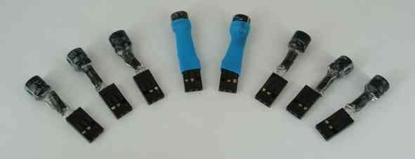
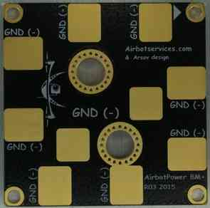

.. _common-airbotpower-power-module:

========================
AirbotPower Power Module
========================

This page explains how to set up the `AirbotPower Power Module <http://www.airbotservices.com/airbotpower.html>`__ and *AirbotPDB* stackable companion power distribution board.

This power module is useful for higher power systems (battery voltage from 4S to 8S and currents from 90 amps to 150 amps). The board encapsulates all the wiring and complexity described in :ref:`Powering the Pixhawk <common-powering-the-pixhawk>`) in a single, simple package.

Overview
========

The AirbotPower Power Module (and *AirbotPDB* stackable companion power distribution board) provides a reliable and simple way to power a Pixhawk and other UAV components.

.. image:: ../../../images/AirbotPower_PowerModule_Back.jpg
    :target: ../_images/AirbotPower_PowerModule_Back.jpg

AirbotPower provides three power feeds: 2x 5.3V & 1x 12V (up to 3.5 amps
each) and can supply main power to Pixhawk’s power port, backup power to
the servo rail and power for an FPV system. It provides current and
voltage measurements through the main power port, up to 150 amps and 8S.

The following sections provide an overview of the setup. For more
detailed information about the benefits of this board and setup see:

-  AirbotPower Power Module (airbotservices store)
-  `AirbotPower board <https://diydrones.com/profiles/blogs/airbotpower-board>`__ (DIY
   Drones blog post)

Key Features
============

-  2 x 5.3 Volts power feeds up to 3.5 amps
-  1 x 12 Volts power feed up to 3.5 amps (requires >=4S batteries)
-  Equivalent of three L/C filters on each power feed
-  Equivalent of three ferrites on each power feed
-  Voltage spikes suppression with 5.6V Zener diode (5Watts) + Capacitor
   on Pixhawk servo rail
-  HALL EFFECT current measurement (ACS758) for currents to 150 amps
-  A dip-switch configurable 3S to 8S Voltage measurement
-  A primary DF13 6 position connector for direct plugging into Pixhawk
   power port
-  A redundant 5.3V servo connector for standard servo cabling into
   Pixhawk servo rail
-  A standard 12V servo connector output for powering FPV devices
-  Oversized double redundant parallel battery inputs (solder through
   pads, for 10 or 12AWG wires)
-  Modular design separating the Power functions and the distribution
   function in two boards : allows to retrofit any drone already
   assembled with an existing Power Distribution Board (PDB). Stackable
   optional AirbotPDB distributionBoard, via XT150 connectors (less than
   3cm height with stacked optional PDB)
-  Large XT150 heavy duty connectors solder pads to either stack
   AirbotPDB or to link to an existing PDB. Flexibility to connect to
   PDB via connectors or soldered cables.
-  Overcurrent, ESD and shorts protections on all three BECs
-  No messy wiring & no cable fiddling thanks to a 6-pin DF13 output
   connector to connect the board to Pixhawk's 6-pin power port.
-  Board dimensions (W x D) : 50 x 50 mm. A very compact format using
   standard 45x45 mm screw holes spacing (M3)
-  Lightweight and clean surface mount design: 21 grams

Connecting to Pixhawk
=====================

Connecting the main power supply, backup power supply and servo rail
"safety" connector, are shown below.

.. note::

   A few practical guidelines:

   #. Don't use servos on the backup AUX 5.3V supply as they can supply
      just a few amps and too many servos might exceed this amperage.
   #. At least one of the DIP switch switches MUST be switched ON towards
      the ON mark (or towards the battery number marks); In the first batch
      of boards, DIP switches labels have been printed in reverse order:
      3S, 4S,...,7S, 8S should instead be read reversely 8S, 7S? ...4S, 3S.
      Later batches will have their labels printed in the correct order.
   #. On the bottom of the Power Board, there are some gold plated traces
      between the sensor and the 7mm holes and between BAT- and the PDB- .
      It is advised to add some solder on them for extreme currents. To do
      this you'll need at least a 80W soldering iron and must use good
      solder with 2-2.5% non-corrosive flux. Higher power soldering iron
      leads to shorter heating time which is better for both the PCB itself
      and the components.

The board also comes with a Zener Diode 5.6V (5W) + capacitor and easy
instructions to assemble them into an extra safety module that plugs on
Pixhawk’s servo rail. This is required on Pixhawk's servo rail to trim
any short voltage spikes (above 5.6V) that would be fed back to
Pixhawk's servo rail from external devices & servos (possibly causing
Pixhawk to shut itself down).

   5.6V 5WZener+Cap module details: plastidip & heat shrink tubing

AirbotPDB Power Distribution Board
==================================

The AirbotPDB board (“10 solder pads” power distribution board) is
stackable companion board (via XT150 connectors) that can optionally be
used with AirbotPower.

   AirbotPDB Board

.. figure:: ../../../images/AirbotPower_PowerModule_ConnectorsForAirbotPDB.jpg
   :target: ../_images/AirbotPower_PowerModule_ConnectorsForAirbotPDB.jpg

   AirbotPower PowerModule: Connectors for AirbotPDB

Setup through Mission Planner
=============================

:ref:`Power Module Configuration in Mission Planner <common-power-module-configuration-in-mission-planner>`
explains how to configure a Power Module and get low battery alerts from
Mission Planner.

For this specific module, use the settings as shown in the diagram below
(start with a "Voltage divider (calced)" value around 7.65):

.. figure:: ../../../images/AirbotPower_PowerModule_MissionPlanner_Calibration_Currentvoltage.jpg
   :target: ../_images/AirbotPower_PowerModule_MissionPlanner_Calibration_Currentvoltage.jpg

   Mission Planner:Configuraton for the AirbotPower Power Module

The output of the ACS758 current sensor produces a voltage of +0,6V
(offset) +20mV/A (i.e. set copter parameter “BATT_AMP_OFFSET” to a
value of 0.6).
