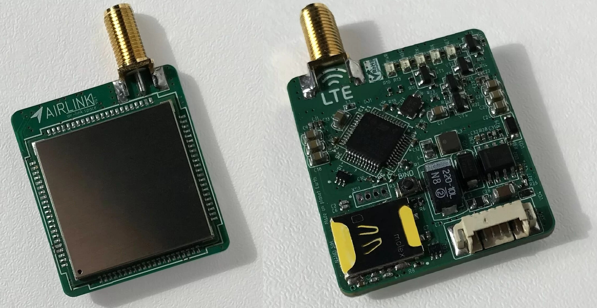
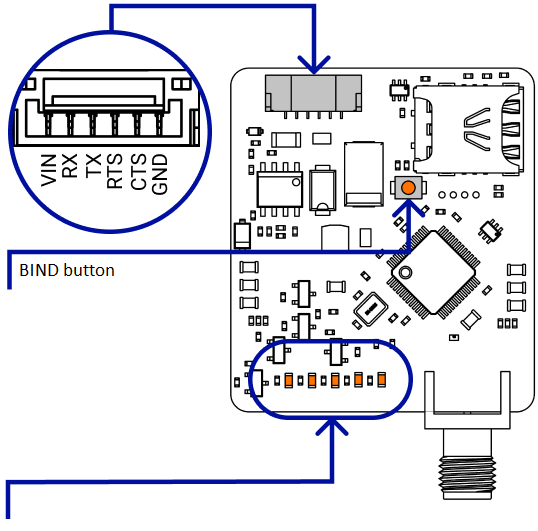

.. _common-airlink-telemetry:
[copywiki destination="plane,copter,rover,blimp"]
=================================
ClearSky Airlink 4G LTE Telemetry
=================================

Overview
========

`ClearSky Airlink <https://air-link.space>`__ very small 4G/LTE telemetry module. It allows you to control a drone or an airplane via the Internet from anywhere on earth.

Features
========
- Telemetry command and control.
- Send data to `Flightradar24 <https://www.flightradar24.com>`__ and `Open Glider Network <https://www.glidernet.org/>`__ (ADS-B).
- Multiple vehicles control (in development).
- Recieve RTK correction data for GNSS from Internet (in development).

Technical Specifications
========================

   +-----------------------------+--------------------------------------------------------------------------------+
   | Frequency Bands             | LTE-TDD: B38/B40; LTE-FDD: B1/B3/B5/B7/B8/B20; GSM/GPRS/EDGE 900/1800 MHz;     |
   +-----------------------------+--------------------------------------------------------------------------------+
   | Airspeed                    | Transmit 5 MBit/s; Recieve 10 MBit/s                                           |
   +-----------------------------+--------------------------------------------------------------------------------+
   | UART speed                  | 9600/57600/115200 Baud/s                                                       |
   +-----------------------------+--------------------------------------------------------------------------------+
   | Serial interface            | 3.3V CMOS TTL (5V tolerance)                                                   |
   +-----------------------------+--------------------------------------------------------------------------------+
   | SIM holder                  | NanoSIM                                                                        |
   +-----------------------------+--------------------------------------------------------------------------------+
   | Power supply                | 4.7..28 V / no more 5 Watts                                                    |
   +-----------------------------+--------------------------------------------------------------------------------+
   | Antenna connector           | SMA                                                                            |
   +-----------------------------+--------------------------------------------------------------------------------+
   | Operating temperature       |  -40℃ ~ +85℃                                                                   |
   +-----------------------------+--------------------------------------------------------------------------------+
   | Size                        | 8x35x52 mm (without antenna)                                                   |
   +-----------------------------+--------------------------------------------------------------------------------+
   | Weight                      | 13g (without antenna)                                                          |
   +-----------------------------+--------------------------------------------------------------------------------+

Pinouts
=======

* **PWR** - power indication
* **HOST** - AIRLINK network connection indicator (always on if everything is fine)
* **RX/TX** - transmit/receive indicators
* **NET** - cellular network registration indicator (blinking if everything is fine)

Videos
======
* Please use the subtitle translator to get English. 
* Overview of the module:

.. youtube:: XszxSj__-Xg
   :width: 100%

* How to connect your drone with Flightradar24/OGN:

.. youtube:: hgrt-Rcn-UQ
   :width: 100%

Where to buy
============
-   `Airlink store <https://rushop.air-link.space/>`_