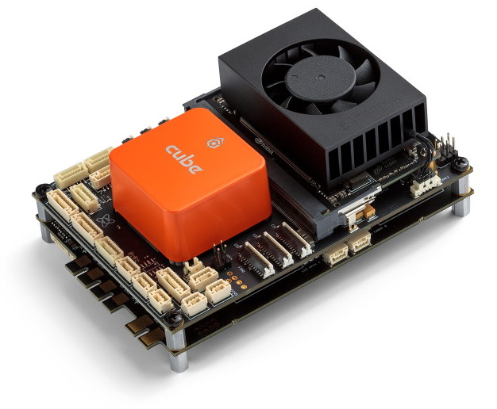
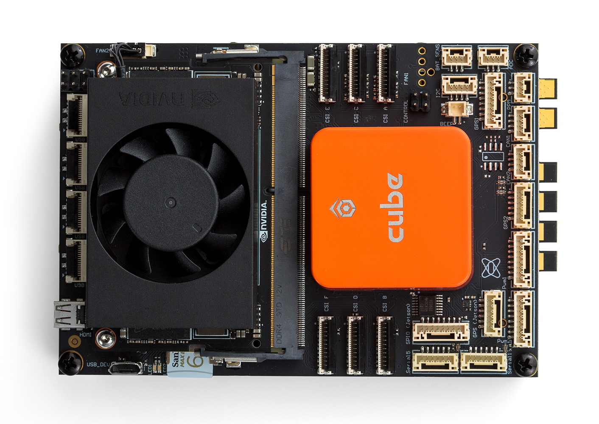

.. _common-airvolute-DroneCore-Suite:
[copywiki destination="copter,plane,rover,blimp"]
=========================
Airvolute DroneCore.Suite
=========================

**DroneCore.Suite** is a one stop autopilot and flight computer solution for developers of advanced drone systems demanding high computing power and high level of modularity. 
It is the "core" of the drone containing most of its electronics in a compact form and it provides wide options for software development of the the most challenging AI and vision based applications.

It consists of a control part called **DroneCore.Pilot** and power part called **DroneCore.Power**.

**DroneCore.Pilot** - top board for control of the aircraft containing

-  **Jetson Xavier NX** Companion Computer
-  CubePilot Cube autopilot running ArduPilot firmware
-  Internal 5V power supply
-  Power selector
-  Peripheral connectors
-  USB hub

**DroneCore.Power** - bottom board with power electronics containing:

-  4 FOC DroneCAN ESCs - 20A continuous / 40A peak current
-  Stacked configuration allows 8 ESCs
-  Power sensor (battery voltage and current measurement)
-  Analog inputs for battery cell monitoring
-  SMBUS
-  LED Driver for 4 x WS2812B strips

Where to Buy
============

`Where to buy <https://www.airvolute.com/contact/>`__

DroneCore.Suite comes with both Cube and Xavier NX pre-configured and communicating together and able to control a Multicopter. Developers no longer need to solve basic communication and compatibility issues coming from connecting two different IT worlds. It They can start to concentrate on their application needs from the beginning.

Accompanying documentation provides a fast learning curve to start using various peripherals to control the drone and create the desired application.
Various software libraries (coming soon) further enrich the possibilities for the developer relieving them from complex configuration and programming tasks.

DroneCore.Suite provides easy to use ROS based software stack supporting development of autonomous applications.

Out of the box the device is configured to fly a Quadcopter (though autopilot calibration is needed).

Specifications
==============

**Mechanical parameters**

-  Weight 247g - including Cube orange, Xavier NX, Xavier heatsink with
   fan
-  Dimensions 115 x 80 x 45mm
-  Mount with 4 screws/spacers M3 109 x 74mm
-  WiFi module
-  WiFi antennas 2pcs

**Electrical parameters**

-  Power supply range: 12V – 35V (6S LiHV)
-  Integrated DC/DC converter for control circuits
-  Redundant power supply with power good monitoring for control unit
-  Current protected peripheral connectors
-  4 x FOC DroneCAN ESC 40A, featuring motor identification and motor
   diagnostics
-  Power sensor, SMBUS

**ArduPilot (Cube) Connections**

-  RC input
-  PWM output (7 + 7 lines)
-  2x CAN
-  4x UART
-  2x I2C
-  Buzzer
-  Power sensor input
-  ADC input
-  Buzzer

**Jetson connections**

-  PCI Express (M2, Key E connector)
-  4 USB 3.0 (ZIF connectors, reductions available)
-  Gigabit Ethernet (ZIF connector, reductions available)
-  6 CSI (22 pin)
-  4 GPIO
-  DroneCAN, UART, I2C, SPI
-  IMU BMI088 and barometer BMP388 on board
-  USB 2.0 for debugging
-  Micro SD card
-  Video output connector (micro HDMI)
-  Fan

**DroneCore.Power** (bottom power board)

-  4 x FOC DroneCAN ESCs – 40A peak / 20A continuous
-  power sensor, SMBUS,
-  LED Driver for 4x WS2812B strips

Block Diagram
=============

.. image:: ../../../images/airvolute_DroneCore.Pilot_block_diagram.svg
    :target: ../_images/airvolute_DroneCore.Pilot_block_diagram.svg

**DroneCore.Pilot** is based on Cube Orange - the widely used autopilot by Hex.aero running on ArduPilot (or optionally PX4 flight stack) and Nvidia Jetson Xavier NX. Their rich interfaces allow connecting most sensors and other peripherals for drones available on the market.

**DroneCore.Power** contains 4 FOC DroneCAN ESCs with motor identification feature able to be configured for all common BLDC/PMSM drone motors on the market and a telemetry interface providing real time data to the autopilot. Furthermore it provides battery voltage and current measurements as well as individual cell voltages.

Useful links
============

`Product website <https://www.airvolute.com/product/dronecore/>`__

`Documentation <https://docs.airvolute.com/airvolute-dronecore.suite>`__

