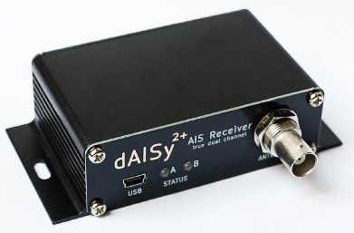
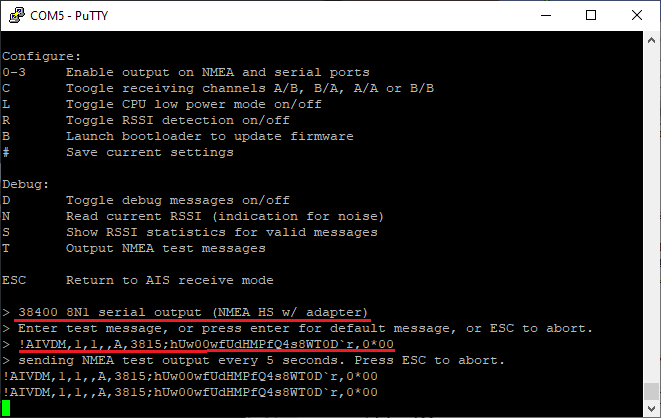
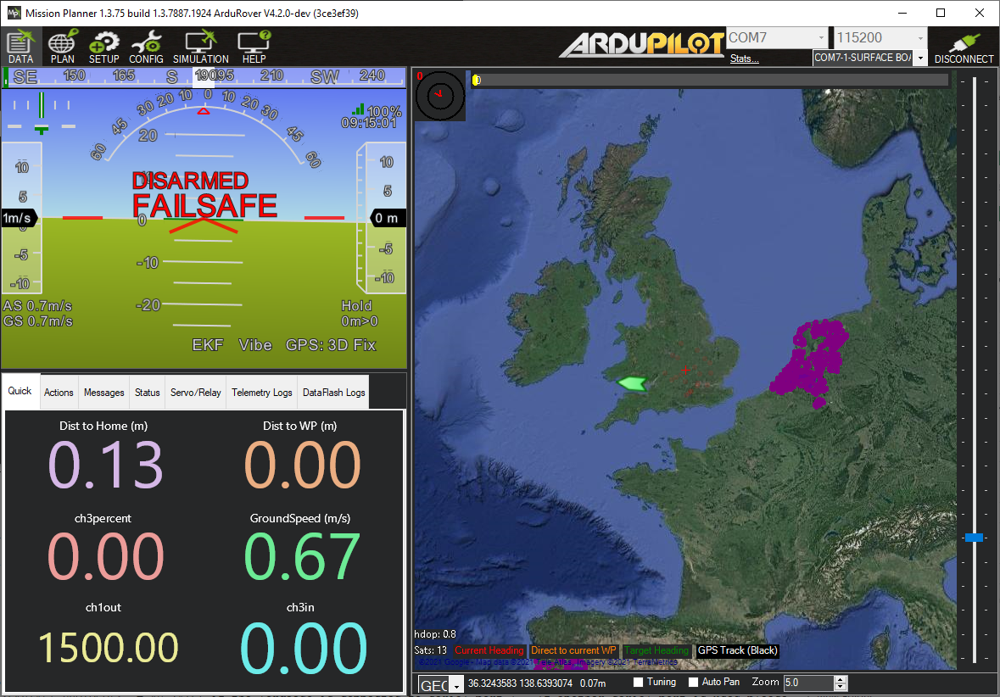

.. _common-ais:

===============
AIS (for boats)
===============

Rover-4.2.0 (and higher) support `Automatic identification system (AIS) <https://en.wikipedia.org/wiki/Automatic_identification_system>`__ sensors allowing the position of manned boats to be displayed on the ground station

.. note:: Support for this peripheral is also available for Planes and Copters using the `Custom Firwmare Build Server <https://custom.ardupilot.org/>`__ , by creating a firmware build including this feature listed under the IDENT category.

What to Buy
-----------

- `dAISy 2+ <https://shop.wegmatt.com/products/daisy-2-dual-channel-ais-receiver-with-nmea-0183>`__
- AIS compatible antenna (161.975 MHz and 162.025 MHz).  VHF antennas `including this one <https://www.ebay.co.uk/itm/133825338570?chn=ps&norover=1&mkevt=1&mkrid=710-134428-41853-0&mkcid=2&itemid=133825338570&targetid=1279076611409&device=c&mktype=pla&googleloc=9045387&poi=&campaignid=12125450855&mkgroupid=123088734215&rlsatarget=pla-1279076611409&abcId=9300480&merchantid=7309454&gclid=CjwKCAjwmK6IBhBqEiwAocMc8sJIbv4ZN9fhjX3vB1uKhBodpDi0X3O4bFbGwYcejBn_U2bl1SpqfRoCG3EQAvD_BwE>`__ should work

AutoPilot connection
--------------------

The dAISy2 should be connected to one of the autopilot's serial ports as shown below

  .. image:: ../../../images/ais-daisy2-autopilot.png
      :target: ../_images/ais-daisy2-autopilot.png
      :width: 400px

Autopilot Configuration
-----------------------

Connect to the autopilot with a ground station and set these parameters and then reboot the autopilot

- AIS_TYPE = 1 (Enable)
- :ref:`SERIAL1_PROTOCOL <SERIAL1_PROTOCOL>` = 40 (AIS) if the sensor is connected to serial port 1.  If another serial port is used please set the appropriate SERIALx_PROTOCOL parameter
- :ref:`SERIAL1_BAUD <SERIAL1_BAUD>` = 38 (38400 bps) if using serial port 1.  If another serial port is used please set the appropriate SERIALx_BAUD parameter instead
- :ref:`SR0_ADSB <SR0_ADSB>` = 5 to enable sending AIS mavlink messages to the ground station over Serial0 (the USB port).  If a telemetry radio is used the SRx_ADSB param corresponding to its serial port should also be set to 5(Hz).

dAISy2 Configuration and Testing
--------------------------------

- Connect dAISy2 to your PC using a USB cable
- Download, install and run a terminal program such as `Putty <https://www.putty.org/>`__
- Connect to the dAISy2's COM port at 38400 baud and press <ESC> to view the setup menu
- Type "3" to enable the serial port.  "38400 8N1 serial output (NMEA HS w/ adapter)" should be displayed
- Type "#" to save this change and retain this baudrate on boot
- Type "T" to enable entering a test NMEA message and then copy-paste this message, "!AIVDM,1,1,,A,3815;hUw00wfUdHMPfQ4s8WT0D`r,0*00", or hit "Enter" and use the default location

- Connect to the autopilot with Mission Planner (or another ground station) and a boat should appear on the South West coast of England

- press <ESC> to stop sending test messages

Logging
-------

The AIS_OPTIONS parameter specifies which AIS messages are logged.  These messages are useful for debugging purposes and contain the following information

- TimeUS : System time that the AIS message was received
- Num : Number of fragments in the currently accumulating message
- Total : Fragment number of this sentence
- ID : Sequential message ID for multi-sentence messages
- Payload : Data payload

User Videos
-----------

.. youtube:: pGluWMlIXho
    :width: 100%

