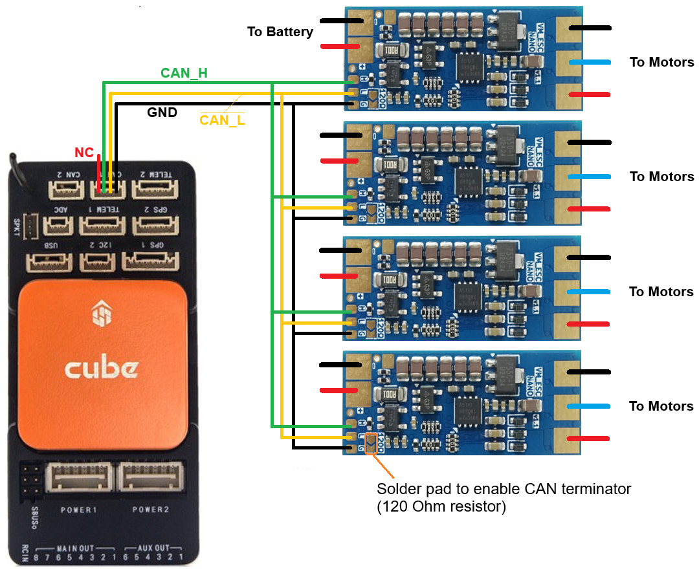

.. _common-am32-escs:

===================
AM32 Drone CAN ESCs
===================

.. image:: ../../../images/am32-dronecan-escs-title.jpg
    :width: 450px

The `AM32 ESC firmware <https://github.com/am32-firmware/AM32>`__ is open source ESC firmware for use on multicopters and rovers.  DroneCAN support was added in late 2024

Where to Buy
------------

AM32 ESCs that support DroneCAN

- `VimDrones ESC Nano <https://dev.vimdrones.com/products/vimdrones_esc_nano/>`__
- `VimDrones ESC Development Board <https://dev.vimdrones.com/products/vimdrones_esc_dev/>`__

More ESCs may be found from the `AM32 targets.h <https://github.com/am32-firmware/AM32/blob/main/Inc/targets.h>`__ file (seach for _CAN)

ArduPilot Connection and Configuration
======================================

The ESCs should be connected to the autopilot's CAN port.  Below shows the ESCs connected to the autopilot's CAN1 port but CAN2 may also be used.

To enable communication with the AM32 ESCs using DroneCAN, set the following parameters:

- Set :ref:`CAN_P1_DRIVER <CAN_P1_DRIVER>` = 1 (First driver) to specify that the ESCs are connected to the CAN1 port
- Set :ref:`CAN_D1_PROTOCOL <CAN_D1_PROTOCOL>` = 1 (DroneCAN)
[site wiki="copter,rover"]
- Set :ref:`MOT_PWM_MIN <MOT_PWM_MIN>` = 1000 and :ref:`MOT_PWM_MAX <MOT_PWM_MAX>` = 2000 so ArduPilot uses an output range that matches the ESCs input range
[/site]
[site wiki="plane"]
- Set ``SERVOx_MIN`` = 1000 and ``SERVOx_MAX`` = 2000 for each ESC connected (``x`` corresponds to the ESC number) so ArduPilot uses an output range that matches the ESCs input range
[/site]
- Set ``SERVOx_FUNCTION`` to each motor channel (e.g. 33 - 40 for motors 1 - 8). This is automatically configured when setting frame class/type. If a motor channel isn't assigned to a servo output, commands won't be sent to the associated ESC.
- :ref:`CAN_D1_UC_ESC_BM <CAN_D1_UC_ESC_BM>` is a bitmask that determines which servo output channels are transmitted over CAN.  For quadcopters this is normally "15"
- :ref:`CAN_D1_UC_ESC_OF <CAN_D1_UC_ESC_OF>` allows for more efficient packing of ESC command messages when ESCs are connected to higher servo outputs (e.g. 5 to 8).  For most vehicles this can be left at zero
- :ref:`CAN_D1_UC_ESC_RV <CAN_D1_UC_ESC_RV>` allows specifying which ESCs support spinning in reverse

ESC Firmware Updates
====================

The latest firmwares can be found on the `am32.ca downloads page <https://am32.ca/downloads>`__

To update the ESCs firmware using Mission Planner:

- Download the firmware from the `am32.ca downloads page <https://am32.ca/downloads>`__
- Power on the autopilot and ESCs
- Connect to the autopilot using Mission Planner
- Open Mission Planner's Setup, Optional Hardware, DroneCAN/UAVCAN page
- Select "MAVLinkCAN1" from the drop-down (assuming the ESCs are connected to the autopilot's CAN1 port) and press Connect
- The ESCs should appear in the list of connected devices
- For each ESC listed, push the "Menu" button on the right and select "Update"
- When asked, "Do you want to search the internet for an update?", push "No" and select the firmware downloaded above
- After the firmware is uploaded, check the "SW Version" column shows the expected version

ESC Configuration
=================

If the ESCs are already connected to the autopilot (via DroneCAN), they can be configured using Mission Planner's DroneCAN/UAVCAN page or the :ref:`DroneCAN GUI Tool <common-uavcan-gui>`.  Alternatively, the `AM32 configurator <https://am32.ca/configurator>`__ can be used by directly connecting to the ESC's PWM connection.

In most cases at least some of the following parameters will need to be changed:

- ESC_INDEX: The motor number - 1.  For multicopters the motor number and position are shown on the :ref:`ESCs and Motors wiki page <copter:connect-escs-and-motors>`
- DIR_REVERSED: the motor direction.  Use Mission Planner's motor test page to check the direction and change this parameter if necessary
- MOTOR_POLES: the number of poles in the motor
- MOTOR_KV: the motor's KV rating

To change the above parameters using Mission Planner:

- Power on the autopilot and ESCs
- Connect to the autopilot using Mission Planner
- Open Mission Planner's Setup, Optional Hardware, DroneCAN/UAVCAN page
- Select "MAVLinkCAN1" from the drop-down (assuming the ESCs are connected to the autopilot's CAN1 port) and press Connect
- For each ESC listed, push the "Menu" button on the right and select "Parameters"
- Change the parameters as required and press, "Write Params"

Logging and Reporting
---------------------

ESCs RPM, voltage, current and temperature are recorded in the autopilot's onboard log and reported in real-time to the ground station

.. image:: ../../../images/dshot-realtime-esc-telem-in-mp.jpg
    :target: ../_images/dshot-realtime-esc-telem-in-mp.jpg
    :width: 450px

Videos
------

..  youtube:: lM22MPgsbQw
    :width: 100%
