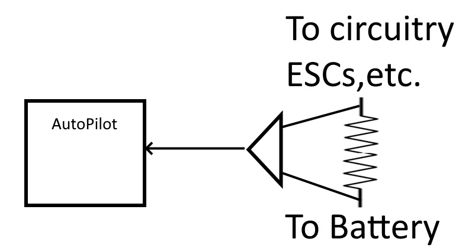

.. _common-analog-current-calibration:

==================================
Analog Current Monitor Calibration
==================================

Analog current monitors usually consist of an ultralow resistance shunt used to generate a very small voltage which is then electronically amplified and delivered to the autopilot via one of its analog-to-digital (A/D) interfaces. In ArduPilot, this voltage is scaled by the :ref:`BATT_AMP_PERVLT<BATT_AMP_PERVLT__AP_BattMonitor_Analog>` parameter to indicated the current level. The :ref:`BATT_AMP_OFFSET<BATT_AMP_OFFSET__AP_BattMonitor_Analog>` parameter is provided to correct for any voltage offsets generated by the current monitor's amplifier that results in output when zero current is flowing thru the shunt.

This monitor's accuracy  and repeatability across different boards is dependent on many factors:
- The tolerance of the shunt resistor and amplifier components
- The quality of the PCB layout which can induce parasitic errors due to high current flows
- The temperature coefficient of the components since high currents can cause localized heating in some cases.

.. note:: many of these issues do not occur if using a HALL-EFFECT current sensor instead of a resistive shunt. Unfortunately, those are more bulky and expensive and are not practical for use on autopilots with integrated current sensors.

The net result is that shunt current sensors usually need their ArduPilot parameters tweaked to achieve good results. There are two main methods for calibration:
#. Using a good ammeter. Hobby grade devices such as the `GT Power Meter <https://www.amazon.com/GT-Power-Analyzer-Consumption-Performance/dp/B00C1BZSYO>`__ or inexpensive `DVM types <https://www.amazon.com/GT-Power-Analyzer-Consumption-Performance/dp/B00C1BZSYO>`__ can be used to set the scale and offset.
#. Empirically, by test flying and comparing the used mah reported for the flight vs how much charge is put back into the battery during recharge.

Using an Ammeter
================
- Attach the ammeter and power the vehicle with its battery. Connect to the GCS and note the current reported.
- Adjust the :ref:`BATT_AMP_OFFSET<BATT_AMP_OFFSET__AP_BattMonitor_Analog>` parameter to match the ammeter.
- Arm and throttle up the vehicle. For Copters this can be done with the propellers reversed to hold the vehicle down. For Plane, it should be secured (A helper is advised) to prevent movement. Rover will need some way to load the wheels.

.. warning:: be safe! make sure you or someone else cannot be injured while doing this!

- The throttle level should stimulate current consumption close to the expected normal vehicle flight condition (ie like cruising level in Plane or hovering in Copter).
- Note the difference betweeen the ammeter and what the GCS reports and adjust the :ref:`BATT_AMP_PERVLT<BATT_AMP_PERVLT__AP_BattMonitor_Analog>` to match.
- Recheck the idle current and re-adjust the :ref:`BATT_AMP_OFFSET<BATT_AMP_OFFSET__AP_BattMonitor_Analog>`, if needed. There will be some interaction between it and the :ref:`BATT_AMP_PERVLT<BATT_AMP_PERVLT__AP_BattMonitor_Analog>` so some repetition of the above may be needed.

Its always good to use the process explained next to tweak the :ref:`BATT_AMP_PERVLT<BATT_AMP_PERVLT__AP_BattMonitor_Analog>` parameter after a real flight or two.

Empirical Adjustment
====================
- Power the vehicle on the bench with its battery and note the reported current to the GCS. As a guess, normally it should read in the .2 to .4A range with the autopilot and peripherals powered. If a VTX is also in the system, it could be in the .6A range. Adjust :ref:`BATT_AMP_OFFSET<BATT_AMP_OFFSET__AP_BattMonitor_Analog>` to get that reported value.
- Test fly with a lengthy period in its normal flying condition (ie one takeoff, one landing only). Try to use at least 50% of the battery.
- From the flight log determine how much battery was consumed, re-charge it and note how much was put back. This is usually about 105% of what was consumed. Adjust the :ref:`BATT_AMP_PERVLT<BATT_AMP_PERVLT__AP_BattMonitor_Analog>` param according to this:

      (amount of charge put back into battery/ reported used charge ) * current value becomes the new value for :ref:`BATT_AMP_PERVLT<BATT_AMP_PERVLT__AP_BattMonitor_Analog>`
- Readjust the :ref:`BATT_AMP_OFFSET<BATT_AMP_OFFSET__AP_BattMonitor_Analog>` value on the bench
- Test fly again, iterate as needed.
