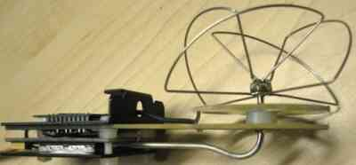

.. _common-antenna-design:

=======================
Antenna Design Overview
=======================

This article provides an overview of the the fundamental principles of
antenna design. Antenna design is an important factor in using UAVs over
extended range and where there are obstructed views. While this is not
directly related to Antenna Tracking/autopilots, it may be
useful for some readers.

Antenna fundamentals
====================

When we speak of antenna radiation it also includes the reverse, that
is, the antenna 'collecting' radiated energy.

Any piece of wire will radiate energy when connected to a source of RF (
Your transmitter or receiver). How WELL it radiates that applied
energy is dependent on only two factors:

-  That the antenna is resonant at the same frequency as the radio
   signal applied and
-  That the feedpoint of the antenna is matched to the impedance of the
   attached transmitter energy source.

   .. tip::

      Maximum energy transfer between source and load ( the antenna)
         occurs ONLY when the load and source impedance's are equal.

How well the antenna radiates that energy in any or all directions, if
the above conditions are met, is then only dependent on the antenna
design, shape, or style. For example:

-  A simple vertical 1/4 wave radiator will radiate a doughnut shaped
   pattern, in all direction of the compass, with low energy upwards and
   downwards, in the direction of the antenna element.
-  A yagi type antenna, on the other hand, ( such as your VHF or UHF TV
   antenna) focuses the energy in a single direction, as would a torch.

Antennas do not have gain:

-  They focus the energy to a greater or lesser extent, in a direction
   of design, but do this by robbing energy from other radiating
   directions.
-  Your torch puts more light out the lens end, with nothing out the
   rear end.
-  If you remove the reflector from behind the torch bulb, the light is
   radiated in all directions, omnidirectionally, but is much weaker at
   any distant point than the focused beam.

.. image:: ../../../images/TrackerHelical.jpg
    :target: ../_images/TrackerHelical.jpg

Antenna radiation is polarized
==============================

That is to say, the radiated electromagnetic wave has a net polarization
plane. This is usually either linear or circular (elliptical
polarization is also found, but that is simply a mix of the two other
types)

-  A 1/4 wave vertical antenna will radiate linearly, with vertical
   polarization. Placed on its side it will radiate horizontal
   polarization.
-  A Helical antenna (looks like a coil of wire wound in a screw
   fashion) wound clockwise when viewed from behind will radiate
   clockwise circular polarization, and vise versa.

For reception of maximum energy, the transmitting and receiving antennae
must be identically polarized.

-  There is a massive loss of signal ( easily some 30dB, although the
   theoretical loss is infinite) if one attempts to receive a
   horizontally polarized signal with a vertically polarized antenna.
-  Similarly, there are massive losses if trying to receive a circularly
   polarized signal with an antenna of the opposite circular sense.
-  The odd man out is that there is only a 3db loss between an antenna
   that is circularly polarized and one that is linear.

You would use circular polarization if:

-  If the two antennas in question could not be made to maintain similar
   attitudes, such as one in a pitching , rolling aircraft, then there
   would be unacceptable signal losses as the aircraft banks and
   pitches.
-  So you could use a vertical on the aircraft, and a helical or
   turnstile, or similar, on the ground segment.
-  This way you would only ever experience a 3db maximum loss. ( all
   assuming good line of sight view).
-  Or you could gain back the 3db loss by fitting a similar circularly
   polarized antenna on the aircraft, giving the best of both worlds.
-  But you actually gain more than that with circular polarization at
   both ends.

Assume first that the two antennas are simple vertical monopoles,
radiating vertically polarized signals.

-  When you are flying, at the flying club, etc, you are probably near
   some metal structures, the 'hanger' , cars and other vehicles, etc.
-  All these structures reflect the same energy you are trying to
   receive.
-  In addition, when the aircraft is low and far, the RF transmitted by
   the A/C antenna follows two paths to your receiver - One directly,
   and one via a reflection from the ground, somewhat midway between you
   and the A/C.
-  What happens to the reflected wave is that the polarization is
   changed in unpredictable ways.
-  Your receiver ( and antenna) does not know or care where the received
   energy comes from, so it receives this reflected energy as well.
-  These multitude of received waves add constructively and
   destructively with the main received wave, causing large, short
   duration, signal drop-outs - a sort of 'flutter' in the signal.

If both antenna are circularly polarized, however, the picture is quite
different:

-  When the circular polarized waveform is reflected , it REVERSES its
   polarization.
-  When this reversed polarized signal arrives at your receiving antenna
   it is largely rejected and hugely attenuated, so interfering
   minimally with the main received signal.

.. image:: ../../../images/ACantBay.jpg
    :target: ../_images/ACantBay.jpg

Resonance and matching issues
=============================

-  Most simple linear antenna are either of the monopole or dipole form.

   -  A single monopole ( 1/4 wave vertical for example) or a single
      dipole will only radiate linear polarization.

-  Any antenna is only resonant when it is exactly the correct length AT
   the frequency of operation.

   -  ( this does not apply to the class of broadband antenna, such as
      helical antenna, etc.
   -  The helical will easily cover an ocatve with good performance).

-  At resonance the antenna will exhibit its characteristic feedpoint
   impedance.

   -  Feedpoint impedance is expressed with two terms, the pure
      resistive part, and the reactive ( j operator) part.

-  Most transmitters and receivers terminal impedance are made to be
   50ohms resistive, or very close to that.

   -  So it stands to reason the antenna must also be 50 Ohm resistive
      to have max energy transfer.
   -  However, none of the antenna are that obliging, so we have to do
      some feedpoint matching to meet the criteria.

-  A 1/4wave vertical monopole over a ground plane has a resistive feed
   point of around 75ohms.

   -  A half wave dipole is around 72ohms.
   -  As with resistors, placing two dipole in parallel as in the
      IBcrazy turnstile, will result in a feedpoint impedance of 35ohms.

-  A 75ohm feed connected to a 50ohm coax and transmitter will exhibit a
   1.5:1 SWR ( the ratio of power going out to power reflected).

   -  A 1.5:1 SWR means that approx 3% of your transmitter power is not
      being radiated: ( 30milliwatts for a 1watt transmitter).
   -  That is not so bad, and we can live with an SWR of 1.5:1 in most
      cases.

-  The turnstile antenna is a pair of crossed dipoles, fed 90deg out of
   phase with each other, thereby generating circular polarisation.

   -  You CANNOT simply connect the dipole in parallel at the coax
      feedpoint though.
   -  Apart from the halving of impedance ( which we decided we can live
      with) the radiation pattern and polarization of the antenna will
      be totally destroyed by unwanted radiation from the coax cable.
   -  The RF energy, at the dipole connection point, 'leaks' out and
      currents then flow down the outer shield of the coax.
   -  As mentioned previously, any piece of wire will radiate RF energy,
      and so the coax radiates this energy, and the radiation again adds
      constructively and destructively with the main antenna radiation,
      causes complete distortion and signal nulls in the pattern.
   -  This radiation from the coax MUST be prevented.

-  This is done by means of a **Balun** transformer. - which is is an
   acronym for '**Bal**\ anced to \ **Un**\ balanced transformer'.
-  A dipole is a balanced device - it is electrical equal along each
   element, outwards from the feedpoint. It therefore requires that the
   feedpoint be fed in a balanced fashion.

   -  Coax cable is a balanced feeder - the shield is at ground
      potential, while the inner core carries the energy.
   -  This effectively ( oversimplifying a little) connects the one
      dipole half to the 'live' core, and the other half to 'ground'
      unbalancing the dipole.
   -  This causes currents to flow on the coax outer shield, and
      distortion of the dipole radiation pattern.

-  **Baluns** can be constructed from coax cable, but the accuracy
   required in coax cable length ( they are normally length multiples of
   1/4 wavelength) is very critical, especially in the GHz range - 0.5mm
   can have a great effect.
-  The **turnstile** is not new - it is some 50 to 60 years old, and is
   well researched and published.

   -  Up to the VHF and lower UHF region , the coax balun, with embedded
      impedance match transmission line transformer, is used, along
      these lines:

      .. image:: ../../../images/turnstile.jpg
          :target: ../_images/turnstile.jpg

-  For the higher microwave frequencies, a plumbing type version is more
   appropriate.

   -  This is called the **spilt tube** or **split sheath** **balun**,
      and looks like this when used as a feed for a pair of crossed
      dipoles.

      .. image:: ../../../images/Oblique.jpg
          :target: ../_images/Oblique.jpg
      
      .. image:: ../../../images/Slit.jpg
          :target: ../_images/Slit.jpg

-  The balun and feed match consists of an outer and an inner tube.

   -  The ratio of diameters D/d is chosen to give the desired
      impedance:

-  D/d = 1.86 for 75ohms, and 1.5 for 50 ohms.
-  Typically the outer tube would be around 8mm for use at 2.4GHz.
-  In order to obtain circular polarisation, I mentioned that the two
   dipole have to be fed 90deg apart ( phase quadrature).
-  This can be done as in the coax balun version above ( inserting an
   extra 1/4wave length of coax in the leg to one dipole gives an extra
   electrical wavelegnth of 90 degerees).
-  Or, this can be achieved by slightly lengthening the one element (
   becomes more inductive) and shortening the other( becomes more
   capacitive) - this also introduces the required phase difference
   between the elements.
-  This can be seen in the images above:

   -  The one element is typically around 0.21 wavelength per half,
      while the other is around 0.25 wavelength.
   -  One short and one long element penetrate the outer tube and are
      connected to the inner tube.
   -  While the opposite pair of elements are connected only to the
      outer tube.
   -  The outer tube is split or slotted ( 0.5mm width slot). The slot
      is approx 0.23 wavelength long.

      .. image:: ../../../images/End.jpg
          :target: ../_images/End.jpg    
      
      .. image:: ../../../images/Teflon.jpg
          :target: ../_images/Teflon.jpg

-  The relationship in length between the two dipoles is critical.

   -  Typically this would be measured on a network analyser and the
      feed impedance of each element set to say R+j45 ohms ( longer
      dipole) and the other to R-j45 ohms.
   -  This will give the correct phase relationship between elements.
   -  A half mm variation can have a great effect, turning a good
      antenna into a mediocre one..

-  The last image above shows a teflon tube.

   -  This is inserted in the tube from below, and fits snugly inside
      the outer tube, and over the inner tube.
   -  This is then slid up and down to adjust the 'R' part of R+-jX,
      till the match is a good 50ohms.
   -  This does not affect the antenna radiation pattern or
      characteristics.
   -  Obtaining a 50ohm impedance match can be done by trimming the
      element lengths as well, at the same time destroying the antenna
      radiation pattern and circularity.

-  And that is why it is not so simple to do at home, and why the 'Hobby
   King' et al variants sold everywhere are mostly trash.

   -  You will probably achieve a few km range with those.

      -  Remember, any old piece of wire will radiate.
      -  I easily achieve 15km with 500milliwats at 2.4GHz using two
         split sheath balun , properly matched and trimmed, crossed
         dipoles..

-  **For those interested:**
-  **References are - RSGB VHF/UHF Manual - page 8.45**
-  **Modern Antenna Design - Page 255**
-  Here are some images of my \ **split sheath balun** crossed dipoles.

   .. figure:: ../../../images/AntennaDesign_Split_SheathBalunCrossedDdipoles.jpg
      :target: ../_images/AntennaDesign_Split_SheathBalunCrossedDdipoles.jpg

      Split-Sheath Balun Crossed Dipoles

   .. image:: ../../../images/antenna_split_sheath_balun_crossed_dipoles.jpg
       :target: ../_images/antenna_split_sheath_balun_crossed_dipoles.jpg

.. _common-antenna-design_understanding_db_watts_and_dbm:

Understanding dB, Watts and dBm
===============================

The `Watt (W) <https://en.wikipedia.org/wiki/Watt>`__ is the standard
`SI unit <https://en.wikipedia.org/wiki/International_System_of_Units>`__
for measuring power.

The `decibel (dB) <https://en.wikipedia.org/wiki/Decibel>`__ is a
logarithmic ratio that can be used to describe the non-linear
differences between signal power values across a range (a positive or
negative difference means a gain or a loss of the signal). For example,
you can use a negative dB value to describe the non-linear rate of
signal loss as as it travels through a conductive medium. The ``dB``
unit is based on log :sub:`10` (the "Log" function on a scientific calculator). `dBm <https://en.wikipedia.org/wiki/DBm>`__ is an abbreviation for the
power ratio in decibels (dB) of the measured power referenced to one
milliwatt (mW). To put it another way, the dBm value is the number of dB
by which a value exceeds 1mW: 0dBm is 1mW, 1dBm is 1.259mW etc).

The basic conversion equations are below:

-  **Watt to dBm**:

   ::

       10*log10([signal in watt]*1000)

-  **dBm to Watt**:

   ::

       (10^([ratio in dBm]/10))/1000

Power calculations expressed in dB or dBm can use simple addition and
subtraction. For example, consider a radio with an output of 60mW which
is connected to an antenna with a gain of 14dBi using a 7m cable
(attenuation 25dB per 100m). We can calculate the output power as shown:

**TX_Power**\ = 60mW = \ **0.06W** = **17.78dBm** (using conversions
above) 

**Cable_Loss** = 25dB/100m = 0.25dB per meter \* 7 metres
= \ **1.75dB**

**Antenna_Gain** = **14dBi**

**Output_Power** = **TX_Power** - **Cable_Loss** + **Antenna_Gain**

**Output_Power** = **17.78** - **1.75** + **14** = **30.03dB** = **1W**
(using conversions above)

Acknowledgements
================

Much of this antenna information has been provided by Joe Noci as an
extension of this discussion: `433 UHF LRS Antenna "Turn Stile" <https://diydrones.com/forum/topics/433-uhf-lrs-antenna-turn-stile>`__.

