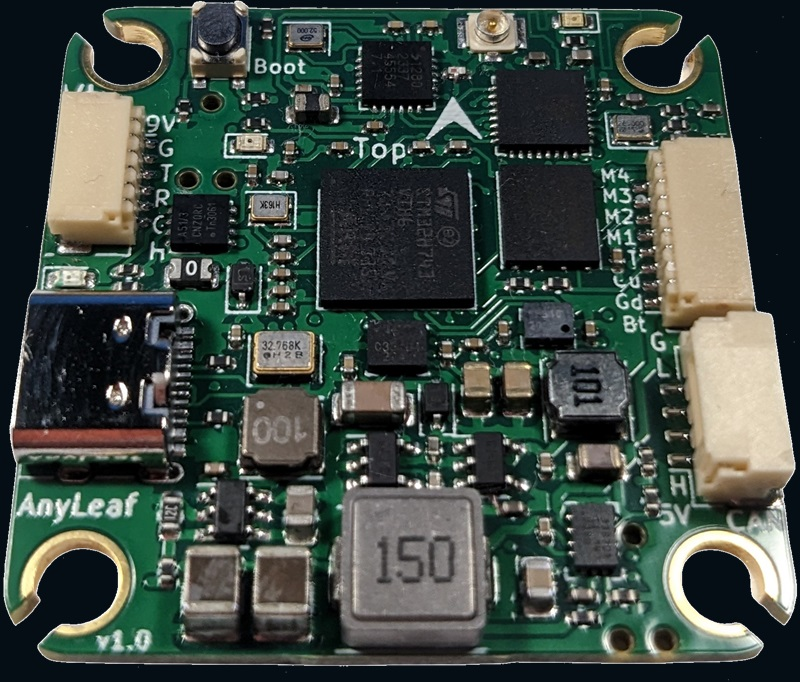
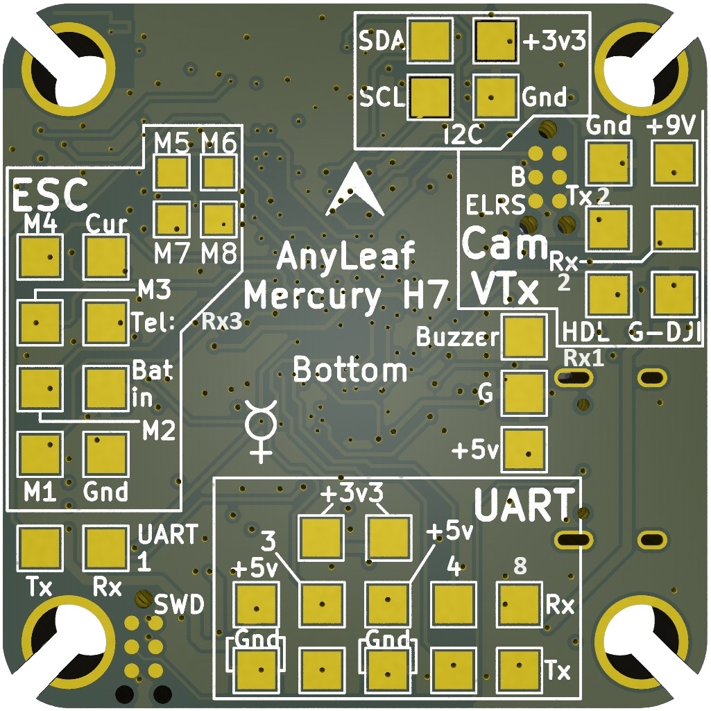
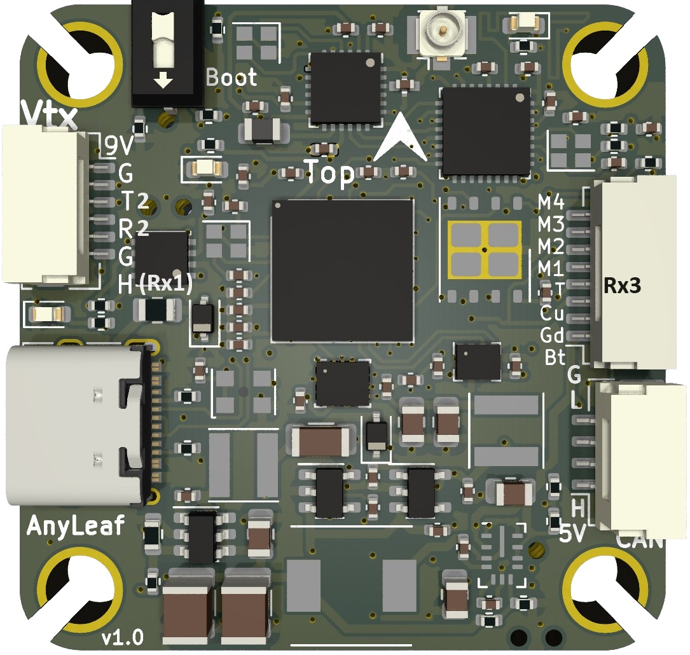

.. _common-anyleafh7:

===========
Anyleaf H7
===========

*above image and some content courtesy of* `Anyleaf <http://www.anyleaf.org>`__

Where to Buy
============

- Available from `Anyleaf <http://www.anyleaf.org>`__

Specifications
==============

-  **Processor**

   -  STM32H743 32-bit processor 
   -  8 MByte flash for logging
   -  Integrated ELRS receiver

-  **Sensors**

   -  ICM42688 IMU (accel and gyro only, no compass)
   -  DPS310 barometer

-  **Power**

   -  2S  - 6S Lipo input voltage with voltage monitoring
   -  9V, 3A BEC for powering Video Transmitter
   -  5V, 2A BEC for peripherals

-  **Interfaces**

   -  8x PWM/BDShot outputs, 4 on ESC connector
   -  1x CAN_FD port
   -  DJI VTX Connector
   -  4x UARTs/serial for GPS and other peripherals
   -  1x I2C port for external compass
   -  USB-C port
   -  Switchable VTX power
   -  All UARTS support hardware inversion.
   -  External current monitor input

- **Dimensions**
   - Size: 37.5mm x 37.5mm
   - Weight: 8g

Pinout
======

UART Mapping
============

The UARTs are marked Rn and Tn in the above pinouts. The Rn pin is the
receive pin for UARTn. The Tn pin is the transmit pin for UARTn. All UARTS are DMA capable

   -  SERIAL0 -> USB
   -  SERIAL1 -> (External pads, and RX1 on DJI connector SBUS pin; defaulted to MAVLINK2)
   -  SERIAL2 -> UART2 (DJI Connector telemetry; defaulted to DisplayPort)
   -  SERIAL3 -> UART3 (ESC connector telemetry pin, or external pad; defaulted to ESC telemetry)
   -  SERIAL4 -> USART4 (External pads; GPS protocol by default)
   -  SERIAL5 -> UART7 (Onboard ELRS receiver only, RCIN protocol)
   -  SERIAL6 -> UART8 (USER, External pads)

Any UART may be re-tasked by changing its protocol parameter.

Can FD port
===========

This flight controller includes a 4-pin DroneCAN standard CAN port. It's capable of 64-byte frames,
and up to 5Mbps data rates. It's useful for connecting GPS devices, compasses, power monitoring, sensors, motors, servos, and other CAN peripherals.

RC Input
========

This flight controller includes a 2.4Ghz ExpressLRS transceiver, capable of receiving control input, and transmitting or receiving MavLink telemetry. To enable all ELRS features, either RC5 channel should be setup as an ARM switch (there are several RC5_OPTIONS that can do this) or by mapping the transmitter's Channel 5 to reflect ARM status from telemetry. See: https://youtu.be/YO2yA1fmZBs for an example.

SBUS on the DJI connector may be used if SERIAL5_PROTOCOL is changed to 0 and SERIAL1_PROTOCOL is changed to 23 for RC input.
   
PWM Output
==========

The Anyleafh7 supports up to 8 PWM outputs. Outputs 1-4 are available via an JST-SH connectors. All 8 outputs support DShot and bi-directional DShot, as well as all PWM types.

The PWM is in 3 groups:

 - PWM 1-4 in group1
 - PWM 5, 6 in group2
 - PWM 7, 8 in group3

Channels within the same group need to use the same output rate, whether PWM or Dshot. If
any channel in a group uses DShot then all channels in the group need
to use DShot.

Magnetometer
============
This flight controller does not have a built-in magnetometer, but you can attach an external one using the CAN connector, or the I2C pads on the bottom.

Battery Monitoring
==================

The board has a built-in voltage sensor via the ESC connector, but no internal current sensor. An external current sensor can be connected to the CUR pin on the ESC connector. Default parameters for both internal voltage and external current monitoring are set by default to the below and may need to be changed depending on ESC used.
The correct battery setting parameters are:

 - :ref:`BATT_MONITOR<BATT_MONITOR>` 4
 - :ref:`BATT_VOLT_PIN<BATT_VOLT_PIN>` 18
 - :ref:`BATT_CURR_PIN<BATT_CURR_PIN>` 16
 - :ref:`BATT_VOLT_MULT<BATT_VOLT_MULT>` 11.4
 - :ref:`BATT_AMP_PERVLT<BATT_AMP_PERVLT>` 40, but varies depending on external current sensor

Firmware
========

Firmware for these boards can be found at https://firmware.ardupilot.org in sub-folders labeled “Anyleaf H7”.

Initial firmware load can be done with DFU by plugging in USB with the
boot button pressed. Then you should load the "AnyleafH7_with_bl.hex"
firmware, using your favourite DFU loading tool.

Subsequently, you can update firmware using Mission Planner or QGroundControl.

\*.apj firmware files.

[copywiki destination="plane,copter,rover,blimp"]
