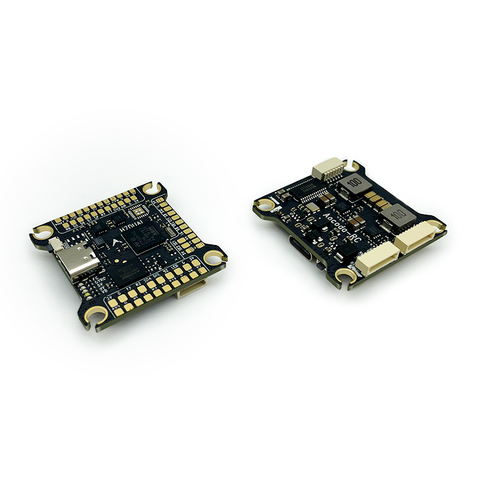
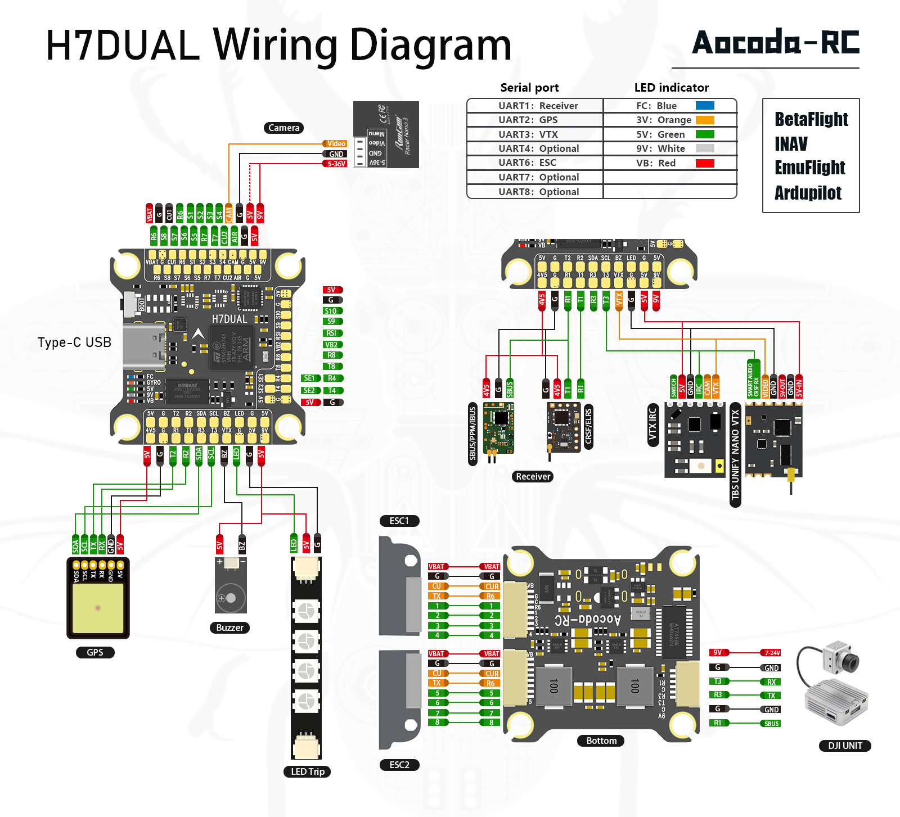

.. _common-aocoda-h743dual:

==================
Aocoda-RC H743Dual
==================

the above image and some content courtesy of `aocoda-rc.com <https://www.aocoda-rc.com/>`__

.. note:: Both versions use the same firmware and differ in the IMU used

Specifications
==============

-  **Processor**

   -  STM32H743VIH6 (480MHz)
   -  128MByte Flash for datalogging

-  **Sensors**

   -  InvenSense MPU6000 or 2x BOSCH BMI270 IMU (accel, gyro)
   -  DPS310 barometer
   -  Voltage & 130A current sensor

-  **Power**

   -  3-6S Lipo input power
   -  5V 2.5A BEC for peripherals
   -  9V 3A BEC for video

-  **Interfaces**

   -  USB port (type-C)
   -  7x UARTS
   -  12x PWM outputs via two 8 pin ESC connectors and/or solder pads
   -  1x RC input PWM/SBUS
   -  I2C port for external compass, airspeed sensor, etc.
   -  DJI Goggles
   -  2x Power Monitor
   -  Buzzer and LED stripe
   -  Built-in OSD

-  **Size and Dimensions**

   - 37 mm x 37 mm
   - 8.8 g

-  **Mounting Hole**

   - 30.5 mm x 30.5 mm

Wiring Diagram
==================

  
Default UART order
==================

- SERIAL0 = USB (MAVLink2)
- SERIAL1 = UART1 (RCinput)
- SERIAL2 = UART2 (GPS) 
- SERIAL3 = UART3 (VTX or DJI HD Air Unit)
- SERIAL4 = UART4 (USER)
- SERIAL5 = not available
- SERIAL6 = UART6 (ESC Telemetry)
- SERIAL7 = UART7 (USER)
- SERIAL8 = UART8 (USER)

.. note:: Serial port protocols (Telem, GPS, etc.) can be adjusted to personal preferences.

RC Input
========

RC input is configured by default on SERIAL1 (USART1). PPM receivers are *not* supported. The 4V5 pin is supplied by both USB and on board 5V BEC from battery.

 - PPM is not supported.
 - SBUS/DSM/SRXL connects to the RX1 pin.
 - FPort requires connection to TX1. Set :ref:`SERIAL1_OPTIONS<SERIAL1_OPTIONS>` = 7. See FPort Receivers.
 - CRSF also requires a TX1 connection, in addition to RX1, and automatically provides telemetry.
 - SRXL2 requires a connection to TX1 and automatically provides telemetry. Set SERIAL6_OPTIONS to “4”.

Any UART can be used for RC system connections in ArduPilot also. See :ref:`common-rc-systems` for details.

RSSI/Analog Airspeed Input
==========================

Analog inputs are provided.

- Airspeed reference pin number is "4"
- RSSI reference pin number is "8".

.. note:: set :ref:`RSSI_TYPE<RSSI_TYPE>` = 1 for analog RSSI, = 3 for RSSI provided by RC protocols such as CRSF.

OSD Support
===========

The Aocoda-RC H743Dual has an on-board OSD using :ref:`OSD_TYPE<OSD_TYPE>` =  1 (MAX7456 driver). The CAM and VTX pins provide connections for using the internal OSD.

DJI Video and OSD
=================

An "SH1.0 6P" connector supports a standard DJI HD VTX connection and SERIAL3 is already setup for this by default.  Pin 1 of the connector is 9V so be careful not to connect this to any peripheral requiring 5V.

Dshot capability
================

All motor/servo outputs 1-10 are Dshot, Bi-Directional DShot, and PWM capable. However, mixing Dshot and normal PWM operation for outputs is restricted into groups, ie. enabling Dshot for an output in a group requires that ALL outputs in that group be configured and used as Dshot, rather than PWM outputs. The output groups that must be the same (PWM rate or Dshot, when configured as a normal servo/motor output) are: 1/2, 3/4, 5/6, 7-10. Outputs 11/12 (SE1/SE2) and 13 (LED) are in separate groups and are not Dshot capable.

GPIOs
=====

The Aocoda-RC H743Dual outputs can be used as GPIOs (relays, buttons, RPM etc). To use them you need to set the output's ``SERVOx_FUNCTION`` to -1. See :ref:`common-gpios` page for more information.

The numbering of the GPIOs for PIN variables in ArduPilot is:

 - PWM1 50
 - PWM2 51
 - PWM3 52
 - PWM4 53
 - PWM5 54
 - PWM6 55
 - PWM7 56
 - PWM8 57
 - PWM9 58
 - PWM10 59
 - PWM11 60
 - PWM12 61
 - LED 62
 - BUZZER 80
 - PINIO1 81 (internal)

VTX Power Control
=================

GPIO 81 controls the VTX BEC output to pins marked “9V”. Setting this GPIO low removes voltage supply to pins.

Set a RELAYx_PIN to “81” to control the switching. Then select an RC channel for control (Chx) and set its RCx_OPTION to the appropriate Relay (1-6) that you had set its pin parameter above.

For example, use Channel 10 to control the switch using Relay 2:

    :ref:`RELAY2_PIN<RELAY2_PIN>` = “81”

    :ref:`RC10_OPTION<RC10_OPTION>` = “34” (Relay2 Control)

.. warning:: PINIO1 is for 9V DC-DC control (HIGH:on; LOW:off). Default 9V DC is ON. Please install an antenna on VTX when battery powered.

Connecting a GPS/Compass module
===============================

This board does not include a GPS or compass so an :ref:`external GPS/compass <common-positioning-landing-page>` should be connected in order for autonomous modes to function.

.. note:: If the GPS is attached to UART2 TX/RX and powered from the adjacent 5V pins, a battery must be plugged in for power to be provided.

.. tip:: you could use the 4V5 pin to supply both the RC and the GPS without a battery attached on the bench for setup as long as the total current does not exceed the USB source (normally 1A on most computers)

Battery Monitor Settings
========================

These should already be set by default. However, if lost or changed:

Enable Battery monitor with these parameter settings :

:ref:`BATT_MONITOR<BATT_MONITOR>` = 4

Then reboot.

First group of battery monitor pins & options:

 - :ref:`BATT_VOLT_PIN<BATT_VOLT_PIN>` = 10
 - :ref:`BATT_CURR_PIN<BATT_CURR_PIN>` = 11
 - :ref:`BATT_VOLT_MULT<BATT_VOLT_MULT>` = 11
 - :ref:`BATT_AMP_PERVLT<BATT_AMP_PERVLT>` = 17.0 (note: Please calibrate before use, depending on current sensor.)

Second group of battery monitor pins & options:

 - :ref:`BATT2_VOLT_PIN<BATT2_VOLT_PIN>` = 18
 - :ref:`BATT2_CURR_PIN<BATT2_CURR_PIN>` = 7
 - :ref:`BATT2_VOLT_MULT<BATT2_VOLT_MULT>` = 11
 - :ref:`BATT2_AMP_PERVLT<BATT2_AMP_PERVLT>` = 17.0 (note: Please calibrate before use, depending on current sensor.)

.. note:: this autopilot uses a high precision current sensor input which is sensitive to ESC switching noise. Please check carefully before use that current readings are accurate across the usage range. If not, low ESR capacitors on the ESC power inputs may need to be added.

Where to Buy
============

- `aocoda-rc.com <https://www.aocoda-rc.com/products/47>`__
- `aocoda-rc aliexpress <https://www.aliexpress.com/item/1005005610849417.html>`__

Firmware
========
This board does not come with ArduPilot firmware pre-installed. Use instructions :ref:`here to load ArduPilot the first time<common-loading-firmware-onto-chibios-only-boards>`.

Firmware for these boards can be found `here <https://firmware.ardupilot.org>`_ in  sub-folders labeled "Aocoda-RC-H743Dual".

.. note:: If you experience issues with the device ceasing to initialize after power up, see :ref:`common-when-problems-arise` section for H7 based autopilots for a possible solution.

[copywiki destination="plane,copter,rover,blimp"]
