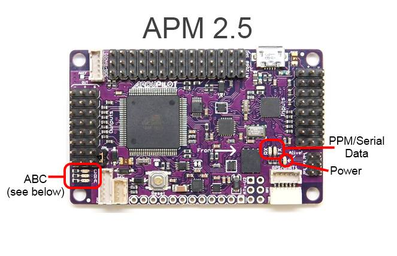

.. _common-apm-board-leds:

=======================
Archived:LEDs (APM 2.x)
=======================

.. warning::

    **ARCHIVED**
    
    The APM2.x is end of life for use with ArduPilot. 
    This article is made available for existing users.

APM 2.5 board
=============

.. raw:: html

   <table>
   <tbody>
   <tr>
   <th>LED:</th>
   <th>Behavior:</th>
   </tr>
   <tr>
   <td>Power</td>
   <td>On when powered</td>
   </tr>
   <tr>
   <td>**A (red)**</td>
   <td>Solid = armed, motors will spin when throttle raisedSingle Blink =
   disarmed, motors will not spinDouble Blink = disarmed, motors will not
   spin, cannot arm because of failure in pre-arm checks</td>
   </tr>
   <tr>
   <td>**B (yellow)**</td>
   <td>Only flashes along with A and B during calibration or as part of the in-flight auto trim feature</td>
   </tr>
   <tr>
   <td>**C (blue)**</td>
   <td>Solid = GPS working, 3D lockBlinking = GPS working, no LockOFF = GPS not attached or not working</td>
   </tr>
   <tr>
   <td>PPM/Serial</td>
   <td>Flashing when data detected</td>
   </tr>
   </tbody>
   </table>

..  youtube:: IeOB4Iz4tpw
    :width: 100%

APM 2.0 board
=============

.. raw:: html

   <table>
   <tbody>
   <tr>
   <th>LEDs:</th>
   <th>Behavior:</th>
   </tr>
   <tr>
   <td>Power</td>
   <td>On when powered</td>
   </tr>
   <tr>
   <td>3D Fix</td>
   <td>Flashing while GPS is waiting for a fix; solid once it has a fix</td>
   </tr>
   <tr>
   <td>ABC</td>
   <td>See below</td>
   </tr>
   </tbody>
   </table>

.. image:: ../../../images/LED_and_their_meaning_APM2.jpg
    :target: ../_images/LED_and_their_meaning_APM2.jpg
