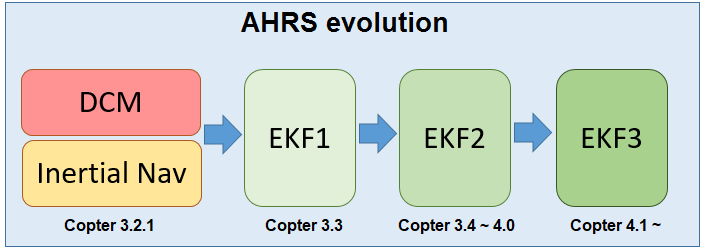

.. _common-apm-navigation-extended-kalman-filter-overview:

============================
Extended Kalman Filter (EKF)
============================

An Extended Kalman Filter (EKF) algorithm is used to
estimate vehicle position, velocity and angular orientation based on
rate gyroscopes, accelerometer, compass, GPS, airspeed and barometric
pressure measurements.

The advantage of the EKF over the simpler complementary filter
algorithms (i.e. "Inertial Nav"), is that by fusing all available measurements it is better
able to reject measurements with significant errors. This makes the
vehicle less susceptible to faults that affect a single sensor. An EKF also
enables measurements from optional sensors such as optical flow and
laser range finders to be used to assist navigation.

Current stable versions of ArduPilot use EKF3 as their primary attitude and position estimation source with DCM running quietly in the background.
If the autopilot has two (or more) IMUs available, two EKF "cores" (i.e. two instances of the EKF) will run in parallel, each using a different IMU.
At any one time, only the output from a single EKF core is ever used, that core being the one that reports the best health which is determined by the consistency of its sensor data.

Most users should not need to modify any EKF parameters, but the information below provides some information on those parameters that are most commonly changed.
More detailed information can be found on the :ref:`developer EKF wiki page <dev:extended-kalman-filter>`. 

Should the EKF2 or EKF3 be used?
--------------------------------

In general, we recommend users stick with the EKF3, which is now the default. In addition, 1MB autopilots only have this option due to space limitations. EKF2 can still be used but does not have many of the enhancements of EKF3 such as newer sensor sources including Beacons, Wheel Encoders and Visual Odometry.

Choosing the EKF and number of cores
------------------------------------

:ref:`AHRS_EKF_USE <dev:extended-kalman-filter_ahrs_ekf_use>`: set to "1" to use the EKF, "0" to use DCM for attitude control and
inertial nav (Copter-3.2.1) or ahrs dead reckoning (Plane) for position control.  In Copter-3.3 (and higher) this parameter is forced to "1" and cannot be changed.

:ref:`AHRS_EKF_TYPE <AHRS_EKF_TYPE>`: set to "2" to use EKF2 for attitude and position estimation, "3" for EKF3.

:ref:`EK2_ENABLE <EK2_ENABLE>`, :ref:`EK3_ENABLE <EK3_ENABLE>`: set to "1" to enable the EKF2 and/or EKF3 respectively.

:ref:`EK2_IMU_MASK <EK2_IMU_MASK>`, :ref:`EK3_IMU_MASK <EK3_IMU_MASK>`: a bitmask specifying which IMUs (i.e. accelerometer/gyro) to use.  An EKF "core" (i.e. a single EKF instance) will be started for each IMU specified.

-  1: starts a single EKF core using the first IMU
-  2: starts a single EKF core using only the second IMU
-  3: starts two separate EKF cores using the first and second IMUs respectively

:ref:`EK3_PRIMARY<EK3_PRIMARY>`: selects which "core" or "lane" is used as the primary. A value of 0 selects the first IMU lane in the :ref:`EK3_IMU_MASK <EK3_IMU_MASK>`, 1 the second, etc. Be sure that the selected primary lane exists. See Affinity and Lane Switching below.

.. note::

   Plane and Rover will fall back from EKF2 or EKF3 to DCM if the EKF becomes unhealthy or the EKF is not fusing GPS data despite the GPS having 3D Lock.
   There is no fallback from EKF3 to EKF2 (or EKF2 to EKF1)

.. warning::

   Using the parameters above it is possible to run up to 5 AHRSs in parallel at the same time (DCMx1, EKF2x2, EKF3x2) but this can result in performance problems so if running EKF2 and EKF3 in parallel, set the IMU_MASK to reduce the total number of cores.

Affinity and Lane Switching
----------------------------

EKF3 provides the feature of sensor affinity which allows the EKF cores to also use non-primary instances of sensors, specifically, Airspeed, Barometer, Compass (Magnetometer) and GPS. This allows the vehicle to better manage good quality sensors and be able to switch lanes accordingly to use the best-performing one for state estimation. For more details and configuration, refer :ref:`EKF3 Affinity and Lane Switching <common-ek3-affinity-lane-switching>`.

GPS / Non-GPS Transitions
-------------------------

EKF3 (in ArduPilot 4.1 and higher) supports in-flight switching of sensors which can be useful for transitioning between GPS and Non-GPS environments.  See :ref:`GPS / Non-GPS Transitions <common-non-gps-to-gps>` for more details.

Commonly modified parameters
----------------------------

:ref:`EK2_ALT_SOURCE <EK2_ALT_SOURCE>` which sensor to use as the primary altitude source

-  0 : use barometer (default)
-  1 : use range finder.  **Do not use this option unless the vehicle is being flown indoors where the ground is flat**.  For terrain following please see :ref:`copter <terrain-following>` and :ref:`plane specific terrain following instructions <common-terrain-following>` which do not require changing this parameter.
-  2 : use GPS.  Useful when GPS quality is very good and barometer drift could be a problem.  For example if the vehicle will perform long distance missions with altitude changes of >100m.

:ref:`EK2_ALT_M_NSE <dev:extended-kalman-filter_ekf_alt_noise>`: Default is "1.0".  Lower number reduces reliance on accelerometers, increases reliance on barometer.

:ref:`EK2_GPS_TYPE <dev:extended-kalman-filter_ekf_gps_type>`:
Controls how GPS is used.

-  0 : use 3D velocity & 2D position from GPS
-  1 : use 2D velocity & 2D position (GPS velocity does not contribute
   to altitude estimate)
-  2: use 2D position
-  3 : no GPS (will use :ref:`optical flow <copter:common-optical-flow-sensors-landingpage>` only if available)

:ref:`EK2_YAW_M_NSE <EK2_YAW_M_NSE>`: Controls the weighting between GPS and Compass when calculating the heading.  Default is "0.5", lower values will cause the compass to be trusted more (i.e. higher weighting to the compass)
   
As mentioned above, a more detailed overview of EKF theory and tuning parameters is available on the developer wiki's :ref:`Extended Kalman Filter Navigation Overview and Tuning <dev:extended-kalman-filter>`.
