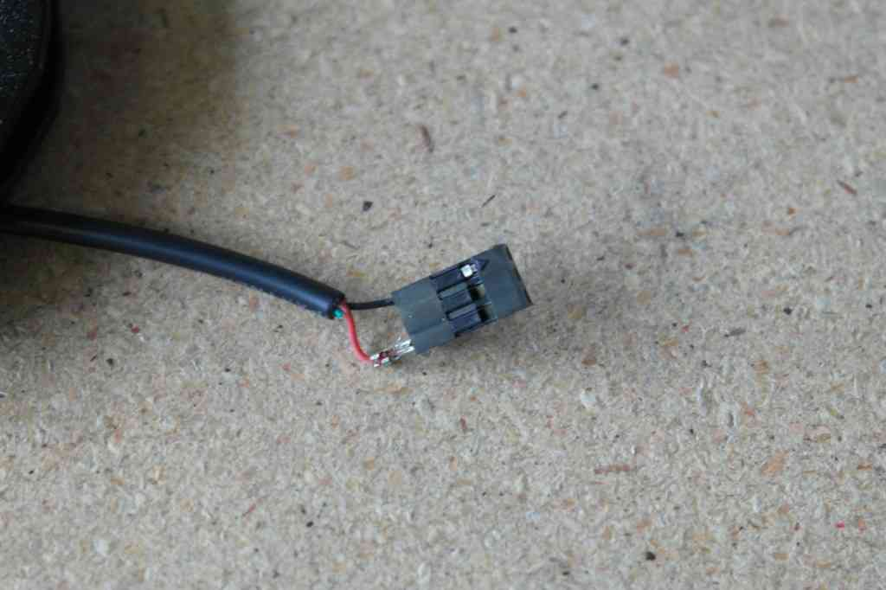

.. _common-apm-to-chdk-camera-link-tutorial:

====================================
Camera Shutter Triggering using CHDK
====================================

This article explains how to set up camera shutter triggering for Canon
Cameras that support the `Canon Hacker Development Kit <http://chdk.wikia.com/wiki/CHDK>`__ (CHDK).

Overview
========

ArduPilot allows you to 
:ref:`configure a servo or relay output as the control signal for the camera shutter <common-camera-shutter-with-servo>` 
so that it can be used in
:ref:`Camera Missions <common-camera-control-and-auto-missions-in-mission-planner>`.
Additional hardware is required to convert the shutter activation signal
to the format expected by the particular camera.

This article explains how to set up the shutter-trigger for Canon
Cameras that support the *Canon Hacker Development Kit* (CHDK). The
method connects the ArduPilot output to the camera using a \*custom
cable\*, and causes a script running on the camera to take pictures when
the *relay* output voltage goes high.

At the end of the article is a 
:ref:`list of cables that you can purchase <common-apm-to-chdk-camera-link-tutorial_chdk_cables_for_purchase>` 
instead of using the custom cable (please extend this list if you find another appropriate cable).

The article covers both Pixhawk and APM2.x.

   APM Connected to aCanon SX260 HS using a custom cable

.. note::

   It is also possible to use a 
   :ref:`servo output instead of a relay <common-apm-to-chdk-camera-link-tutorial_using_a_servo_instead_of_a_relay>`.

CHKD and ArduPilot integration
==============================

CHDK is an experimental (and free) development tool, which temporarily
patches (supported) *Canon cameras* so that they can be controlled using
scripts. The scripts are able to take pictures, control the camera zoom,
set the focus, and access many other camera features.

Scripts can also read the camera USB port voltage and execute different
instructions/functions based on the signal pulse-length. When using a
relay, the script can be very simple — all it needs to do is check the
voltage (in a loop), and take a picture when it detects the relay
voltage go high. More complicated scripts might first set the focus,
zoom, or preform any other default behaviour.

The `CHDK Wiki <http://chdk.wikia.com/wiki/CHDK>`__ documentation
explains which cameras are supported, how you install CHDK on you
camera, and how to install and run scripts.

Cable for connecting to Pixhawk
===============================

.. note::

   See :ref:`CHDK cables for purchase <common-apm-to-chdk-camera-link-tutorial_chdk_cables_for_purchase>` if
   you just want to buy a cable. This section is useful if you want to
   create your own cable or understand what the cable needs to do.

For Pixhawk you have to modify the APM cable in the following section,
adding a circuit step the output pin signal voltage from 3.3 to 5 volts.
This is required because the relay/servo output voltage is approximately
3.3V while CHDK needs 5V to trigger.

A circuit and PCB you can use are shown below. 5V should be supplied
from a BEC (or from a BEC powering the central pin on the AUX output
rail) because the servo rail itself is not powered.

1 x BC547 or 2N3904

1 x BC557 or 2N3906

2 x 1 K

1 x 220 ohm

.. figure:: http://api.ning.com/files/6A05RJELsODapmzmxrkfVjh3WsYV3VM6gRNmnUfTqO8MDOtaCuWg6baF2UChPaKaq52lXT63W*i-uwbGNqEGfbEczIHGK3ER/3.3vto5vlogiclevelshifterwithtransistorsinproteus.jpg
   :target:  https://diydrones.com/forum/topics/using-aux-pins-as-relays-for-chdk?commentId=705844%3AComment%3A1581209

   3Vto 5V Shifter Circuit

.. figure:: http://api.ning.com/files/iAT0B9wCR3AoT2PagGiqpRaMPAUgnytMSGSeJ7sSKh9gtRNuhdzj01dCdTkRLM2*x0pN58LfGHlqFbKfTThHXPkyjaetHNu-/Pixhawk_35_diag.png
   :target:  https://diydrones.com/forum/topics/using-aux-pins-as-relays-for-chdk?commentId=705844%3AComment%3A1594680

   3V to5V Shifter (PCB)

.. note::

   The voltage stepper circuit and PCB above are `from the community discussion boards <https://diydrones.com/forum/topics/using-aux-pins-as-relays-for-chdk?commentId=705844%3AComment%3A1581209>`__.

It is also possible to find pre-built stepper circuits like the
`SparkFun 5V Step-Up Breakout - NCP1402 <https://www.sparkfun.com/products/10968>`__ (not tested).

Cable for connecting to APM
===========================

A cable is needed to connect the APM board to the camera USB port. This
section shows how to modify the USB cable that is supplied with the
camera, replacing the standard USB connector with a 3-position header
that can connect to the AMP output port.

.. note::

   This example uses the USB Mini-B connector that comes with the
   SX260 HS camera. The same approach should work equally well using the
   supplied cable on any CHDK-supported Canon Powershot camera.

The components used to attach the servo connector to the wire are shown
below. If you don’t have a crimp tool you can just solder a spare servo
wire connector instead.

   APM CHDK Camera Control Cable: Parts needed

We’ll only be using the Mini-B side of this cable, so measure whatever
length you need from that end depending on how your camera and autopilot
mount in your airframe. I’ve measured out about 14″ and cut the cable
completely through. Inside are four wires, we only need the red and
black wire so cut away the green and white wires. Strip the ends of the
red and black wires.

.. figure:: ../../../images/USB_StrippedWires-1024x682.jpg
   :target: ../_images/USB_StrippedWires-1024x682.jpg

   CHDK Camera Control Cable:Stripped Wires

If you have the crimp tool, crimp and insert the wires into the first
and third positions of a 3-position header. If you don’t have the crimp
tool, solder these two wires to the ground and signal wires of a spare
servo wire. Insert the ground wire into the side with an arrow so you
can tell which wire is which later on.

   CHDK Camera Cable:Attaching the 3-Position Header

Cover the connector with heatshrink. Be careful with the hot air near
the connector as it can cause the locking plastic pieces in the
receptacle to deform.

   ACHDK Camera Cable: Connector covered withHeatshrink

Camera shutter configuration in Mission Planner
===============================================

:ref:`Camera Shutter Configuration in Mission Planner <common-camera-shutter-with-servo>` explains how to configure
a Pixhawk AUX output or the APM2.x A9 pin as a relay camera trigger.
Connect the cable to the appropriate port as described, and to the
camera.

The specific Mission Planner settings required for this CHDK hardware
are listed below. Note that duration required may be different on some
cameras:

-  Pixhawk:

   -  ``CAM_TRIG_TYPE``: 1 (Relay).
   -  ``Shutter (Port)``: RC10 (Name of connected port, in this example
      we use RC10 = AUX2).

-  APM2.x:

   -  ``Shutter (Port)``: Relay (A9 Pin).

-  ``Shutter Duration``: 1 (1/10 second)
-  ``CH7_OPT`` : 9 (Optional - enables manual shutter triggering on
   Copter only).

The servo settings are not used for the relay configuration, and can be
ignored.

Creating and installing the CHDK script
=======================================

One of the simplest scripts you can use is **E38_APM.bas**, which
simply waits on the relay signal and then takes a picture (originally
from www.event38.com):

::

    rem Event 38 APM Tie-In Script
    rem Free For Modification & Distribution
    @title E38_APM
    print "Script Started, Listening"
    sleep 1000
    goto "interval"
    :interval
      p = get_usb_power
      if p > 0 then goto "picture"
      goto "interval"
    :picture
      press "shoot_full"
      sleep 50
      release "shoot_full"
      goto "interval"
    :terminate
      print "Shut-Down Command Received"
      sleep 1000
      shut_down

Alternatively you can use a more advanced script to set up the camera
focus, exposure or other settings before taking the picture. A good
starting point is the open source `KAP UAV Exposure Control Script <http://chdk.wikia.com/wiki/KAP_UAV_Exposure_Control_Script>`__
(v3.1). This was used as the basis for the `3DR Aero Plane <https://3dr.com/kb/aero-m/>`__ *3DR EAI (Exposure-Aperture-ISO)*
script described in the `Aero-M Operation Manual <https://3dr.com/kb/aero-m/>`__.

The `CHDK Wiki <http://chdk.wikia.com/wiki/CHDK>`__ explains how you set
up CHDK and install and activate scripts for your particular camera.
Installing scripts is usually as simple as copying them into the
"scripts" directory on your SD card. You can then activate them by
navigating to the menu **Miscellaneous Stuff \| Remote Parameters** and
making sure the **Enable Remote** setting is checked.

.. figure:: ../../../images/CHDK_Camera_Enable_Remote.jpg
   :target: ../_images/CHDK_Camera_Enable_Remote.jpg

   CHDK: Camera Menu to EnableRemote

Testing
=======

Load and run your CHDK script. On Copter you should be able to trigger
the shutter using the CH7 switch.

On other vehicles set the ``CAM_TRIGG_DIST`` to 1 or 2 meters. Small
changes in the GPS readings will cause the distance value to count up
slowly and it should trigger the shutter every few seconds. If nothing
happens at all, take your vehicle outside and walk around to make sure
that some distance is detected. If your camera lens closes and opens
instead of taking a picture, make sure the CHDK *remote enable* setting
is activated on the camera.

.. _common-apm-to-chdk-camera-link-tutorial_using_a_servo_instead_of_a_relay:

Using a servo instead of a relay
================================

It is also possible to trigger the camera shutter using a servo output,
but that requires additional (and often more expensive) hardware to
decode the servo's PWM signal. 
The :ref:`CHDK Camera Control Tutorial <common-chdk-camera-control-tutorial>` describes a suitable
PWM-to-voltage pulse cable, and information from which the servo
settings can be inferred.

.. note::

   The :ref:`CHDK Camera Control Tutorial <common-chdk-camera-control-tutorial>` integrates with the
   camera as a "generic servo" rather than as a shutter trigger. This
   approach means that camera triggering is not as well integrated with
   mission planning, but more camera commands can be called.

.. _common-apm-to-chdk-camera-link-tutorial_chdk_cables_for_purchase:
   
CHDK Cables for purchase
========================

This section is for listing CHDK cables that you can purchase (rather
than creating your own, as described in this article). Please extend the
list if you discover more.

Tuffwing camera trigger cable for Pixhawk
=========================================

Tuffwing camera trigger cable for connecting Pixhawk to a CHDK Canon
PowerShot. This includes circuitry to upscale the Pixhawk 3.3 volt
signal to 5 volts from the + pin. You'll need to have an ESC with an BEC
or UBEC plugged into any of the open AUX or MAIN OUTs on the Pixhawk.

-  `Purchase from Tuffwing store <http://www.tuffwing.com/store/store.html#PixHawk_Camera_Trigger_Cable>`__
-  `Pixhawk Camera Trigger Cable <http://www.tuffwing.com/support/pixhawk_camera_trigger_cable.html>`__
   (User Guide)

.. figure:: http://www.tuffwing.com/images/pixhawk_trigger_cable.jpg
   :target:  http://www.tuffwing.com/store/store.html#PixHawk_Camera_Trigger_Cable

   Tuffwing Pixhawk CHDK Camera Trigger Cable
