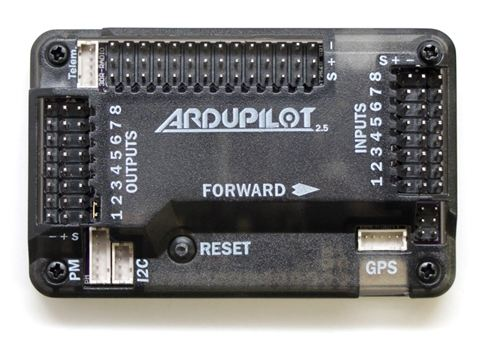
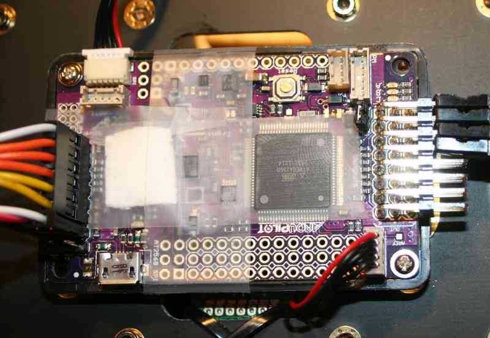

.. _common-apm25-and-26-overview:

=================================
Archived:APM 2.5 and 2.6 Overview
=================================

.. warning::

    The APM2.x is end of life for use with ArduPilot.
    This article is made available for existing users.

APM 2.5
=======

[site wiki="copter" heading="off"]
.. warning::

   The APM2.6 board is no longer supported for Copter. From Copter
   3.3 firmware (and later) no longer fits on APM boards. The last firmware
   builds that can be installed (AC v3.2.1) can be downloaded from here:
   `APM2.x <https://download.ardupilot.org/downloads/wiki/firmware/ArduCopter_APM_2.0_Firmware_3.2.1.zip>`__
   and
   `APM1.x <https://download.ardupilot.org/downloads/wiki/firmware/ArduCopter_APM_1.0_Firmware_3.2.1.zip>`__

.. warning::

   The APM2.6 board is no longer supported for Plane. The last
   firmware build that fits on the APM is Plane 3.3.0.
[/site]

The APM 2.5 board requires no assembly, and is ready for firmware. You
have a choice of side or top entry pin configuration, in order to
accommodate a variety of installations. You'll see this option when you
order.

This page gives you a look under the hood, and goes into more detail
about the design of this board.

The APM 2.5 has some improvements over the APM 2.0, but they both have a
very similar layout and function.

APM 2.6
=======

-  **APM 2.6** is a revision of the APM that makes use of an external
   compass.
-  The APM 2.6 has no on board compass, and is optimized for vehicles
   where the compass should be placed as far from power and motor
   sources as possible to avoid magnetic interference.
-  APM 2.6 is designed to be used with the 3DR GPS uBlox LEA-6 with
   Compass module.
-  The GPS/Compass module may be mounted further from noise sources than
   the APM itself.
-  APM 2.6 requires a GPS unit with an on board compass for full
   autonomy.
-  For information on installing a 3DR GPS uBlox LEA-6 with Compass,
   visit :ref:`3DR Power Module <common-installing-3dr-ublox-gps-compass-module>`.

.. image:: ../../../images/apm25.3.jpg
    :target: ../_images/apm25.3.jpg

Using the APM 2.5/2.6 Enclosure
===============================

The APM 2.5/2.6 board is shipped in an enclosure with foam protecting
the barometric pressure sensor, as shown here.

Not using the APM Enclosure
===========================

If you aren't using the enclosure, make sure to cover the barometric
sensor with some open cell foam, cotton padding or tissue to protect it
from prop wash, wind and turbulence. Also, the barometric sensor is
sensitive to light and readings can change by several meters from direct
sunlight to shade. Some type of light shield (on top of the foam) will
minimize the effects of light changes.

.. _common-apm25-and-26-overview_powering_the_apm2:

Powering the APM2
=================

The most common way to power the APM2 is to use the :ref:`3DR Power Module <common-3dr-power-module>`.

Detailed information on powering the APM and providing power to Servos
is provided in :ref:`Powering the APM2 <common-powering-the-apm2>`.

.. _common-apm25-and-26-overview_explanation_of_solder_jumper_options_on_the_bottom_of_the_board:

Explanation of solder jumper options on the bottom of the board
===============================================================

.. image:: ../../../images/apm25-explained.jpg
    :target: ../_images/apm25-explained.jpg

Changing your telemetry to use UART2 (aka Serial3)
--------------------------------------------------

By default an Xbee connected to the APM2 will use UART0 (aka "Serial" in
Arduino) which is shared with the USB as mentioned above. If you wish to
instead use UART2 (aka "Serial3") for telemetry you can change the
"AutoMUX UART0" jumper on the bottom of the APM2.

Although difficult to see, by default there are two small jumpers
between the upper pads that must be cut with an X-Acto blade. Then a new
solder bridge must be made to join the bottom pads.

.. image:: ../../../images/BOTTOM_AutoMUX_UART02_small.jpg
    :target: ../_images/BOTTOM_AutoMUX_UART02_small.jpg

APM 2.5 Board Features
----------------------

.. image:: ../../../images/apm.jpg
    :target: ../_images/apm.jpg

APM 2.5 Board Assembly Options
------------------------------

.. image:: ../../../images/Assembly_APM25.jpg
    :target: ../_images/Assembly_APM25.jpg

-  Quadzimodo has produced a really nice editable 3D model of the APM
   2.5 board in SketchUp 8: \ **`APM 2.5 Google Sketchup File <http://api.ning.com/files/z*snRdi7rtEVMDL6zeTTD678X-*SIqNkeiepEP-wb-0A5OFmvQtg033sq9pqhoTVdRIYs9ti10ygSpGNk-hhNnRNbQd8kV78/APM2.5SketchupFile.zip>`__**

.. image:: ../../../images/APM2.5frontquarter.jpg
    :target: ../_images/APM2.5frontquarter.jpg

.. _common-apm25-and-26-overview_analog_input_pins:

Analog input pins
=================

Pin 0 to 8: The APM2 has a row of analog input pins down one side,
labelled A0 to A8 on the underside of the board. These are available as
pin numbers 0 to 8 inclusive in PIN variables.

All these pins can take up to 5V and may be used for any general analog
input. They are commonly used for airspeed and sonar inputs.

Pin 12: power management connector current pin, accepts up to 5V,
usually attached to 3DR power brick with 17:1 scaling

Pin 13: power management connector voltage pin, accepts up to 5V,
usually attached to 3DR power brick with 10.1:1 scaling

.. image:: ../../../images/apm2_analog_pins2.jpg
    :target: ../_images/apm2_analog_pins2.jpg

Digital output pins
===================

The APM2 uses the same set of 9 analog input pins as digital output
pins. They are configured as digital output pins automatically when you
start to use them as digital outputs.

Pin 54 to 62: You need to add 54 to the pin number to convert from an
analog pin number to a digital pin number. So pin 54 is digital output
pin on the A0 connector. Pin 58 is A4 etc.

These pins are usually used with the RELAY_PIN to RELAY_PIN4
parameters, allowing you to control things like camera shutter, bottle
drop etc. They are also used as sonar "stop" pins allowing you to have
multiple sonars and not have them interfere with each other.

.. toctree::
    :maxdepth: 1

[site wiki="rover"]
    APM2 Wiring and QuickStart <rover-apm2-setup>
[/site]

[site wiki="copter"]
    Archived:APM2.x Wiring QuickStart <connecting-the-apm2>
[/site]

[site wiki="plane"]
    APM2.x Wiring QuickStart <archived-apm2x-wiring-quickstart>
    externalmagentometer-apm2x
[/site]
    
    Powering the APM2 <common-powering-the-apm2>
    Connecting the Radio Receiver (APM2) <common-connecting-the-radio-receiver-apm2>
    LEDs <common-apm-board-leds>
    PPM Encoder <common-ppm-encoder-apm2x-atmega32u2>

