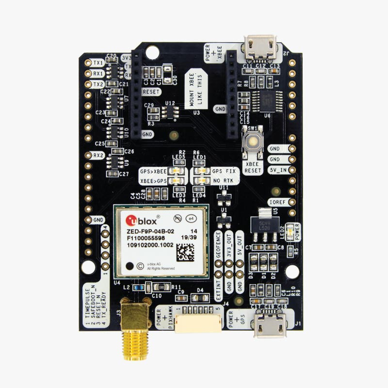
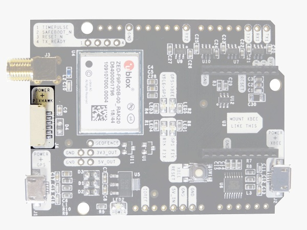

.. _common-ardusimple-rtk-gps-simplertk2b-budget:

======================================================
ArduSimple RTK GPS simpleRTK2B Budget (u-blox ZED-F9P)
======================================================

simpleRTK2B Budget (u-blox ZED-F9P) is a GNSS/RTK receiver which provides centimeter accurate GNSS positioning and navigation for more accurate and reliable autonomous operations.

It provides:

   -  Down to centimeter GPS accuracy
   -  Up to 10 RTK position updates per second 
   -  Multiband: L1, L2, E5b support

Where to Buy
============

- `ArduSimple simpleRTK2B Budget (u-blox ZED-F9P) <https://www.ardusimple.com/product/simplertk2b/>`_

Pin Map
=======

The system is connected to the autopilot via one of its UARTs.

The JST-GH connector is following the Pixhawk standard:

   -  1: 5V_IN
   -  2: ZED-F9P UART1 RX (3.3V level)
   -  3: ZED-F9P UART1 TX (3.3V level)
   -  4,5: Not connected
   -  6: GND

Wiring and Connections
======================
All ArduSimple GNSS models come with a JST GH 6-pin connector/cable that is compatible with the Pixhawk family and many other autopilots.

XBee socket
===========
The onboard XBee socket can be used to expand functionality with `Plugin accessories <https://www.ardusimple.com/radio-links/>`_ (MR/LR radios, Bluetooth, WiFi, Ethernet, Dataloggers, RS232, Canbus, L-Band). 

Not compatible with high power XBee accessories (XLR radio and 4G NTRIP Master). To have this full compatibility consider `simpleRTK2B Pro. <https://www.ardusimple.com/product/simplertk2b-pro/>`

.. note:: The cables/connectors may be modified to connect to other autopilot boards, using the Pin Map information provided above.

ArduPilot integration
=====================
For normal GPS only operation, ArduPilot’s GPS parameter defaults will work for any serial port configured for ``SERIALx_PROTOCOL`` = 5.
To set up simpleRTK2B Budget receiver to use with ArduPilot, we have prepared several tutorials:

1. `Configuration tutorial: simpleRTK2B Budget (u-blox ZED-F9P) and ArduPilot. <https://www.ardusimple.com/how-to-configure-simplertk2b-basic-starter-kit-zed-f9p-module-and-connect-it-to-ardupilot-to-get-centimeter-accurate-gps-location/>`_

2. To achieve centimeter-level precision in positioning, RTK correction data must be sent to your drone in real time. There are two main methods for delivering this correction data:

   -  Using NTRIP correction service:  If you are going to operate in areas with reliable internet connection and NTRIP service coverage, follow `Tutorial on sending NTRIP corrections to ArduPilot. <https://www.ardusimple.com/send-ntrip-corrections-to-ardupilot-with-missionplanner-qgroundcontrol-and-mavproxy/>`_  If you are not aware of NTRIP service provider in your area, we have prepared the `List of RTK correction service providers in your country. <https://www.ardusimple.com/rtk-correction-services-in-your-country/>`_ 
   -  Using RTK corrections from a Base Station: if there is no internet access or NTRIP correction service available in your area, refer to ArduSimple’s `tutorial on sending RTK corrections from Base station to ArduPilot. <https://www.ardusimple.com/send-rtk-base-station-corrections-to-ardupilot-with-missionplanner-qgroundcontrol-and-mavproxy/>`_ 

More information
================
   -  `User Guide: simpleRTK2B Budget <https://www.ardusimple.com/user-guide-simplertk2b-budget/>`_  
   -  `How to configure u-blox ZED-F9P <https://www.ardusimple.com/how-to-configure-ublox-zed-f9p/>`_ 