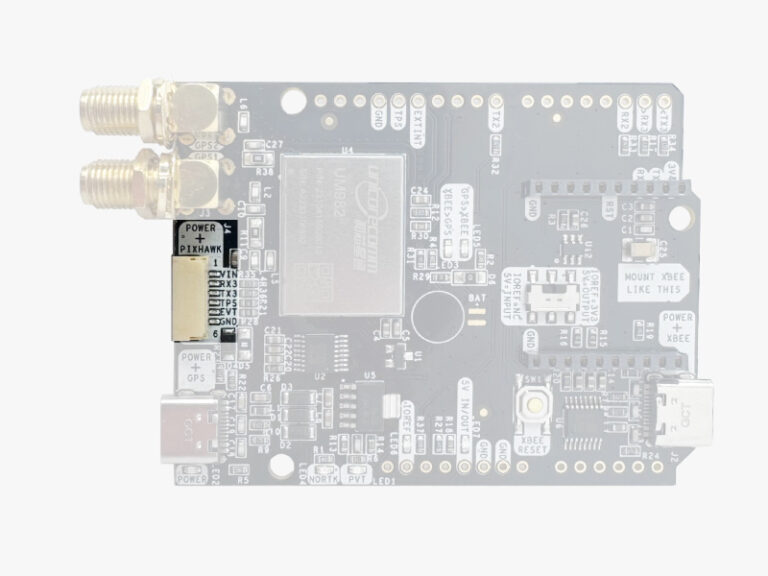

.. _common-ardusimple-rtk-gps-simplertk3b-compass:

============================================================================
ArduSimple RTK GPS simpleRTK3B Compass (Unicore UM982, Dual antenna heading)
============================================================================

simpleRTK3B Compass is a GNSS/RTK receiver with dual antenna which provides centimeter accurate GNSS positioning and determine precise orientation (heading).

Key features:

   -  Down to 10 millimeters GPS accuracy
   -  Heading accuracy of 0.1° per meter of Baseline distance
   -  Up to 50 RTK position updates per second 
   -  Tripleband: L1, L2, L5 support
   -  Basic jamming immunity 

Where to Buy
============

- `ArduSimple simpleRTK3B Compass (Unicore UM982, Dual antenna heading) <https://www.ardusimple.com/product/simplertk3b-compass/>`_

Pin Map
=======

The system is connected to the autopilot via one of its UARTs.

The JST-GH connector is following the Pixhawk standard:

   -  1: 5V_IN
   -  2: Unicore COM3 RX (3.3V level)
   -  3: Unicore COM3 TX (3.3V level)
   -  4: Timepulse output (3.3V level)
   -  5: Extint (3.3V level)
   -  6: GND

Wiring and Connections
======================
All ArduSimple GNSS models come with a JST GH 6-pin connector/cable that is compatible with the Pixhawk family and many other autopilots.

XBee socket
===========
The onboard XBee socket can be used to expand functionality with `Plugin accessories <https://www.ardusimple.com/radio-links/>`_ (MR/LR/XLR radios, Bluetooth, WiFi, Ethernet, Dataloggers, RS232, Canbus, L-Band, 4G/3G/2G). 

.. note:: The cables/connectors may be modified to connect to other autopilot boards, using the Pin Map information provided above.

ArduPilot integration
=====================
For normal GPS only operation, ArduPilot’s GPS parameter defaults will work for any serial port configured for ``SERIALx_PROTOCOL`` = 5.
To set up simpleRTK3B Compass receiver to use with ArduPilot, we have prepared several tutorials:

1. `Configuration tutorial: simpleRTK3B Compass (Unicore UM982) and ArduPilot. <https://www.ardusimple.com/how-to-set-up-simplertk3b-compass-with-the-unicore-um982-in-ardupilot-for-high-precision-gnss-heading/>`_

2. To achieve centimeter-level precision in positioning, RTK correction data must be sent to your drone in real time. There are two main methods for delivering this correction data:

   -  Using NTRIP correction service:  If you are going to operate in areas with reliable internet connection and NTRIP service coverage, follow `Tutorial on sending NTRIP corrections to ArduPilot. <https://www.ardusimple.com/send-ntrip-corrections-to-ardupilot-with-missionplanner-qgroundcontrol-and-mavproxy/>`_  If you are not aware of NTRIP service provider in your area, we have prepared the `List of RTK correction service providers in your country. <https://www.ardusimple.com/rtk-correction-services-in-your-country/>`_ 
   -  Using RTK corrections from a Base Station: if there is no internet access or NTRIP correction service available in your area, refer to ArduSimple’s `tutorial on sending RTK corrections from Base station to ArduPilot. <https://www.ardusimple.com/send-rtk-base-station-corrections-to-ardupilot-with-missionplanner-qgroundcontrol-and-mavproxy/>`_ 

More information
================
   -  `User Guide: simpleRTK3B Compass <https://www.ardusimple.com/user-guide-simplertk3b-compass/>`_  
   -  `How to configure Unicore UM98x Mosaic-X5 <https://www.ardusimple.com/how-to-configure-unicore-um980-um981-um982/>`_ 
   -  `How GPS can help you measure the real heading of your vehicle <https://www.ardusimple.com/how-gps-can-help-you-measure-the-real-heading-of-your-vehicle/>`_ 