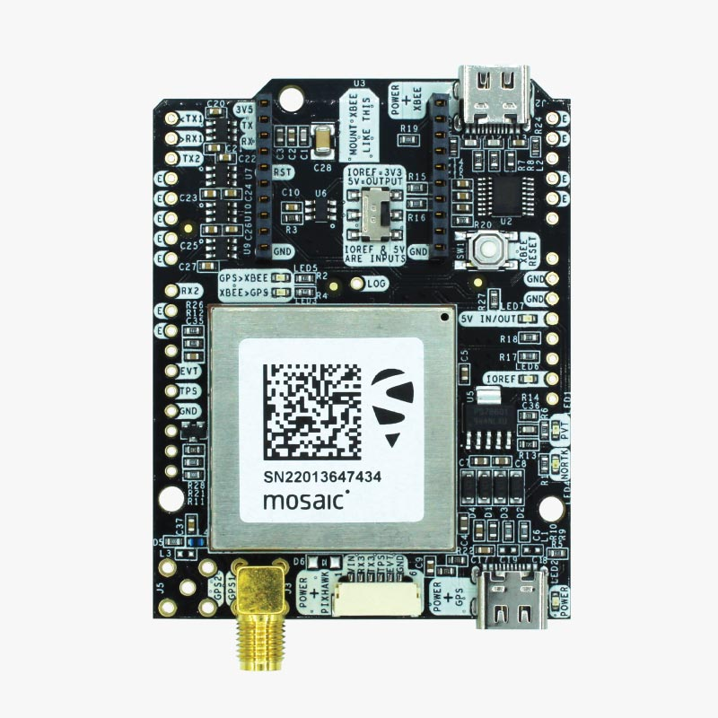
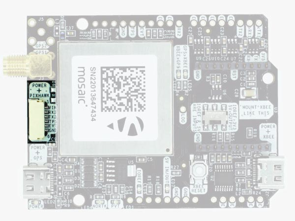

.. _common-ardusimple-rtk-gps-simplertk3b-pro:

=========================================================
ArduSimple RTK GPS simpleRTK3B Pro (Septentrio Mosaic-X5)
=========================================================

simpleRTK3B Pro (Septentrio Mosaic-X5) is a GNSS/RTK receiver which provides millimeter accurate GNSS positioning and has for anti-jamming and anti-spoofing capabilities for more reliable autonomous navigation on challenging environments.

Key features:

   -  Down to 10 millimeters GPS accuracy
   -  Up to 100 RTK position updates per second 
   -  Tripleband: L1, L2, L5 support
   -  Anti-jamming and anti-spoofing capabilities

Where to Buy
============

- `ArduSimple simpleRTK3B Pro (Septentrio Mosaic-X5) <https://www.ardusimple.com/product/simplertk3b-x5/>`_

Pin Map
=======

The system is connected to the autopilot via one of its UARTs.

The JST-GH connector is following the Pixhawk standard:

   -  1: 5V_IN
   -  2: Mosaic COM3 RX (3.3V level)
   -  3: Mosaic COM3 TX (3.3V level)
   -  4: Timepulse output (3.3V level)
   -  5: Event input (3.3V level) 
   -  6: GND

Please note that the board only includes GPS and doesn’t include a compass.

Wiring and Connections
======================
All ArduSimple GNSS models come with a JST GH 6-pin connector/cable that is compatible with the Pixhawk family and many other autopilots.

XBee socket
===========
The onboard XBee socket can be used to expand functionality with `Plugin accessories <https://www.ardusimple.com/radio-links/>`_ (MR/LR/XLR radios, Bluetooth, WiFi, Ethernet, Dataloggers, RS232, Canbus, L-Band, 4G/3G/2G). 

.. note:: The cables/connectors may be modified to connect to other autopilot boards, using the Pin Map information provided above.

ArduPilot integration
=====================
For normal GPS only operation, ArduPilot’s GPS parameter defaults will work for any serial port configured for ``SERIALx_PROTOCOL`` = 5.
To set up simpleRTK3B Pro receiver to use with ArduPilot, we have prepared several tutorials:

1. `Configuration tutorial: simpleRTK3B Pro (Septenrio Mosaic- X5) and ArduPilot. <https://www.ardusimple.com/how-to-configure-triple-band-septentrio-gnss-receiver-and-connect-it-to-ardupilot/>`_

2. To achieve centimeter-level precision in positioning, RTK correction data must be sent to your drone in real time. There are two main methods for delivering this correction data:

   -  Using NTRIP correction service:  If you are going to operate in areas with reliable internet connection and NTRIP service coverage, follow `Tutorial on sending NTRIP corrections to ArduPilot. <https://www.ardusimple.com/send-ntrip-corrections-to-ardupilot-with-missionplanner-qgroundcontrol-and-mavproxy/>`_  If you are not aware of NTRIP service provider in your area, we have prepared the `List of RTK correction service providers in your country. <https://www.ardusimple.com/rtk-correction-services-in-your-country/>`_ 
   -  Using RTK corrections from a Base Station: if there is no internet access or NTRIP correction service available in your area, refer to ArduSimple’s `tutorial on sending RTK corrections from Base station to ArduPilot. <https://www.ardusimple.com/send-rtk-base-station-corrections-to-ardupilot-with-missionplanner-qgroundcontrol-and-mavproxy/>`_ 

More information
================
   -  `User Guide: simpleRTK3B Pro <https://www.ardusimple.com/user-guide-simplertk3b-pro/>`_  
   -  `How to configure Septentrio Mosaic-X5 <https://www.ardusimple.com/how-to-configure-septentrio-mosaic-x5-and-mosaic-h/>`_ 
