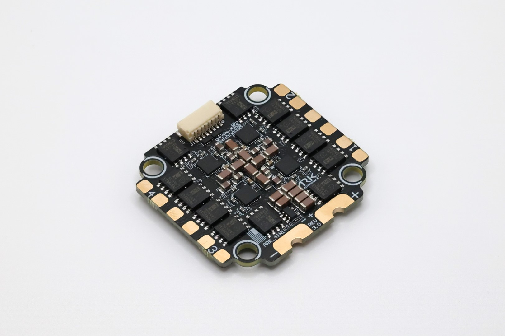

.. _common-ark-4in1-esc:

============
ARK 4IN1 ESC
============

NDAA compliant, made in the USA, 4 in 1 electronic speed controller running open source AM32 firmware.

Specifications
==============

- **Features**
   
   - Battery Voltage: 3-8s
   - Current Rating: 50A Continuous, 75A Burst
   - Microcontroller: STM32F0
   - Firmware: AM32 Firmware
   - Features: Onboard Current Sensor, Serial Telemetry
   
-  **Connections**

   -  Two Pixhawk Standard CAN Connectors
   - 8 Pin JST-SH Input/Output Connector

    - Battery Output
    - Current
    - Telemetry
    - Motor 1
    - Motor 2
    - Motor 3
    - Motor 4
    - Ground

   - 10 Pin JST-SH Debug Connector
   
    - 3.3V
    - SWDIO Motor 1, SWCLK Motor 1
    - SWDIO Motor 2, SWCLK Motor 2
    - SWDIO Motor 3, SWCLK Motor 3
    - SWDIO Motor 4, SWCLK Motor 4
    - Ground

-  **Other**

   -  USA Built
   -  NDAA compliant

-  **Additional Information**

   - Size: 43.00mm x 40.50mm x 7.60mm
   - Mounting Pattern: 30.5mm
   - Weight: 14.5g

More Information
================

* `ARK 4IN1 ESC <https://arkelectron.com/product/ark-4in1-esc/?srsltid=AfmBOopYg5uj2bYP4DeMT8S1xTlqZBgr0890RDqnH-axuQyzHHQHIOnw>`_

* `ARK 4IN1 ESC Documentation <https://arkelectron.gitbook.io/ark-documentation/electronic-speed-controllers/ark-4in1-esc>`_

