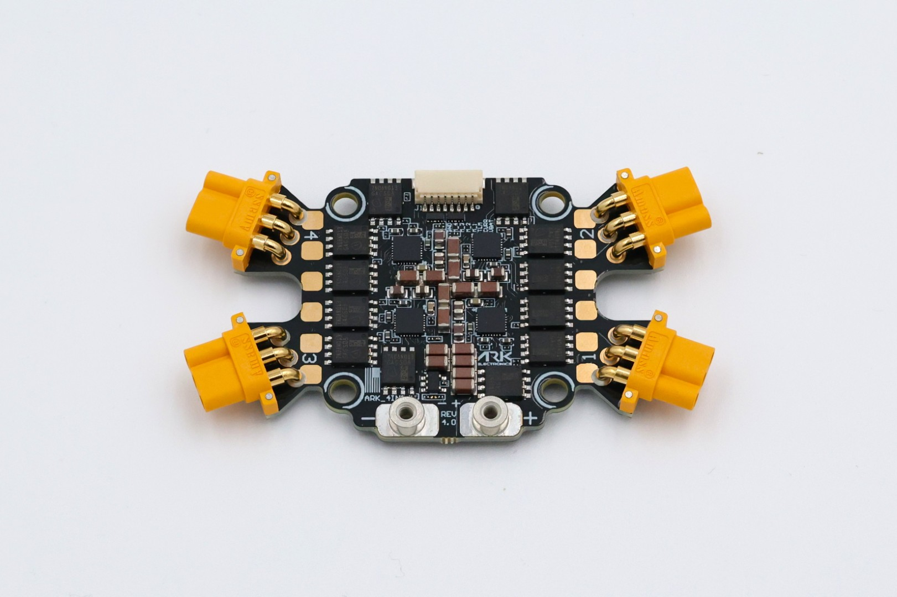

.. _common-ark-4in1-esc_con:

============
ARK 4IN1 ESC CONS
============

NDAA compliant, made in the USA, DIU Blue Framework listed, 4 in 1 electronic speed controller running open source AM32 firmware. No soldering required with built in motor and battery connectors.

Specifications
==============

- **Features**
   
   - Battery Voltage: 3-8s
   - MR30 Connector Limit Per Motor: 30A Continuous, 40A Burst
   - Current Rating: 50A Continuous, 75A Burst
   - Microcontroller: STM32F0
   - Firmware: AM32 Firmware
   - Features: Onboard Current Sensor, Serial Telemetry
   
-  **Connections**

   - Four MR30 Motor Connectors
   - Two Pixhawk Standard CAN Connectors
   - 8 Pin JST-SH Input/Output Connector

    - Battery Output
    - Current
    - Telemetry
    - Motor 1
    - Motor 2
    - Motor 3
    - Motor 4
    - Ground

   - 10 Pin JST-SH Debug Connector
   
    - 3.3V
    - SWDIO Motor 1, SWCLK Motor 1
    - SWDIO Motor 2, SWCLK Motor 2
    - SWDIO Motor 3, SWCLK Motor 3
    - SWDIO Motor 4, SWCLK Motor 4
    - Ground
  
  - M2.5 Battery Input Threaded Standoffs 
    - Two 150mm 10AWG Power Cables Terminated with M2.5 Ring Terminals Included

-  **Other**

   -  USA Built
   -  NDAA compliant
   -  DIU Blue Framework Listed

-  **Additional Information**

   - Size: 77.00mm x 42.00mm x 9.43mm
   - Mounting Pattern: 30.5mm
   - Weight: 24g

More Information
================

* `ARK 4IN1 ESC CONS <https://arkelectron.com/product/ark-4in1-esc-cons/>`_

* `ARK 4IN1 ESC CONS Documentation <https://arkelectron.gitbook.io/ark-documentation/electronic-speed-controllers/ark-4in1-esc>`_

