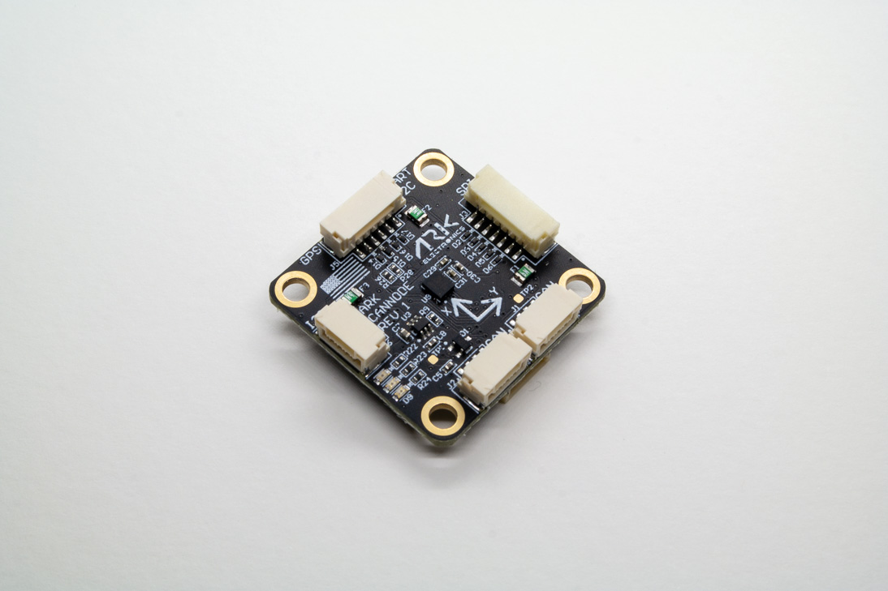

.. _common-ark-can-node:

===========
ARK CANnode
===========

ARK CANNode is an open-source generic DroneCAN node that includes a 6-degree-of-freedom IMU. Its main purpose is to enable the use of non-CAN sensors (I2C, SPI, UART) on the CAN bus. It also has PWM outputs to expand a vehicle's control outputs in quantity and physical distance. For ArduPilot, AP_Periph can be used to integrate the CANNode as a peripheral.

Specifications
==============

-  **Sensors**

   -  Bosch BMI088 6-Axis IMU or Invensense ICM-42688-P 6-Axis IMU
   
-  **Microcontroller**

   -  STM32F412CGU6 MCU

    -  1MB Flash

-  **Connections**

   -  Two Pixhawk Standard CAN Connectors

    - 4 Pin JST GH

   -  Pixhawk Standard I2C Connector

    - 4 Pin JST GH

   -  Pixhawk Standard UART/I2C Connector (Basic GPS Port)

    - 6 Pin JST GH

   -  Pixhawk Standard SPI Connector

    - 7 Pin JST GH

   -  PWM Connector

    - 10 Pin JST GH
    - 8 PWM Outputs
    - Matches Pixhawk 4 PWM Connector Pinout

   -  Pixhawk Standard Debug Connector

    - 6 Pin JST SH
 
-  **Power Requirements**

   -  5V
   -  Current dependent on connected peripherals

-  **Other**

   -  USA Built
   -  LED Indicators

-  **Additional Information**

   -  Dimensions: 3 cm x 3 cm x 1.3 cm

More Information
================

* `ARK CANnode <https://arkelectron.com/product/ark-cannode/?srsltid=AfmBOora3E4iCuKMs9zdaGyvBOoYhj6mlYLjDJVz09O7Iv1y16DUDdol>`_

* `ARK CANnode Documentation <https://arkelectron.com/product/ark-cannode/?srsltid=AfmBOora3E4iCuKMs9zdaGyvBOoYhj6mlYLjDJVz09O7Iv1y16DUDdol>`_

