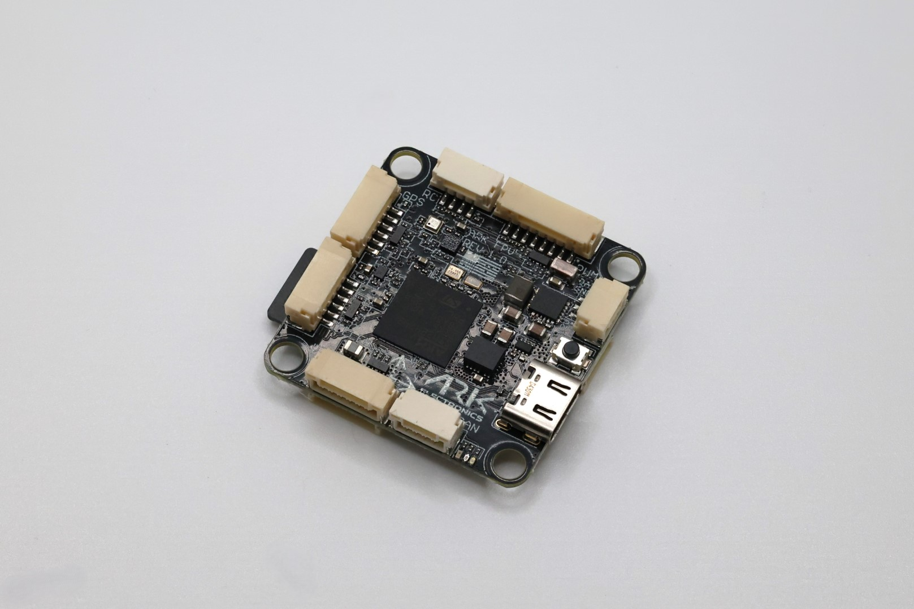

.. _common-ark-fpv-overview:

==================================
ARK FPV Flight Controller Overview
==================================

The ARK FPV NDAA compliant flight controller is based on the `ARKV6X <https://arkelectron.com/product/arkv6x/>`__ in a 30.5mm standard mounting pattern. It supports a 3-12s battery input with a regulated 12V 2A output for video transmitters and payloads.

Specifications
==============

-  **Sensors**

   -  `Invensense IIM-42653 Industrial IMU <https://invensense.tdk.com/products/motion-tracking/6-axis/iim-42653/>`__
   -  `Bosch BMP390 Barometer <https://www.bosch-sensortec.com/products/environmental-sensors/pressure-sensors/bmp390/>`__
   -  `ST IIS2MDC Magnetometer <https://www.st.com/en/magnetic-sensors/iis2mdc.html>`__
   
-  **Microprocessor**

   -  `STM32H743IIK6 MCU <https://www.st.com/en/microcontrollers-microprocessors/stm32h743ii.html>`__
    
    -  480Mhz / 1MB RAM / 2MB Flash

-  **Power**

   -  5.5V - 54V
   -  500mA

    -  300ma for main system
    -  200ma for heater
 
-  **Other**

   -  LED Indicators
   -  MicroSD Slot
   -  USA Built
   -  Designed with a 1W heater. Keeps sensors warm in extreme conditions

-  **Additional Information**

   -  Weight: 7.5 g with MicroSD card
   -  Dimensions: 3.6 × 3.6 × 0.8 cm

More Information
================

* `ARK FPV Flight Controller <https://arkelectron.com/product/ark-fpv-flight-controller/>`_

* `ARK FPV documentation <https://arkelectron.gitbook.io/ark-documentation/flight-controllers/ark-fpv>`_

[copywiki destination="plane,copter,rover,blimp"]
