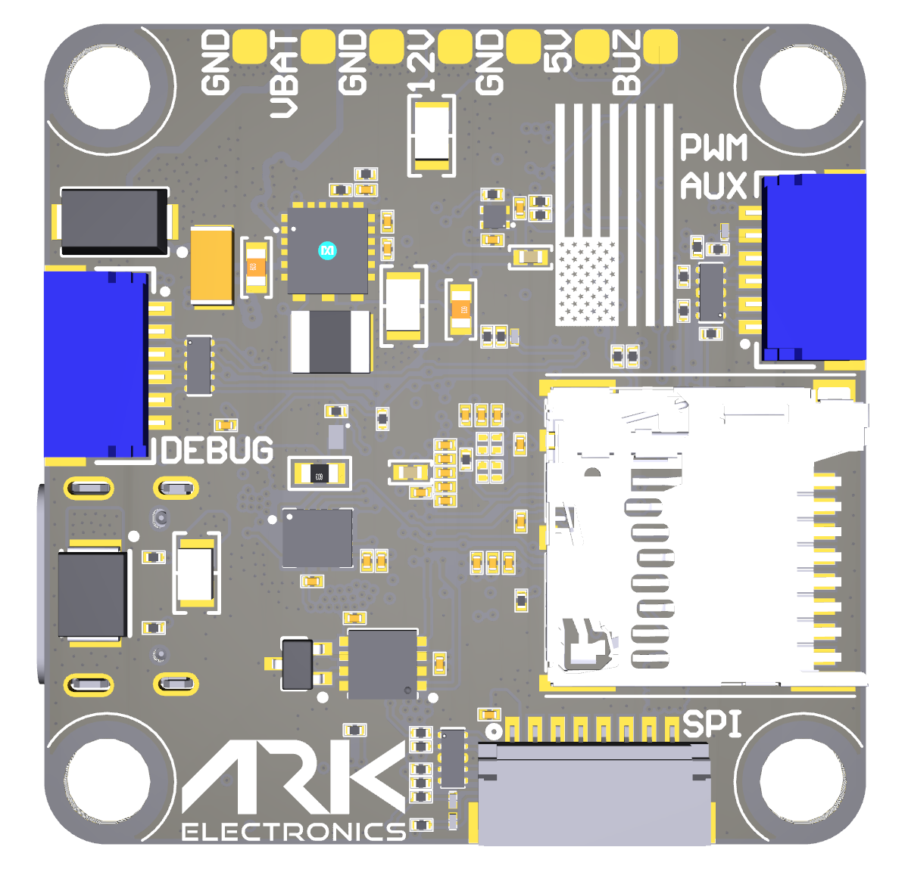

.. _common-ark-fpv:
[copywiki destination="plane,copter,rover,blimp"]
=========================
ARK FPV Flight Controller
=========================

Where to Buy
============
https://arkelectron.com/product/ark-fpv-flight-controller/

Features
========

* STM32H743 32-bit processor
* 480MHz
* 2MB Flash
* 1MB RAM
* Invensense IIM-42653 Industrial IMU with heater resistor
* Bosch BMP390 Barometer
* ST IIS2MDC Magnetometer
* 9x PWM  Bidirectional-DSHOT capable
* 5x UARTS, one with hardware flow control
* 1x CAN
* 1x SPI, 1x I2C
* 5.5V - 54V (2S - 12S) input
* 12V, 2A output for video systems
* 5V, 2A output. 300ma for main system, 200ma for heater, 1.5A peripherals
* Micro SD
* USB-C

Dimensions
----------
* Size: 3.6 × 3.6 × 0.8 cm
* Weight: 7.5g with MicroSD card

Pinout
======

.. image:: ../../../images/ark_fpv_top.png
   :target: ../_images/ark_fpv_top.png

Connectors
==========
PWM UART4 - 8 Pin JST-GH
------------------------

.. list-table::
   :header-rows: 1

   * - Pin
     - Signal Name
     - Voltage
   * - 1
     - VBAT IN
     - 5.5V-54V
   * - 2
     - CURR_IN
     - 3.3V
   * - 3
     - UART4_RX
     - 3.3V
   * - 4
     - FMU_CH1
     - 3.3V
   * - 5
     - FMU_CH2
     - 3.3V
   * - 6
     - FMU_CH3
     - 3.3V
   * - 7
     - FMU_CH4
     - 3.3V
   * - 8
     - GND
     - GND

RC - 4 Pin JST-GH
-----------------

.. list-table::
   :header-rows: 1

   * - Pin
     - Signal Name
     - Voltage
   * - 1
     - 5.0V
     - 5.0V
   * - 2
     - USART6_RX_IN
     - 3.3V
   * - 3
     - USART6_TX_OUTPUT
     - 3.3V
   * - 4
     - GND
     - GND

PWM AUX - 6 Pin JST-SH
----------------------

.. list-table::
   :header-rows: 1

   * - Pin
     - Signal Name
     - Voltage
   * - 1
     - FMU_CH5
     - 3.3V
   * - 2
     - FMU_CH6
     - 3.3V
   * - 3
     - FMU_CH7
     - 3.3V
   * - 4
     - FMU_CH8
     - 3.3V
   * - 5
     - FMU_CH9
     - 3.3V
   * - 6
     - GND
     - GND

POWER AUX - 3 Pin JST-GH
------------------------

.. list-table::
   :header-rows: 1

   * - Pin
     - Signal Name
     - Voltage
   * - 1
     - 12.0V
     - 12.0V
   * - 2
     - GND
     - GND
   * - 3
     - VBAT IN/OUT
     - 5.5V-54V

CAN - 4 Pin JST-GH
------------------

.. list-table::
   :header-rows: 1

   * - Pin
     - Signal Name
     - Voltage
   * - 1
     - 5.0V
     - 5.0V
   * - 2
     - CAN1_P
     - 5.0V
   * - 3
     - CAN1_N
     - 5.0V
   * - 4
     - GND
     - GND

GPS - 6 Pin JST-GH
------------------

.. list-table::
   :header-rows: 1

   * - Pin
     - Signal Name
     - Voltage
   * - 1
     - 5.0V
     - 5.0V
   * - 2
     - USART1_TX_GPS1
     - 3.3V
   * - 3
     - USART1_RX_GPS1
     - 3.3V
   * - 4
     - I2C1_SCL_GPS1
     - 3.3V
   * - 5
     - I2C1_SDA_GPS1
     - 3.3V
   * - 6
     - GND
     - GND

TELEM - 6 Pin JST-GH
--------------------

.. list-table::
   :header-rows: 1

   * - Pin
     - Signal Name
     - Voltage
   * - 1
     - 5.0V
     - 5.0V
   * - 2
     - UART7_TX_TELEM1
     - 3.3V
   * - 3
     - UART7_RX_TELEM1
     - 3.3V
   * - 4
     - UART7_CTS_TELEM1
     - 3.3V
   * - 5
     - UART7_RTS_TELEM1
     - 3.3V
   * - 6
     - GND
     - GND

VTX - 6 Pin JST-GH
------------------

Note: connector pinout not in same order as standard HD VTX cabling

 ===== ====================== =========
  Pin   Signal Name            Voltage
 ===== ====================== =========
  1     12.0V                  12.0V
  2     GND                    GND
  3     UART5_TX_DisplayPort   3.3V
  4     UART5_RX_DisplayPort   3.3V
  5     USART2_RX_(SBUS)       3.3V
  6     GND                    GND
 ===== ====================== =========

SPI (OSD or IMU) - 8 Pin JST-SH
-------------------------------

.. list-table::
   :header-rows: 1

   * - Pin
     - Signal Name
     - Voltage
   * - 1
     - 5.0V
     - 5.0V
   * - 2
     - SPI6_SCK
     - 3.3V
   * - 3
     - SPI6_MISO
     - 3.3V
   * - 4
     - SPI6_MOSI
     - 3.3V
   * - 5
     - SPI6_nCS1
     - 3.3V
   * - 6
     - SPI6_DRDY1
     - 3.3V
   * - 7
     - SPI6_nRESET
     - 3.3V
   * - 8
     - GND
     - GND

Flight Controller Debug - 6 Pin JST-SH
--------------------------------------

.. list-table::
   :header-rows: 1

   * - Pin
     - Signal Name
     - Voltage
   * - 1
     - 3V3_FMU
     - 3.3V
   * - 2
     - USART4_TX_DEBUG
     - 3.3V
   * - 3
     - USART4_RX_DEBUG
     - 3.3V
   * - 4
     - FMU_SWDIO
     - 3.3V
   * - 5
     - FMU_SWCLK
     - 3.3V
   * - 6
     - GND
     - GND

UART Mapping
============
.. list-table::
   :header-rows: 1

   * - Name
     - Function
   * - SERIAL0
     - USB
   * - SERIAL1
     - UART7 (Telem)
   * - SERIAL2
     - UART5 (DisplayPort HD VTX)
   * - SERIAL3
     - USART1 (GPS1)
   * - SERIAL4
     - USART2 (User, SBUS pin on HD VTX, RX only)
   * - SERIAL5
     - UART4 (ESC Telem, RX only)
   * - SERIAL6
     - USART6 (RC Input)
   * - SERIAL7
     - OTG2 (SLCAN)

All UARTS support DMA. Any UART may be re-tasked by changing its protocol parameter.

RC Input
========
RC input is configured on the RX6 (UART6_RX) pin. It supports all RC protocols except PPM. See :ref:`Radio Control Systems <common-rc-systems>` for details for a specific RC system. :ref:`SERIAL6_PROTOCOL<SERIAL6_PROTOCOL>` is set to “23”, by default, to enable this.

* SBUS/DSM/SRXL connects to the RX6 pin.
* FPort requires connection to TX6 and :ref:`SERIAL6_OPTIONS<SERIAL2_OPTIONS>` be set to “7”.
* CRSF also requires a TX6 connection, in addition to RX6, and automatically provides telemetry. Set :ref:`SERIAL6_OPTIONS<SERIAL6_OPTIONS>`
* SRXL2 requires a connecton to TX6 and automatically provides telemetry. Set :ref:`SERIAL6_OPTIONS<SERIAL6_OPTIONS>` to “4”.

Battery Monitoring
==================
The board has a internal voltage sensor and connections on the ESC connector for an external current sensor input. The board supports up to 12S LiPo batteries.

The default battery parameters are:

* :ref:`BATT_MONITOR<BATT_MONITOR>` = 4
* :ref:`BATT_VOLT_PIN<BATT_VOLT_PIN__AP_BattMonitor_Analog>` = 9
* :ref:`BATT_CURR_PIN<BATT_CURR_PIN__AP_BattMonitor_Analog>` = 12
* :ref:`BATT_VOLT_MULT<BATT_VOLT_MULT__AP_BattMonitor_Analog>` = 21
* :ref:`BATT_AMP_PERVLT<BATT_AMP_PERVLT__AP_BattMonitor_Analog>` = 120

Compass
=======
This autopilot has a built-in IIS2MDC compass.Due to potential interference, the autopilot is usually used with an external I2C compass as part of a GPS/Compass combination.

OSD Support
===========
This flight controller has an MSP-DisplayPort output on a 6-pin DJI-compatible JST SH.

Motor Output
============
All outputs are capable of PWM and DShot. Motors 1-4 are capable of Bidirectional-DSHOT. All outputs in the motor groups below must be either PWM or DShot:

* Motors 1-4  Group1 (TIM5)
* Motors 5-8  Group2 (TIM8)
* Motor 9     Group3 (TIM4)

Firmware
========
Firmware for this board can be found `here <https://firmware.ardupilot.org>`__ in sub-folders labeled “ARK_FPV”

Loading Firmware
================
Initial firmware load can be done with DFU by plugging in USB with the
BOOT button pressed. You can then load the bootloader using your favorite DFU tool.
The bootloader can be found at https://firmware.ardupilot.org/Tools/Bootloaders/

Once the initial firmware is loaded you can update the firmware using
any ArduPilot ground station software. Updates should be done with the
\*.apj firmware files.

