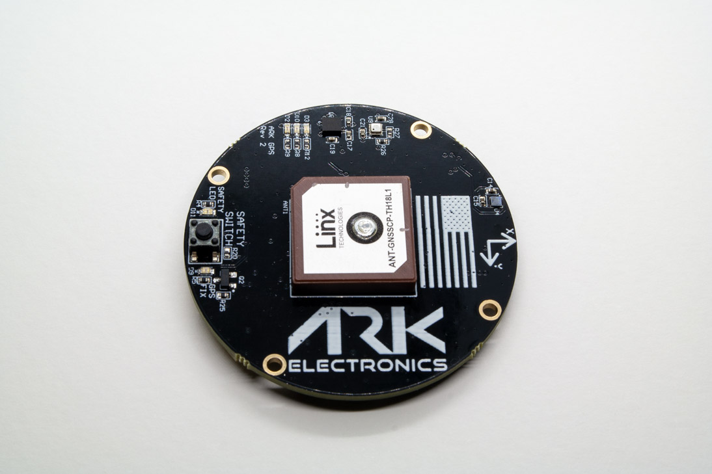

.. _common-ark-gps:

=======
ARK GPS
=======

Made in the USA open source Dronecan M9N GPS, magnetometer, barometer, IMU, buzzer, and safety switch module.

Specifications
==============

-  **Sensors**

   - `Ublox M9N GPS <https://www.u-blox.com/en/product/neo-m9n-module>`__

      - Ultra-robust meter-level GNSS positioning
      - Concurrent reception of 4 GNSS for maximum position availability
      - Advanced spoofing and jamming detection
      - Excellent RF interference mitigation

   - Bosch BMM150 Magnetometer
   - `Bosch BMP388 Barometer <https://www.bosch-sensortec.com/products/environmental-sensors/pressure-sensors/bmp388/>`__
   - `Invensense ICM-42688-P 6-Axis IMU <https://invensense.tdk.com/products/motion-tracking/6-axis/icm-42688-p/>`__
   
-  **Microcontroller**

   -  STM32F412CEU6 MCU

-  **Connections**

   - Two Pixhawk Standard CAN Connectors
      - 4 Pin JST GH

   - Pixhawk Standard Debug Connector
      - 6 Pin JST SH

 
-  **Power Requirements**

   -  5V

    - 110mA Average
    - 117mA Max

-  **Other**

   -  USA Built
   -  LED Indicators
   -  FCC Compliant
   -  LED Indicators

    - Safety LED
    - GPS Fix
    - RGB System Status

-  **Additional Information**

   -  Dimensions: 5 cm x 5 cm x 1 cm
   -  Includes 4 Pin Pixhawk Standard CAN Cable
   - Supports UAVCAN Firmware Updating
   - Open Source Schematic and BOM

Mounting & Wiring
=================

The recommended mounting orientation is with the connectors on the board pointing towards the back of vehicle.
The ARK GPS is connected to the CAN bus using a Pixhawk standard 4 pin JST GH cable. 

More Information
================

* `ARK GPS <https://arkelectron.com/product/ark-gps/?srsltid=AfmBOoqJ1p8Hya7MVyBwjMM0xWFDEGmrK7HLP9gp10q8Dyn1DGA9GKHQ>`_

* `ARK GPS Documentation <https://arkelectron.gitbook.io/ark-documentation/sensors/ark-gps>`_

