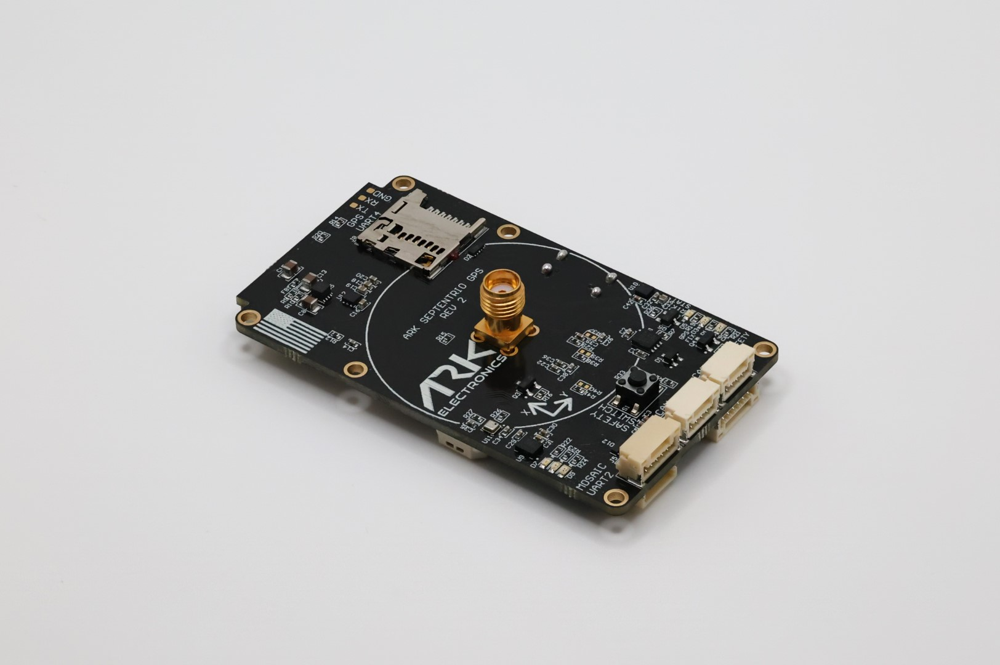

.. _common-ark-mosaic-rtk-gps:

=====================
ARK MOSAIC-X5 RTK GPS
=====================

Made in the USA Dronecan Septentrio Mosaic-X5 RTK GPS, magnetometer, barometer, IMU, buzzer, and safety switch module.

Specifications
==============

-  **Sensors**

   - `Septentrio Mosaic-X5 GPS <https://www.septentrio.com/en/products/gnss-receivers/gnss-receiver-modules/mosaic-x5>`__

      - Triple Band L1/L2/L5
      - `AIM+ jamming protection <https://www.septentrio.com/en/learn-more/advanced-positioning-technology/aim-anti-jamming-protection>`__
      - Update rate of 100 Hz

   - `ST IIS2MDC Magnetometer <https://www.st.com/en/mems-and-sensors/iis2mdc.html>`__

   - `Bosch BMP390 Barometer <https://www.bosch-sensortec.com/products/environmental-sensors/pressure-sensors/pressure-sensors-bmp390.html>`__

   - `Invensense ICM-42688-P 6-Axis IMU <https://invensense.tdk.com/products/motion-tracking/6-axis/icm-42688-p/>`__
   
-  Microcontroller

   -  STM32F412VGH6 MCU

- Connections

   - Two Pixhawk Standard CAN Connectors
   
    - 4 Pin JST-GH
    - 5V Input

   - Pixhawk Standard “Basic GPS Port”

    - For external sensors such as airspeed or distance
    - 6 pin JST-GH
    - USART3 from STM32
    - I2C2 from STM32

   - Pixhawk Standard Debug Connector

    - 6 Pin JST-SH

   - USB-C Port

    - 5V Input
    - USB 2.0 to Mosaic-X5

   - Micro-SD Slot

    - Mosaic-X5 Logging

   - Mosaic “UART 2” Connector

    - 5 Pin JST-GH (TX, RX, TIMEPULSE, GP1, GND)
 
-  **Power Requirements**

   -  5V
   
    - 260mA Average
    - 340mA Peak

-  **Other**

   -  USA Built
   -  LED Indicators

    - Safety LED
    - GPS Fix
    - RTK Status
    - RGB System Status LED

- **Additional Information**

   - Includes 4 Pin Pixhawk Standard CAN Cable
   - Triple Band (L1/L2/L5) Helical GPS Antenna
   - USA Built
   - Supports DroneCAN Firmware Updating

More Information
================

* `ARK MOSAIC-X5 RTK GPS <https://arkelectron.com/product/ark-mosaic-x5-gps/>`_

* `ARK MOSAIC-X5 RTK GPS Documentation <https://arkelectron.gitbook.io/ark-documentation/sensors/ark-mosaic-x5-rtk-gps>`_

