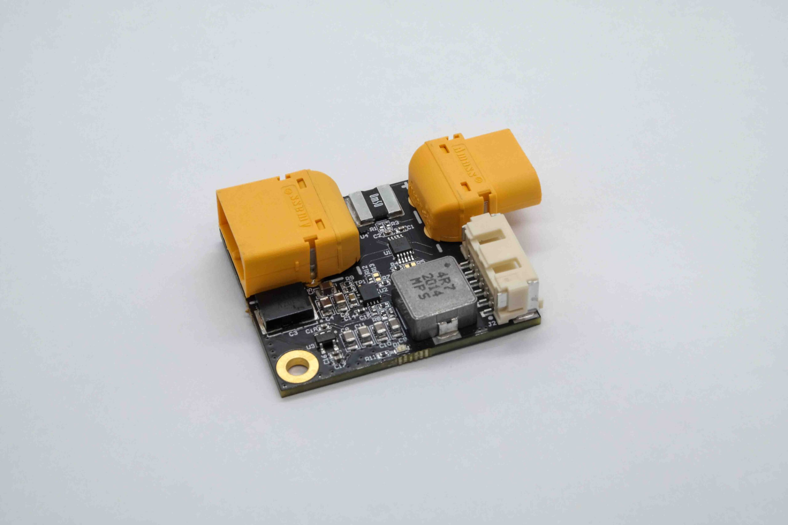
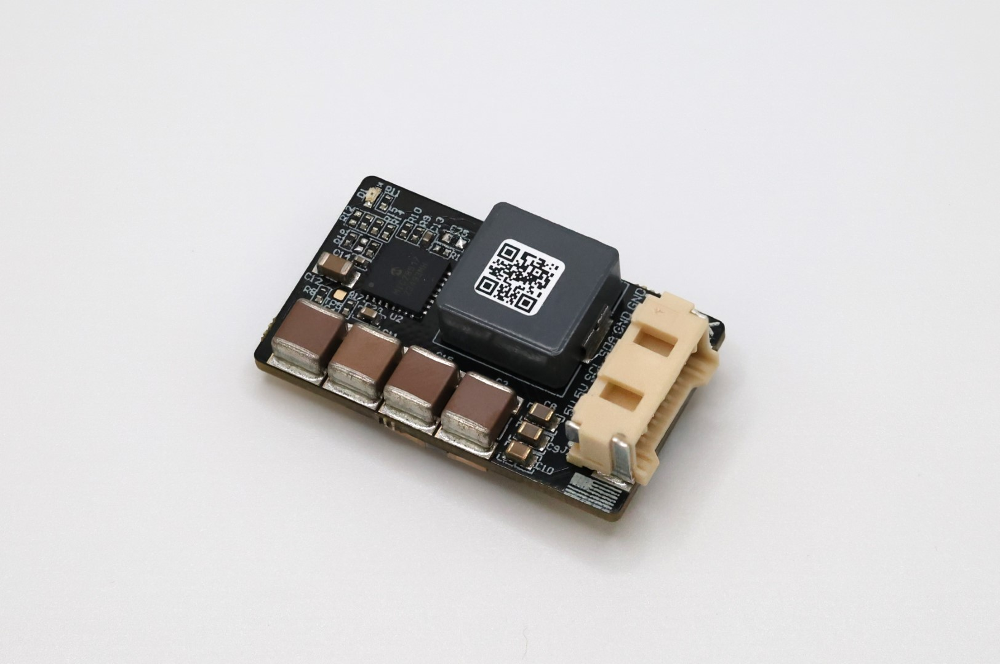

.. _common-ark-power-modules:

====================
ARK PAB Power Module
====================

The ARK PAB Power Module is rated for 60A continuous battery current at 20C ambient. However, when running 60A battery current at 20C without cooling, the 5V regulator is de-rated to 3A continuous output. It is recommended to run multiple power modules in parallel if more than 60A continuous current is required.

Specifications
==============

-  **TI INA226 Digital Power Monitor**

   -  0.0005 Ohm Shunt
   -  I2C Interface
   
-  **5.2V 6A Step-Down Regulator**

   -  33V Maximum Input Voltage
   -  5.8V Minimum Input Voltage at 6A Out
   -  Output Over-Voltage Protection
   -  Output Over-Current Protection

-  **Connections**

   -  XT60 Battery Input
   -  XT60 Battery Output
   -  6 Pin Molex CLIK-Mate Output

    -  `Matches ARK PAB Carrier Power Pinout <https://arkelectron.gitbook.io/ark-documentation/flight-controllers/ark-pixhawk-autopilot-bus-carrier/pinout>`__
 
-  **Other**

   -  USA Built
   -  FCC Compliant
   -  Includes 6 Pin Molex CLIK-Mate Cable

-  **Additional Information**

   -  Weight: 17.9 g
   -  Dimensions: 4.75 cm x 3.43 cm x 1.15 cm

More Information
================

* `ARK PAB Power Module <https://arkelectron.com/product/ark-pab-power-module/>`_

* `ARK PAB Power Module Documentation <https://arkelectron.gitbook.io/ark-documentation/power/ark-pab-power-module>`_

========================
ARK 12S PAB Power Module
========================

The ARK 12S PAB Power Module is a 5V 6A power supply and digital power monitor designed for the Pixhawk Autopilot Bus Carrier boards.

Specifications
==============

-  **TI INA238 Digital Power Monitor**

   -  0.0001 Ohm Shunt
   -  I2C Interface
   
-  **5.2V 6A Step-Down Regulator**

   -  66V Maximum Input Voltage
   -  10V Minimum Input Voltage at 6A Out
   -  Output Over-Current Protection

-  **Connections**

   -  Solder Pads Battery Input
   -  Solder Pads Battery Output
   -  6 Pin Molex CLIK-Mate Output

    -  `Matches ARK PAB Carrier Power Pinout <https://arkelectron.gitbook.io/ark-documentation/flight-controllers/ark-pixhawk-autopilot-bus-carrier/pinout>`__
 
-  **Other**

   -  USA Built
   -  Includes 6 Pin Molex CLIK-Mate Cable

-  **Additional Information**

   -  Weight: 15.5 g
   -  Dimensions: 3.7 cm x 2.2 cm x 1.3 cm

Ardupilot Setup
===============

   -  Set the ``BATTx_MONITOR`` parameter to "INA2XX"
   -  Set the `BATTX_SHUNT`` parameter to "0.0001"
   -  Reboot the flight controller

More Information
================

* `ARK 12S PAB Power Module <https://arkelectron.com/product/ark-12s-pab-power-module/>`_

* `ARK 12S PAB Power Module Documentation <https://arkelectron.gitbook.io/ark-documentation/power/ark-12s-pab-power-module>`_
