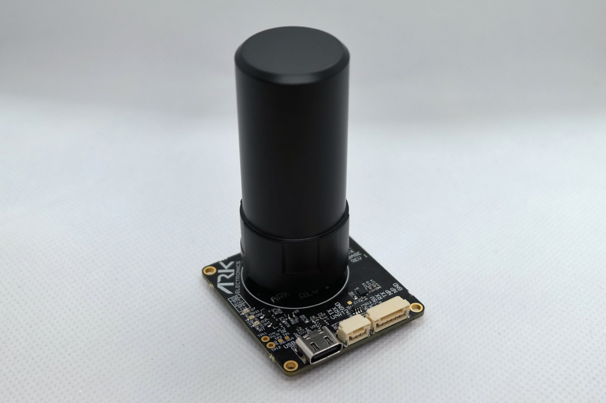

.. _common-ark-rtk-base:

============
ARK RTK Base
============

Open source Ublox ZED-F9P RTK GPS module. The ARK RTK Base is a high precision GPS module that can be used as a base station for RTK GPS systems. It is compatible with ArduPilot and can be used with the RTK GPS module to provide high precision GPS data for drones.

Specifications
==============

-  **GPS Receiver**

   - `Ublox F9P GPS <https://www.u-blox.com/en/product/zed-f9p-module>`__

    - Multi-band GNSS receiver delivers centimeter-level accuracy in seconds
    - Concurrent reception of GPS, GLONASS, Galileo, and BeiDou
    - Multi-band RTK with fast convergence times and reliable performance
    - High update rate for highly dynamic applications
    - Centimeter accuracy in a compact and energy-efficient module
   

-  **Connections**

   - USB-C Connector
   - Pixhawk Standard UART Connector

      - 6 Pin JST GH

   - F9P “UART 2” Connector

      - 3 Pin JST GH (TX, RX, GND)
 
-  **Power Requirements**

   - 5V via USB-C or UART Connector

      - 120mA Average
      - 150mA Max

-  **Other**

   - USB-C Cable
   - 6 Pin Pixhawk Standard UART Cable
   - Dual Band (L1/L2) Helical GPS Antenna
   - USA Built
   - FCC Compliant
   - LED Indicators
   
    - Power
    - GPS Fix
    - RTK Status

More Information
================

* `ARK RTK Base <https://arkelectron.com/product/ark-rtk-base/>`_

* `ARK RTK Base Documentation <https://arkelectron.gitbook.io/ark-documentation/sensors/ark-rtk-base>`_

