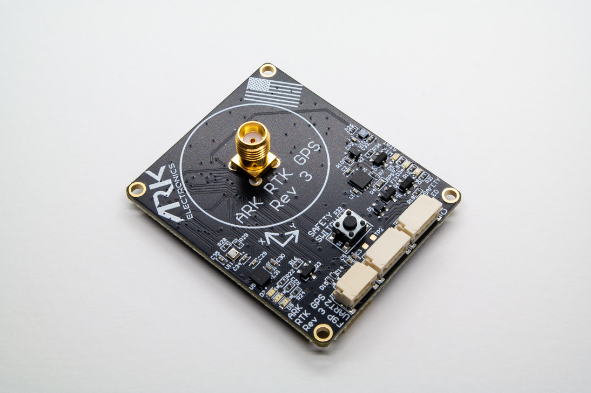

.. _common-ark-rtk-f9p-gps:

===========
ARK RTK GPS
===========

Made in the USA, DIU Blue UAS Framework listed, open source, Dronecan L1/L2 RTK GPS, F9P, magnetometer, barometer, IMU, buzzer, and safety switch module.

Specifications
==============

-  **Sensors**

   - `Ublox F9P GPS <https://www.u-blox.com/en/product/zed-f9p-module>`__

    - L1/L2 bands
    - Multi-band GNSS receiver delivers centimeter-level accuracy in seconds
    - Concurrent reception of GPS, GLONASS, Galileo, and BeiDou
    - Multi-band RTK with fast convergence times and reliable performance
    - High update rate for highly dynamic applications
    - Centimeter accuracy in a compact, energy-efficient module
    - Moving Base for Heading

   - Bosch BMM150 Magnetometer
   - `Bosch BMP388 Barometer <https://www.bosch-sensortec.com/products/environmental-sensors/pressure-sensors/bmp388/>`__
   - `Invensense ICM-42688-P 6-Axis IMU <https://invensense.tdk.com/products/motion-tracking/6-axis/icm-42688-p/>`__
   
-  **Microcontroller**

   - STM32F412CEU6 MCU

-  **Connections**

   - Two Pixhawk Standard CAN Connectors

    - 4 Pin JST GH

   - F9P “UART 2” Connector

    - 3 Pin JST GH (TX, RX, GND)

   - Pixhawk Standard Debug Connector
    
    - 6 Pin JST SH
 
-  **Power Requirements**

   -  5V

    - 170mA Average
    - 180mA Max

- **Alternate Antenna Options**

   - Tallysman 33-HC882-28
   - Taoglas AA.175.301111
   - Taoglas A.80.A.101111
   - Linx ANT-GNRM-L12A-3
   - Ublox ANN-MB-00-00

-  **Other**

   - USA Built
   - FCC Compliant
   - 4 Pin Pixhawk Standard CAN Cable
   - Dual Band (L1/L2) Helical GPS Antenna
   - LED Indicators

    - Safety LED
    - GPS Fix
    - RTK Status
    - RGB System Status

Mounting & Wiring
=================

The recommended mounting orientation is with the connectors on the board pointing towards the back of vehicle.
The ARK GPS is connected to the CAN bus using a Pixhawk standard 4 pin JST GH cable. 

More Information
================

* `ARK RTK GPS <https://arkelectron.com/product/ark-rtk-gps/>`_

* `ARK RTK GPS Documentation <https://arkelectron.gitbook.io/ark-documentation/sensors/ark-rtk-gps>`_

