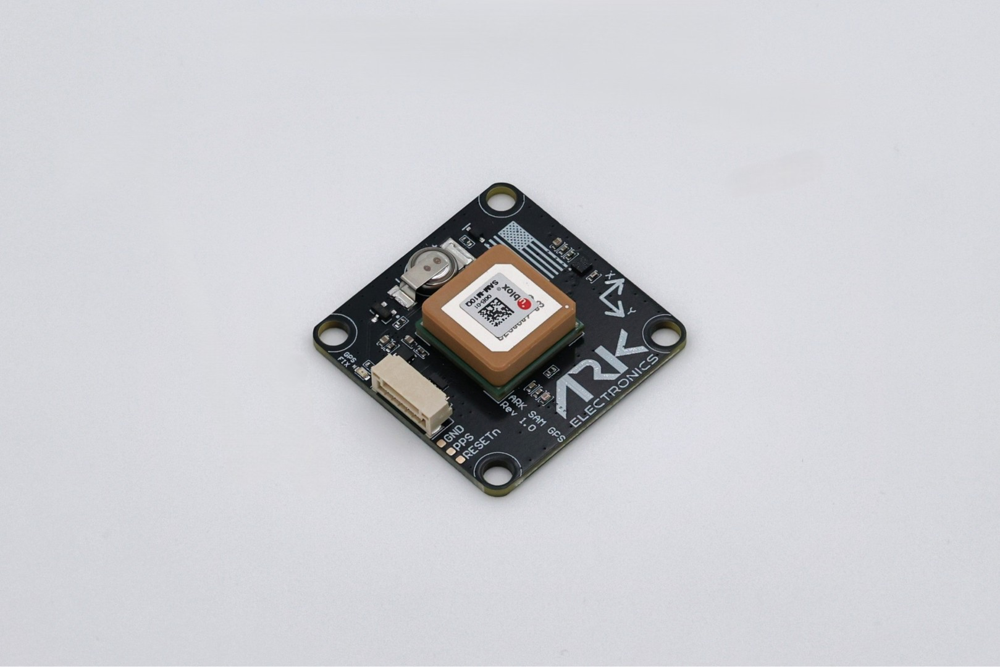

.. _common-ark-sam-gps:

============
ARK SAM GPS
============

Made in the USA u-blox SAM-M10Q GPS and industrial magnetometer.

Specifications
==============

**Sensors**

- `u-blox SAM-M10Q <https://www.u-blox.com/en/product/sam-m10q-module>`__
  
  - Less than 38 mW power consumption without compromising GNSS performance
  - Maximum position availability with 4 concurrent GNSS reception
  - Advanced spoofing and jamming detection

- `ST IIS2MDC Magnetometer <https://www.st.com/en/mems-and-sensors/iis2mdc.html>`__

**Connections**

- Pixhawk Standard UART/I2C Connector
- 6 Pin JST GH

**Power Requirements**

- 5V
- 15mA Average
- 20mA Max

**Other Features**

- USA Built
- NDAA Compliant
- 6 Pin Pixhawk Standard UART/I2C Cable
- LED Indicators (GPS Fix)

More Information
================

- `ARK SAM GPS <https://arkelectron.com/product/ark-sam-gps/>`_
- `ARK SAM GPS Documentation <https://arkelectron.gitbook.io/ark-documentation/gps/ark-sam-gps>`_
