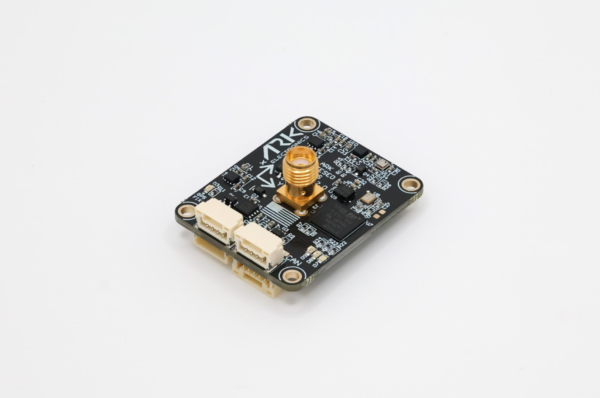

.. _common-ark-teseo-gps:

=============
ARK TESEO GPS
=============

Made in the USA and NDAA Compliant Dronecan L1/L5 GPS, ST TESEO LIV4F, magnetometer, barometer, IMU, and buzzer module.

Specifications
==============

-  **Sensors**

   - `ST TESEO LIV4F GPS <https://www.st.com/en/positioning/teseo-liv4f.html>`__
    
    - L1/L5 bands
    - Simultaneous multi-constellation and multi-band GNSS (GPS, Galileo, GLONASS, BeiDou, QZSS)
    - IRNSS constellation ready
    - -162 dBm tracking sensitivity
    - Submeter positioning accuracy

   - `ST IIS2MDC Magnetometer <https://www.st.com/en/mems-and-sensors/iis2mdc.html>`__
   - `Bosch BMP390 Barometer <https://www.bosch-sensortec.com/products/environmental-sensors/pressure-sensors/pressure-sensors-bmp390.html>`__
   - `Invensense ICM-42688-P 6-Axis IMU <https://invensense.tdk.com/products/motion-tracking/6-axis/icm-42688-p/>`__
   
-  **Microcontroller**

   - STM32F412VGH6 MCU

-  **Connections**

   - Two Pixhawk Standard CAN Connectors
   
    - 4 Pin JST GH
   
   - I2C and Timepulse/PPS Connector
   
    - 5 Pin JST GH (5.0V, SCL, SDA, TIMEPULSE, GND)
   
   - Pixhawk Standard Debug Connector
    
    - 6 Pin JST SH
 
-  **Power Requirements**

   -  5V

    - 137mA

-  **Other**

   - USA Built
   - NDAA Compliant
   - 4 Pin Pixhawk Standard CAN Cable
   - Dual Band (L1/L5) Helical GPS Antenna
   - LED Indicators

    - GPS Fix
    - RGB Status

More Information
================

* `ARK TESEO GPS <https://arkelectron.com/product/ark-teseo-gps/>`_

* `ARK TESEO GPS Documentation <https://arkelectron.gitbook.io/ark-documentation/sensors/ark-teseo-gps>`_

