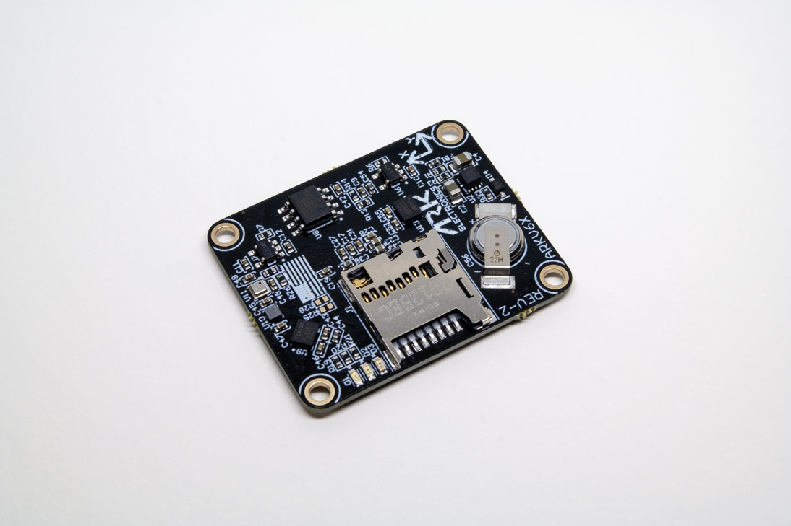

.. _common-ark-v6x-overview:

=================================
ARKV6X Flight Controller Overview
=================================

The USA-built ARKV6X flight controller is based on the `FMUV6X and Pixhawk Autopilot Bus open source standards <https://github.com/pixhawk/Pixhawk-Standards>`__.
With triple synced IMUs, data averaging, voting, and filtering is possible. The Pixhawk Autopilot Bus (PAB) form factor enables the ARKV6X to be used on any PAB-compatible carrier board, such as the `ARK Pixhawk Autopilot Bus Carrier <https://arkelectron.com/product/ark-pixhawk-autopilot-bus-carrier/>`__.

Specifications
==============

-  **Sensors**

   -  `Dual Invensense ICM-42688-P IMUs <https://invensense.tdk.com/products/motion-tracking/6-axis/icm-42688-p/>`__
   -  `Invensense IIM-42652 Industrial IMU <https://invensense.tdk.com/products/smartindustrial/iim-42652/>`__
   -  `Bosch BMP390 Barometer <https://www.bosch-sensortec.com/products/environmental-sensors/pressure-sensors/bmp390/>`__
   -  `Bosch BMM150 Magnetometer <https://www.bosch-sensortec.com/products/motion-sensors/magnetometers/bmm150/>`__

-  **Microprocessor**

   -  `STM32H743IIK6 MCU <https://www.st.com/en/microcontrollers-microprocessors/stm32h743ii.html>`__
    
    -  480Mhz / 1MB RAM / 2MB Flash

-  **Power Requirements**

   -  5V
   -  500mA

    -  300ma for main system
    -  200ma for heater
 
-  **Other**

   -  FRAM
   -  `Pixhawk Autopilot Bus (PAB) Form Factor <https://github.com/pixhawk/Pixhawk-Standards/blob/master/DS-010%20Pixhawk%20Autopilot%20Bus%20Standard.pdf>`__
   -  LED Indicators
   -  MicroSD Slot
   -  USA Built
   -  Designed with a 1W heater. Keeps sensors warm in extreme conditions

-  **Additional Information**

   -  Weight: 5.0 g
   -  Dimensions: 3.6 x 2.9 x 0.5 cm

-  **Pinout**

    - For pinout of the ARKV6X see the `DS-10 Pixhawk Autopilot Bus Standard <https://github.com/pixhawk/Pixhawk-Standards/blob/master/DS-010%20Pixhawk%20Autopilot%20Bus%20Standard.pdf>`__

Serial Port Mapping
===================

.. list-table:: Serial Port Mapping for Default Firmware with No IOMCU
   :widths: 15 25 15
   :header-rows: 1

   * - UART
     - Serial Number
     - Port
   * - UART7
     - SERIAL1
     - TELEM1
   * - UART5
     - SERIAL2
     - TELEM2
   * - USART1
     - SERIAL3
     - GPS
   * - UART8
     - SERIAL4
     - GPS2
   * - USART2
     - SERIAL5
     - TELEM3
   * - UART4
     - SERIAL6
     - UART4 & I2C
   * - USART3
     - SERIAL7
     - Debug Console
   * - USART6
     - SERIAL8
     - PX4IO/RC

More Information
================

* `ARKV6X Flight Controller <https://arkelectron.com/product/ark-fpv-flight-controller/>`_

* `ARKV6X documentation <https://arkelectron.gitbook.io/ark-documentation/flight-controllers/arkv6x>`_

[copywiki destination="plane,copter,rover,blimp"]
