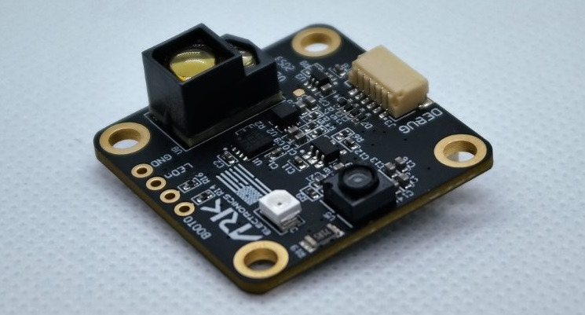
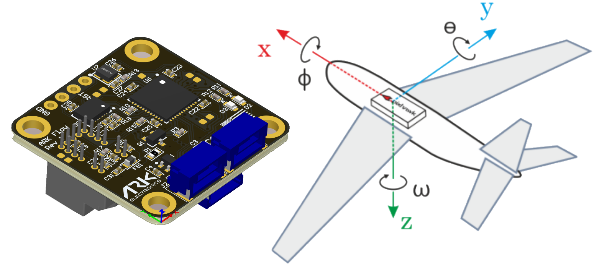

.. _common-arkflow:

=====================================================
ARK Flow Open Source Optical Flow and Distance Sensor
=====================================================

[copywiki destination="copter,plane,rover"]

The `ARK Flow Open Source Optical Flow and Distance Sensor <https://arkelectron.com/product/ark-flow/>`__ is an open source optical flow sensor including a Broadcom AFBR lidar which uses the CAN protocol to communicate with the autopilot.  This can be used to improve horizontal position control especially in GPS denied environments.

..  youtube:: SAbRe1fi7bU
    :width: 100%

Where to Buy
------------

The sensor is available from `ARK Electronics <https://arkelectron.com/product/ark-flow/>`__.

Connection to Autopilot
-----------------------

- The ARK Flow is connected to the CAN bus using a Pixhawk standard 4 pin JST GH cable.
- Multiple sensors can be connected by plugging additional sensors into the ARK Flow's second CAN connector.
- The recommended mounting orientation is with the connectors on the board pointing towards back of vehicle, as shown in the following picture.

- Connect the sensor to the autopilots' CAN port
- Set :ref:`FLOW_TYPE <FLOW_TYPE>` = 6 (DroneCAN)
- Set :ref:`CAN_P1_DRIVER <CAN_P1_DRIVER>` = 1 to enable DroneCAN
- Set :ref:`CAN_D1_PROTOCOL <CAN_D1_PROTOCOL>` = 1 (DroneCAN)

To use the onboard lidar:

- Set :ref:`RNGFND1_TYPE <RNGFND1_TYPE>` = 24 (DroneCAN)
- Set :ref:`RNGFND1_MAX_CM <RNGFND1_MAX_CM>` = 3000 to set range finder's maximum range to 30m

Additional Notes
-----------------

- :ref:`FlowHold <flowhold-mode>` does not require the use of a rangefinder
- Performance can be improved by setting the :ref:`sensors position parameters <common-sensor-offset-compensation>`.  For example if the sensor is mounted 2cm forward and 5cm below the frame's center of rotation set :ref:`FLOW_POS_X <FLOW_POS_X>` to 0.02 and :ref:`FLOW_POS_Z <FLOW_POS_Z>` to 0.05.

Testing and Setup
-----------------

See :ref:`common-optical-flow-sensor-setup`
