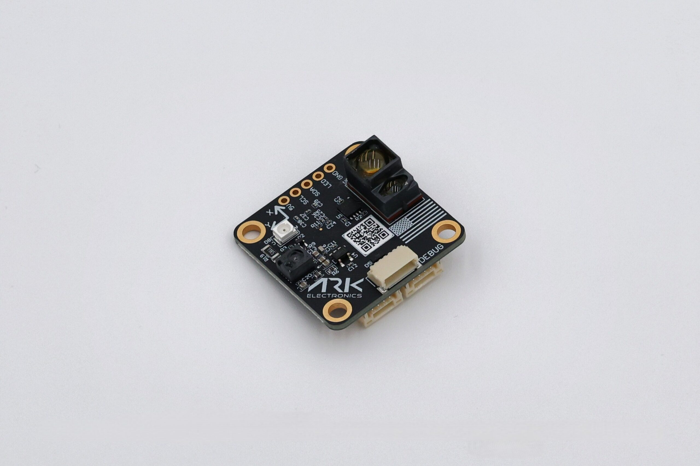
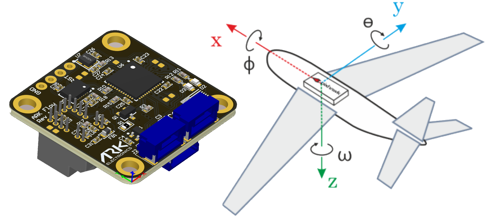

.. _common-arkflow_mr:

=========================================================
ARK Flow MR Open Source Optical Flow and Distance Sensor
=========================================================

[copywiki destination="copter,plane,rover"]

The `ARK Flow MR Open Source Optical Flow and Distance Sensor <https://arkelectron.com/product/ark-flow-mr/>`__ is an open source optical flow sensor including a Broadcom AFBR lidar which uses the CAN protocol to communicate with the autopilot.  This can be used to improve horizontal position control especially in GPS denied environments.
Next Generation of the :ref:`ARK Flow<common-arkflow>`, designed for mid-range applications.

..  youtube:: SAbRe1fi7bU
    :width: 100%

Specifications
==============

-  **Sensors**

   - `Dronecan Optical Flow and Mid-Range Distance Sensor Module <https://dronecan.github.io/>`__
   - `PixArt PAA3905 Optical Flow Sensor <https://www.pixart.com/products-detail/108/PAA3905E1-Q_>`__
    
    - Wide working distance from 80mm to infinity
    - No focal length calibration required
    - Auto detection of challenging conditions, such as checker boards, stripes, glossy surface and yawing
    - Automatic switching of Operation Mode
    - 40mW IR LED built onto board for improved low light operation

   - `Broadcom AFBR-S50LX85D Time-of-Flight Distance Sensor <https://www.broadcom.com/products/optical-sensors/time-of-flight-3d-sensors/afbr-s50lx85d>`__
  
    - Typical distance range up to 50m
    - Operation of up to 200k Lux ambient light
    - Laser Opening Angle of 2° x 2°
  
   - `Invensense IIM-42653 6-Axis IMU <https://invensense.tdk.com/products/smartindustrial/iim-42653/>`__

-  **Connections**

   - Two Pixhawk Standard CAN Connectors
   
    - 4 Pin JST GH
   
   - Pixhawk Standard Debug Connector
    
    - 6 Pin JST SH
 
-  **Power Requirements**

   -  5V

    - 86mA Average
    - 90mA Max

-  **Other**

   - USA Built
   - NDAA Compliant
   - 4 Pin Pixhawk Standard CAN Cable
   - LED Indicators
   - `ROS2 Support <https://github.com/ARK-Electronics/ros2_dronecan>`__

Where to Buy
------------

The sensor is available from `ARK Electronics <https://arkelectron.com/product/ark-flow-mr/>`__.

Connection to Autopilot
-----------------------

- The ARK Flow MR is connected to the CAN bus using a Pixhawk standard 4 pin JST GH cable.
- Multiple sensors can be connected by plugging additional sensors into the ARK Flow's second CAN connector.
- The recommended mounting orientation is with the connectors on the board pointing towards back of vehicle, as shown in the following picture.

- Connect the sensor to the autopilots' CAN port
- Set :ref:`FLOW_TYPE <FLOW_TYPE>` = 6 (DroneCAN)
- Set :ref:`CAN_P1_DRIVER <CAN_P1_DRIVER>` = 1 to enable DroneCAN
- Set :ref:`CAN_D1_PROTOCOL <CAN_D1_PROTOCOL>` = 1 (DroneCAN)

To use the onboard lidar:

- Set :ref:`RNGFND1_TYPE <RNGFND1_TYPE>` = 24 (DroneCAN)
- Set :ref:`RNGFND1_MAX <RNGFND1_MAX>` = 5000 to set range finder's maximum range to 50m

Additional Notes
-----------------

- :ref:`FlowHold <flowhold-mode>` does not require the use of a rangefinder
- Performance can be improved by setting the :ref:`sensors position parameters <common-sensor-offset-compensation>`.  For example if the sensor is mounted 2cm forward and 5cm below the frame's center of rotation set :ref:`FLOW_POS_X <FLOW_POS_X>` to 0.02 and :ref:`FLOW_POS_Z <FLOW_POS_Z>` to 0.05.

More Information
-----------------

* `ARK Flow MR documentation <https://arkelectron.gitbook.io/ark-documentation/sensors/ark-flow-mr/ardupilot-instructions>`_

Testing and Setup
-----------------

See :ref:`common-optical-flow-sensor-setup`
