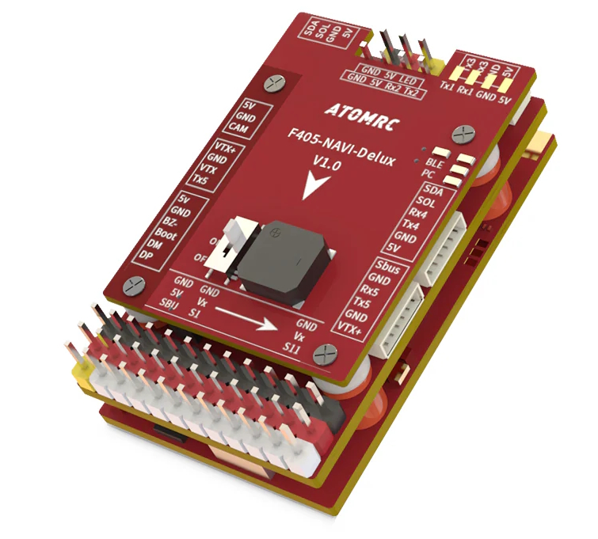

.. _common-atomrcf405-navi-deluxe:

========================
AtomRC F405-NAVI- Deluxe
========================

the above image and some content courtesy of `ATOMRC <http://atomrc.com/>`__

.. note::

	Due to flash memory limitations, this board does not include all ArduPilot features.
        See :ref:`Firmware Limitations <common-limited_firmware>` for details.

Specifications
==============

-  **Processor**

   -  STM32F405RGT6 ARM (168MHz)
   -  AT7456E OSD
   -  ESP32 Bluetooth RF module

-  **Sensors**

   -  ICM-42688 IMU (accel, gyro)
   -  SPL-06 barometer
   -  Voltage & 120A current sensor

-  **Power**

   -  6V ~ 30V DC input power
   -  5V, 5A BEC for servos
   -  5V or 9V, 2A BEC for video

-  **Interfaces**

   -  6x UARTS
   -  12x PWM outputs (PWM12 defaults to serial LED)
   -  1x RC input with inverter for SBUS/PPM
   -  I2C port for external compass and airspeed sensor
   -  Type-C USB port
   -  SD Card Slot
   -  6 pin JST-GH for GPS/Compass
   -  6 pin JST-GH for DJI air units
   -  6 pin JST-GH for remote USB/Buzzer included with autopilot

-  **Size and Dimensions**

   - 50mm x 30mm x 12mm
   - 21g

Where to Buy
============

`ATOMRC <https://atomrc.com/collections/electronics/products/atomrc-fixed-wing-flight-controller-f405-navi-deluxe>`__

Pinout
======

.. image:: ../../../images/atomrcf405-navi-deluxe-wiring.png
    :target: ../_images/atomrcf405-navi-deluxe-wiring.png
    :width: 450px

Default UART order
==================

- SERIAL0 = console = USB
- SERIAL1 = RF Module(MAVLink2) = USART1
- SERIAL2 = RCinput = USART2 (RX2 connected to SBUS via inverter, to use as UART input use :ref:`BRD_ALT_CONFIG<BRD_ALT_CONFIG>` = 1 and do not attach anything to SBUS pin)
- SERIAL3 = GPS1 = USART3
- SERIAL4 = GPS2 = UART4
- SERIAL5 = USER = UART5 (typically used for DJI Goggles (see :ref:`common-msp-osd-overview-4.2`) or Tramp VTX control (see :ref:`common-vtx`))
- SERIAL6 = USER = USART6 (DMA capable, use for CRSF/ELRS)

Serial protocols shown are defaults, but can be adjusted to personal preferences.

Dshot capability
================

All motor/servo outputs are Dshot and PWM capable. However, mixing Dshot and normal PWM operation for outputs is restricted into groups, ie. enabling Dshot for an output in a group requires that ALL outputs in that group be configured and used as Dshot, rather than PWM outputs. The output groups that must be the same (PWM rate or Dshot, when configured as a normal servo/motor output) are: 1/2, 3/4, 5/6/7, 8/9/10, and11/12(LED).

.. note:: PWM12 is marked as "LED"

RC Input
========

The SBUS pin, is passed by an inverter to RX2 (UART2 RX), which by default is mapped to a timer input instead of the UART, and can be used for all ArduPilot supported receiver protocols, except CRSF/ELRS and SRXL2 which require a true UART connection. However, FPort, when connected in this manner, can provide RC without telemetry. 

To use UART2 as a normal UART, set :ref:`BRD_ALT_CONFIG<BRD_ALT_CONFIG>` =1 and connect RC to UART6 as explained below.

To allow CRSF and embedded telemetry available in Fport, CRSF, and SRXL2 receivers, use UART6 RX and TX in order to get the DMA capability needed for these protocols.

With this option, :ref:`SERIAL6_PROTOCOL<SERIAL6_PROTOCOL>` must be set to "23", and:

- PPM is not supported.

- DSM/SRXL connects to the RX6  pin, but SBUS would still be connected to SBUS.

- FPort requires connection to TX6 and RX6 via a bi-directional inverter. See :ref:`common-FPort-receivers`.

- CRSF also requires a TX6 connection, in addition to RX6, and automatically provides telemetry.

- SRXL2 requires a connection to TX6 and automatically provides telemetry.  Set :ref:`SERIAL6_OPTIONS<SERIAL6_OPTIONS>` to "4".

.. note:: the 5v pin above the SBUS pin and the 5V pin in the GPS connector are powered when USB is connected. All other 5V pins are only powered when battery is present.

RF Module
=========

An ESP32 Bluetooth RF module is integrated on board for wireless MAVLink telemetry and control to a Ground Control Station, such as QGC running on an Android phone. This module powers up by default, but power to it can be controlled by setting up a relay function:

Set a ``RELAYx_PIN`` to “81” to control the  switching. Then select an RC channel for control (Chx) and set its ``RCx_OPTION`` to the appropriate Relay (1-6) that you had set its pin parameter above.

For example, use Channel 10 to control the switch using Relay 2:

    :ref:`RELAY_PIN2<RELAY_PIN2>` = “81”

    :ref:`RC10_OPTION<RC10_OPTION>` = “34” (Relay2 Control)

Battery Monitor Configuration
=============================
These settings are set as defaults when the firmware is loaded (except :ref:`BATT_AMP_PERVLT<BATT_AMP_PERVLT>` which needs to be changed from the default value). However, if they are ever lost, you can manually set the parameters:

Enable Battery monitor.

:ref:`BATT_MONITOR<BATT_MONITOR>` =4

Then reboot.

:ref:`BATT_VOLT_PIN<BATT_VOLT_PIN>` 12

:ref:`BATT_CURR_PIN<BATT_CURR_PIN>` 11

:ref:`BATT_VOLT_MULT<BATT_VOLT_MULT>` 11.08836

:ref:`BATT_AMP_PERVLT<BATT_AMP_PERVLT>` 30 

Connecting a GPS/Compass module
===============================

This board does not include a GPS or compass so an :ref:`external GPS/compass <common-positioning-landing-page>` should be connected as shown below in order for autonomous modes to function.

Firmware
========

Firmware for this board can be found `here <https://firmware.ardupilot.org>`_ in  sub-folders labeled
"AtomRCF405NAVI-DLX".

[copywiki destination="plane,copter,rover,blimp"]

