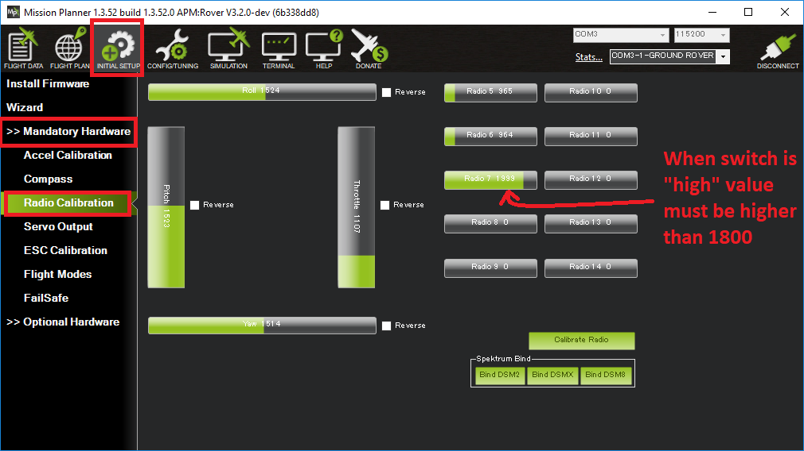

.. _common-auxiliary-functions:

===================
Auxiliary Functions
===================

This feature is firmware versions 4.0 and higher. In Copter versions before 4.0 similar functions were implemented using the CHx_OPT parameters. See :ref:`Auxiliary Function Switches (3.6 and earlier)<channel-7-and-8-options>` page.

This page describes how to set up additional features which can be invoked from the transmitter's auxiliary function switches.

Configuring which transmitter channel is used
=============================================

Any RC input channel can be assigned any auxiliary function. However, the RC channel should not be used by any other function, such as flight mode selection or flight controls. By default, channels 1-4 are used for flight controls, channel 8 is used for flight modes in Plane and Rover, as is channel 5 in Copter.

Assigning the Feature
=====================

The RCx_OPTION parameters control these features. For example, the :ref:`RC7_OPTION <RC7_OPTION>` parameter controls which feature is assigned to RC input 7. Each RC channel has its
own RCx_OPTION parameter that can be accessed in the full parameter list.

Supported Features
==================

+----------------------+----------------------------+----------+---------+---------+
| **RCx_OPTION value** | **Feature Description**    |**Copter**|**Plane**|**Rover**|
+----------------------+----------------------------+----------+---------+---------+
|        0             | Do Nothing (Default)       |    X     |    X    |    X    |
+----------------------+----------------------------+----------+---------+---------+
|        2             | FLIP mode                  |    X     |         |         |
+----------------------+----------------------------+----------+---------+---------+
|        3             | SIMPLE mode (Copter)       |    X     |         |         |
+----------------------+----------------------------+----------+---------+---------+
|        4             | RTL mode                   |    X     |    X    |    X    |
+----------------------+----------------------------+----------+---------+---------+
|        5             | Save Trim                  |    X     |         |    X    |
+----------------------+----------------------------+----------+---------+---------+
|        7             | Save Waypoint              |    X     |         |    X    |
+----------------------+----------------------------+----------+---------+---------+
|        9             | Camera Trigger             |    X     |    X    |    X    |
+----------------------+----------------------------+----------+---------+---------+
|        10            | Rangefinder                |    X     |         |         |
+----------------------+----------------------------+----------+---------+---------+
|        11            | Fence                      |    X     |         |    X    |
+----------------------+----------------------------+----------+---------+---------+
|        12            | ResetToArmedYaw            |          |         |         |
+----------------------+----------------------------+----------+---------+---------+
|        13            | SUPERSIMPLE mode           |    X     |         |         |
+----------------------+----------------------------+----------+---------+---------+
|        14            | Acro Trainer               |    X     |         |         |
+----------------------+----------------------------+----------+---------+---------+
|        15            | Sprayer                    |    X     |         |         |
+----------------------+----------------------------+----------+---------+---------+
|        16            | AUTO mode                  |    X     |    X    |    X    |
+----------------------+----------------------------+----------+---------+---------+
|        17            | AUTOTUNE mode              |    X     |         |         |
+----------------------+----------------------------+----------+---------+---------+
|        18            | LAND Mode                  |    X     |         |         |
+----------------------+----------------------------+----------+---------+---------+
|        19            | Gripper                    |    X     |         |         |
+----------------------+----------------------------+----------+---------+---------+
|        21            | Parachute Enable           |    X     |         |         |
+----------------------+----------------------------+----------+---------+---------+
|        22            | Parachute Release          |    X     |         |         |
+----------------------+----------------------------+----------+---------+---------+
|        23            | Parachute 3 Pos Switch     |    X     |         |         |
+----------------------+----------------------------+----------+---------+---------+
|        24            | Reset Auto Mission to start|    X     |    X    |    X    |
+----------------------+----------------------------+----------+---------+---------+
|        25            | Attitude Controller FF     |    X     |         |         |
+----------------------+----------------------------+----------+---------+---------+
|        26            | Attitude Controller AccLim |    X     |         |         |
+----------------------+----------------------------+----------+---------+---------+
|        27            | Retract Mount              |    X     |         |         |
+----------------------+----------------------------+----------+---------+---------+
|        28            | Relay 1 On/off             |    X     |    X    |    X    |
+----------------------+----------------------------+----------+---------+---------+
|        29            | Landing Gear               |    X     |    X    |         |
+----------------------+----------------------------+----------+---------+---------+
|        30            | Lost Vehicle Sound         |    X     |    X    |    X    |
+----------------------+----------------------------+----------+---------+---------+
|        31            | Motor Emergency Stop       |    X     |    X    |    X    |
+----------------------+----------------------------+----------+---------+---------+
|        32            | Motor Interlock            |    X     |         |         |
+----------------------+----------------------------+----------+---------+---------+
|        33            | BRAKE mode                 |    X     |         |         |
+----------------------+----------------------------+----------+---------+---------+
|        34            | Relay 2 On/Off             |    X     |    X    |    X    |
+----------------------+----------------------------+----------+---------+---------+
|        35            | Relay 3 On/Off             |    X     |    X    |    X    |
+----------------------+----------------------------+----------+---------+---------+
|        36            | Relay 4 On/Off             |    X     |    X    |    X    |
+----------------------+----------------------------+----------+---------+---------+
|        37            | THROW mode                 |    X     |         |         |
+----------------------+----------------------------+----------+---------+---------+
|        38            | ADSB Avoidance Enable      |    X     |         |         |
+----------------------+----------------------------+----------+---------+---------+
|        39            | Precision Loiter           |    X     |         |         |
+----------------------+----------------------------+----------+---------+---------+
|        40            | Object Avoidance           |    X     |         |    X    |
+----------------------+----------------------------+----------+---------+---------+
|        41            | Arm Disarm                 |    X     |    X    |    X    |
+----------------------+----------------------------+----------+---------+---------+
|        42            | SMARTRTL mode              |    X     |         |    X    |
+----------------------+----------------------------+----------+---------+---------+
|        43            | Inverted Flight            |    X     |    X    |         |
+----------------------+----------------------------+----------+---------+---------+
|        46            | RC Override Enable         |    X     |    X    |    X    |
+----------------------+----------------------------+----------+---------+---------+
|        47            | Rsvd for custom function   |    X     |         |         |
+----------------------+----------------------------+----------+---------+---------+
|        48            | Rsvd for custom function   |    X     |         |         |
+----------------------+----------------------------+----------+---------+---------+
|        49            | Rsvd for custom function   |    X     |         |         |
+----------------------+----------------------------+----------+---------+---------+
|        50            | Learn Cruise               |          |         |    X    |
+----------------------+----------------------------+----------+---------+---------+
|        51            | MANUAL mode                |          |    X    |    X    |
+----------------------+----------------------------+----------+---------+---------+
|        52            | ACRO mode                  |    X     |         |    X    |
+----------------------+----------------------------+----------+---------+---------+
|        53            | STEERING mode              |          |         |    X    |
+----------------------+----------------------------+----------+---------+---------+
|        54            | HOLD mode                  |          |         |    X    |
+----------------------+----------------------------+----------+---------+---------+
|        55            | GUIDED mode                |    X     |    X    |    X    |
+----------------------+----------------------------+----------+---------+---------+
|        56            | LOITER mode                |    X     |         |    X    |
+----------------------+----------------------------+----------+---------+---------+
|        57            | FOLLOW mode                |    X     |         |    X    |
+----------------------+----------------------------+----------+---------+---------+
|        58            | Clear Waypoints            |    X     |    X    |    X    |
+----------------------+----------------------------+----------+---------+---------+
|        59            | SIMPLE mode (Rover)        |          |         |    X    |
+----------------------+----------------------------+----------+---------+---------+
|        60            | ZIGZAG mode                |    X     |         |         |
+----------------------+----------------------------+----------+---------+---------+
|        61            | ZIGZAG mode - Save Waypts  |    X     |         |         |
+----------------------+----------------------------+----------+---------+---------+
|        62            | Compass Learn              |    X     |    X    |    X    |
+----------------------+----------------------------+----------+---------+---------+
|        63            | Sailboat Tack              |          |         |    X    |
+----------------------+----------------------------+----------+---------+---------+
|        64            | Reverse Throttle           |          |    X    |         |
+----------------------+----------------------------+----------+---------+---------+
|        65            | GPS Disable                |    X     |    X    |    X    |
+----------------------+----------------------------+----------+---------+---------+
|        66            | Relay 5 On/Off             |    X     |    X    |    X    |
+----------------------+----------------------------+----------+---------+---------+
|        67            | Relay 6 On/Off             |    X     |    X    |    X    |
+----------------------+----------------------------+----------+---------+---------+
|        68            | STABILIZE mode             |    X     |         |         |
+----------------------+----------------------------+----------+---------+---------+
|        69            | POSHOLD mode               |    X     |         |         |
+----------------------+----------------------------+----------+---------+---------+
|        70            | ALTHOLD mode               |    X     |    X    |         |
+----------------------+----------------------------+----------+---------+---------+
|        71            | FLOWHOLD mode              |    X     |         |         |
+----------------------+----------------------------+----------+---------+---------+
|        72            | CIRCLE mode                |    X     |    X    |         |
+----------------------+----------------------------+----------+---------+---------+
|        73            | DRIFT mode                 |    X     |         |         |
+----------------------+----------------------------+----------+---------+---------+
|        74            | Sailboat Motor 3Pos Sw     |          |         |    X    |
+----------------------+----------------------------+----------+---------+---------+
|        75            | Surface Tracking Up/Down   |    X     |         |         |
+----------------------+----------------------------+----------+---------+---------+
|        76            | STANDBY mode               |    X     |         |         |
+----------------------+----------------------------+----------+---------+---------+
|        77            | TAKEOFF mode               |          |    X    |         |
+----------------------+----------------------------+----------+---------+---------+
|        102           | Camera Mode Toggle         |    X     |    X    |    X    |
+----------------------+----------------------------+----------+---------+---------+

Intended as continuous PWM range control inputs:

+----------------------+----------------------------+----------+---------+---------+
| **RCx_OPTION value** | **Feature Description**    |**Copter**|**Plane**|**Rover**|
+----------------------+----------------------------+----------+---------+---------+
|        207           | Mainsail (Sailboat)        |          |         |    X    |
+----------------------+----------------------------+----------+---------+---------+
|        208           | Flaps                      |          |    X    |         |
+----------------------+----------------------------+----------+---------+---------+

Description of Features
=======================

.. note:: in descriptions below, LOW and HIGH for a channel refers to PWM <1200us and >1800us, respectively.

Mode Switches
-------------

Any feature ending with "mode" provides the ability to switch the vehicle into that mode by setting the RC channel to high. You can have multiple "mode" option switches and more than one can be high at a time. The last "mode" change switch will determine the current mode, as well as any change of the normal mode switch.

For example, if you have a "LOITER mode" switch active and then an "AUTO mode" switch is switched high, the mode will change to AUTO. Changing the normal flight mode switch will again change the mode to the new flight mode setting, even though both RCx_OPTION mode switches are high. Lowering an active RCx_OPTION mode switch back to low, will return the flight mode to whatever is set on the flight mode channel, but only if the current mode matches the mode set by that switch. Otherwise, it will have no effect.

.. note:: Copter and Rover mode changes are not guaranteed. They may be denied if the conditions required for that mode are not met. For example, changing to LOITER mode in Copter would fail if GPS lock is not active, whereas Plane will always change to the demanded mode and operate as best as it can.

.. note:: If mapped to a three-position switch then the SUPERSIMPLE mode function will allow **SUPERSIMPLE** and **SIMPLE** modes to be enabled using the high and middle switch positions, respectively (a two-position switch will enable/disable SUPERSIMPLE mode only). :ref:`See here for more details<simpleandsuper-simple-modes>` .

Other functions are:

.. raw:: html

   <table border="1" class="docutils">
   <tbody>
   <tr>
   <th>Option</th>
   <th>Description</th>
   </tr>
   <tr>
   <td><strong>Flip</strong></td>
   <td>

Vehicle will flip on its roll or pitch axis depending upon the pilot's roll and pitch stick position. See :ref:`Flip Mode<flip-mode>` .

.. raw:: html

   </td>
   </tr>
   <tr>
   <td><strong>Save Trim</strong></td>
   <td>

In Rover,a high saves the current steering channel trim, see :ref:`Save Steering Trim <savetrim>` . In Copter, it adjusts the vehicle level position using the current roll and pitch stick inputs. See details :ref:`here <auto-trim>` .

.. raw:: html

   </td>
   </tr>
   <td><strong>Save Waypoint</strong></td>
   <td>Save the current location (including altitude) as a waypoint in the
   mission. If in AUTO mode no waypoint will be saved, instead the vehicle will RTL

.. raw:: html

   </td>
   </tr>
   <tr>
   <td><strong>Camera Trigger</strong></td>
   <td>

Camera shutter will be activated. See more details
:ref:`here <common-camera-shutter-with-servo>`.

.. raw:: html

   </td>
   </tr>
   <tr>
   <td><strong>Range Finder</strong></td>
   <td>

:ref:`RangeFinder <common-rangefinder-landingpage>` is disabled when switch is in low position, enabled when in high position.

.. raw:: html

   </td>
   </tr>
   <tr>
   <td><strong>Fence</strong></td>
   <td>Fence is disabled when switch is in low position, enabled when it high position.

.. raw:: html

   </td>
   </tr>
   <tr>
   <td><strong>Acro Trainer</strong></td>
   <td>

Turn on automatic leveling in the ACRO flight mode.

.. raw:: html

   </td>
   </tr>
   <tr>
   <td><strong>Sprayer</strong></td>
   <td>
   
Turn on the :ref:`crop sprayer <sprayer>` when switch is pulled high.

.. raw:: html

   </td>
   </tr>
   <tr>
   <td><strong>Gripper</strong></td>
   <td>

Operates the :ref:`gripper <common-gripper-landingpage>`.  Switch pulled low releases the gripper, high closes or grabs.

.. raw:: html

   </td>
   </tr>
   <tr>
   <td><strong>Parachute Enable</strong></td>
   <td>

Enables the automatic release of the :ref:`parachute <parachute>` (this does not immediately trigger the release).

.. raw:: html

   </td>
   </tr>
   <tr>
   <td><strong>Parachute Release</strong></td>
   <td>

Immediately triggers the release of the :ref:`parachute <parachute>` as long as the vehicle is not landed or too low.

.. raw:: html

   </td>
   </tr>
   <tr>
   <td><strong>Parachute 3Pos</strong></td>
   <td>

Switch pulled low disables the :ref:`parachute <parachute>`.  Switch in middle enables the parachute for automatic release.  Switch pulled high triggers release of the parachute as long as vehicle is not landed or too low.

.. raw:: html

   </td>
   </tr>
   <tr>
   <td><strong>Mission Reset</strong></td>
   <td>

Reset AUTO to run the first mission command in the command list.

.. raw:: html

   </td>
   </tr>
   <tr>
   <td><strong>AttCon Feed Forward</strong></td>
   <td>Turns on/off attitude controllers feed forward. For developers only.
   </td>
   </tr>
   <tr>
   <td><strong>AttCon Accel Limits</strong></td>
   <td>Turns on/off attitude controller acceleration limits. For developers only.
   </td>
   </tr>
   <tr>
   <td><strong>Retract Mount</strong></td>
   <td>

Move the :ref:`camera mount <common-cameras-and-gimbals>` to its retracted position.

.. raw:: html

   </td>
   </tr>
   <tr>
   <td><strong>Relay On/Off</strong></td>
   <td>

Switch pulled low turns off the first :ref:`relay <common-relay>`, pulled high turns on the first relay.

.. raw:: html

   </td>
   </tr>
   <tr>
   <td><strong>Landing Gear</strong></td>
   <td>

Deploys or Retracts :ref:`Landing Gear <common-landing-gear>`

.. raw:: html

   </td>
   </tr>
   <tr>
   <td><strong>Lost Vehicle Alarm</strong></td>
   <td>

Plays the `lost copter alarm <https://download.ardupilot.org/downloads/wiki/pixhawk_sound_files/LostCopter.wav>`__ though the buzzer

.. raw:: html

   </td>
   </tr>
   <tr>
   <td><strong>Emergency Stop Motors</strong></td>
   <td>

Stops motors immediately
(`video <https://www.youtube.com/watch?v=-Db4u8LJE5w>`__)

.. raw:: html

   </td>
   </tr>
   <tr>
   <td><strong>Motor Interlock</strong></td>
   <td>

Motor Interlock controls the way the heliRSC (motor throttle control) output is generated in Traditional Helicopters and HeliQuads. If > 1200us, it enables the Motor Interlock function, below it is disabled. When <1200us, it is similar to what is sometimes referred to as Throttle Hold in RC Helicopter terminology for Traditional Helicopters and HeliQuads. For Mulit-copters, it is used as a motor stop function when <1200us. (`video <https://youtu.be/-Db4u8LJE5w?t=51>`__).

.. raw:: html

   </td>
   </tr>
   <tr>
   <td><strong>Brake</strong></td>
   <td>

Invokes the :ref:`Brake flight mode <brake-mode>` when switch goes high.
Bringing switch back to low will return the vehicle to the mode
indicated by the ch5 flight mode switch.

.. raw:: html

   </td>
   </tr>
   <tr>
   <td><strong>Relay2 On/Off</strong></td>
   <td>

Switch pulled low turns off the second :ref:`relay <common-relay>`, pulled high turns on the second relay.

.. raw:: html

   </td>
   </tr>
   <tr>
   <td><strong>Relay3 On/Off</strong></td>
   <td>

Switch pulled low turns off the third :ref:`relay <common-relay>`, pulled high turns on the third relay.

.. raw:: html

   </td>
   </tr>
   <tr>
   <td><strong>Relay4 On/Off</strong></td>
   <td>

Switch pulled low turns off the fourth :ref:`relay <common-relay>`, pulled high turns on the fourth relay.

.. raw:: html

   <tr>
   <td><strong>Throw</strong></td>
   <td>

Invokes the :ref:`Throw flight mode <throw-mode>` when switch goes high.
Bringing switch back to low will return the vehicle to the mode
indicated by the ch5 flight mode switch. 

.. raw:: html

   </td>
   </tr>
   <tr>
   <td><strong>ADSB-Avoidance</strong></td>
   <td>

When switch is high, :ref:`ADSB avoidance <common-ads-b-receiver>` (avoidance of manned aircraft) is enabled, otherwise it's disabled

.. raw:: html

   </td>
   </tr>
   <tr>
   <td><strong>Precision Loiter</strong></td>
   <td>

Turns on/off :ref:`Precision Loiter <precision-landing-with-irlock>`.  I.e. holding position above a target in Loiter mode using IR-Lock sensor.

.. raw:: html

   </td>
   </tr>
   <tr>
   <td><strong>Object Avoidance</strong></td>
   <td>

When switch is high, avoid objects using :ref:`Lightware SF40c <common-lightware-sf40c-objectavoidance>` or :ref:`TeraRanger Tower<common-teraranger-tower-objectavoidance>`. When low, object avoidance is disabled.

.. raw:: html

   </td>
   </tr>
   <tr>
   <td><strong>Arm/Disarm</strong></td>
   <td>

Arms the vehicle if the switch goes high (subject to arming checks).
Disarms the vehicle if brought low.

.. raw:: html

   </td>
   </tr>
   <tr>
   <td><strong>Inverted Flight</strong></td>
   <td>

Enabling inverted flight only changes how ArduPilot stabilizes the vehicle. It will stabilize it with a roll of 180 degrees from normal whenever inverted flight is enabled in a stabilized mode. Unless the vehicle is capable of inverted flight, do **NOT** use this option.

.. raw:: html

   </td>
   </tr>
   <tr>
   <td><strong>RC Override Enable</strong></td>
   <td>

This is a 3 position switch which enables (high) or disables (low) the use of RC overrides from the Ground Control Station.

.. raw:: html

   </td>
   </tr>
   <tr>
   <td><strong>Learn Cruise</strong></td>
   <td>

This starts the cruise speed and throttle learning sequence on Rover when switched to high. See :ref:`rover-tuning-throttle-and-speed` .

.. raw:: html

   </td>
   </tr>
   <tr>
   <td><strong>Clear Waypoints</strong></td>
   <td>

Clears currently loaded mission waypoints.

.. raw:: html

   </td>
   <tr>
   <td><strong>Compass Learn</strong></td>
   <td>

Inflight compass offset learning. See Automatic Offset Calibration section of :ref:`common-compass-setup-advanced` .

.. raw:: html

   </td>
   </tr>
   <tr>
   <td><strong>Sailboat Tack</strong></td>
   <td>

Any high to low, or low to high change on this channel will start a tack with opposite direction to the last tack. See Sailboat :ref:`sailboat-configure` .

.. raw:: html

   </td>
   </tr>
   <tr>
   <td><strong>Reverse Throttle</strong></td>
   <td>

When switched high, forces throttle reverse in Plane for steepening descents. Normally, this is controlled by flight mode via the :ref:`USE_REV_THRUST<USE_REV_THRUST>` parameter. See :ref:`automatic-landing` for more information on setup of reverse thrust.

.. raw:: html

   </td>
   </tr>
   <tr>
   <td><strong>GPS Disable</strong></td>
   <td>

Simulates GPS failure by disabling GPS.

.. raw:: html

   </td>
   </tr>
   <tr>
   <td><strong>Relay 5 On/Off</strong></td>
   <td>

Switch pulled low turns off the third :ref:`relay <common-relay>`, pulled high turns on the fifth relay.

.. raw:: html

   </td>
   </tr>
   <tr>
   <td><strong>Relay 6 On/Off</strong></td>
   <td>

Switch pulled low turns off the third :ref:`relay <common-relay>`, pulled high turns on the sixth relay.

.. raw:: html

   </td>
   </tr>
   <tr>
   <td><strong>Sailboat Motor 3Pos Switch</strong></td>
   <td>

This three position switch controls the Sailboat motor. Motor is always used when high, never used when low, and as needed, otherwise.

.. raw:: html

   </td>
   </tr>
   <tr>
   <td><strong>Surface Tracking Up/Down</strong></td>
   <td>

This three position switch determines if surface tracking via rangefinder is toward the ground (low) or ceiling (high), or disabled, otherwise.

.. raw:: html

   </td>
   </tr>
   <tr>
   <td><strong>Standby</strong></td>
   <td>

This puts the autopilot control loops into a soft standby mode so that a parallel, redundant autopilot or companion computer can assume control of the vehicle. The PID loops, position, altitude controllers are modified such that the autopilot can smoothly resume control of the vehicle when standby is subsequently disabled. Switching of outputs or other peripherals must be done by external circuitry.

.. raw:: html

   </td>
   </tr>
   <tr>
   <td><strong>Camera Mode Toggle</strong></td>
   <td>

Toggle camera mode (Photo/Video/etc.). Ideally, should be momentary switch since only low to high transitions toggle the camera mode. Used only with Solo gimbals presently.

.. raw:: html

   </td>
   </tr>
   <tr>
   <td><strong>Mainsail</strong></td>
   <td>

This RC channel will drive the output of the MainSail output ( ``SERVOx_FUNCTION`` = 89) instead of being 
set from the Throttle Input channel (useful if it has an auxiliary motor using that input). See Sailboat :ref:`sailboat-configure` for more information about the main sail setup.

.. raw:: html

   </td>
   </tr>
   <tr>
   <td><strong>Flaps</strong></td>
   <td>

This RC channel provides manual control the amount of FLAP deflection and can also be used in conjunction with :ref:`automatic-flaps` and/or :ref:`flaperons<flaperons-on-plane>` . (Replaces the old FLAP_IN_CHANNEL parameter)

.. raw:: html

   </td>
   </tr>
   </tbody>
   </table>

Check the channel range
=======================

The configured feature will be triggered when the auxiliary switch's pwm value becomes higher than 1800.  It will be deactivated when the value falls below 1200.

You can check the pwm value sent from the transmitter when the switch is high and low using the Mission Planner's Initial Setup >> Mandatory Hardware >> Radio Calibration screen.  If it does not climb higher than 1800 or lower than 1200, it is best to adjust the servo end points in the transmitter.
