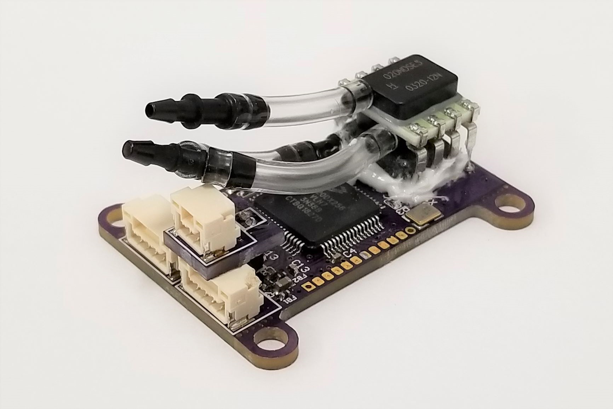

.. _common-avanon-adc:

===============================================================================
Avionics Anonymous Air Data Computer - Airspeed, Barometer, and Air Temperature
===============================================================================

The `Avionics Anonymous Air Data Computer <https://docs.avionicsanonymous.com/devices/microadc>`__ is tiny, 
richly-featured Air Data Computer (ADC) for small unmanned airplanes. It includes an MS5611 barometric 
pressure sensor for 10cm-resolution altitude, a Honeywell RSC-series differential pressure transducer 
for extremely accurate airspeed, and a thermistor interface with high-resolution convertor for air 
temperature measurement with better than 1 degree precision. The device interfaces to your autopilot 
via a robust `UAVCAN <https://uavcan.org>`__ interface, which provides high reliability connections 
to peripherals over greater distances than I2C.

   Avionics Anonymous Air Data Computer: Airspeed, Barometer, and Air Temperature

The following parameter should be set on the autopilot (and then reboot the autopilot):

- :ref:`CAN_P1_DRIVER <CAN_P1_DRIVER>` = 1 (to enable the 1st CAN port)

If the device does not work please follow the instructions on enabling the CANBUS in the :ref:`common-canbus-setup-advanced` page, followed by :ref:`common-uavcan-setup-advanced` steps.

The `manufacturer's product page is here <https://docs.avionicsanonymous.com/devices/microadc>`__ for general information about the device.
