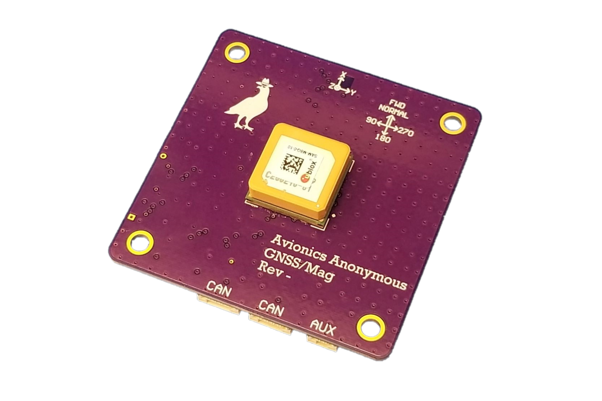

.. _common-avanon-gnss-mag:

===========================
Avionics Anonymous GNSS/Mag
===========================

The `Avionics Anonymous GNSS/Mag <https://docs.avionicsanonymous.com/devices/gnssmag>`__ is a high-performance
combination GPS and magnetometer for small unmanned vehicles. It includes a uBlox SAM-M8Q integrated 
multi-constellation GNSS unit and a high-quality Memsic MMC5983MA magnetometer enabling better than 1-degree 
heading accuracy. The device interfaces to your autopilot via a robust `DroneCAN <https://dronecan.org>`__ 
interface, which provides high reliability connections to peripherals over greater distances than I2C.

   Avionics Anonymous GNSS/Mag

The following parameters should be set on the autopilot (and then reboot the autopilot):

- :ref:`CAN_P1_DRIVER <CAN_P1_DRIVER>` = 1 (to enable the 1st CAN port)
- :ref:`GPS1_TYPE <GPS1_TYPE>` = 9 (DroneCAN)

If the device does not work please follow the instructions on enabling the CANBUS in the :ref:`common-canbus-setup-advanced` page, followed by :ref:`common-uavcan-setup-advanced` steps and then set the :ref:`GPS1_TYPE <GPS1_TYPE>` or :ref:`GPS2_TYPE <GPS2_TYPE>` parameter to 9.

The `manufacturer's product page is here <https://docs.avionicsanonymous.com/devices/gnssmag>`__ for general information about the device.
