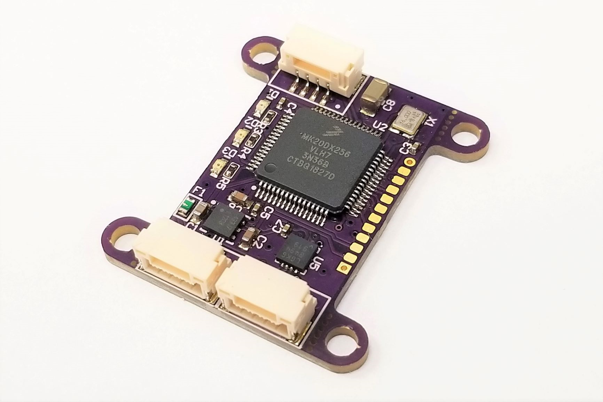

.. _common-avanon-laserint:

=========================================
Avionics Anonymous UAVCAN LIDAR Interface
=========================================

The `Avionics Anonymous UAVCAN LIDAR Interface <https://docs.avionicsanonymous.com/devices/laser_interface>`__ is a tiny interface for 
`several common laser rangefinders <https://docs.avionicsanonymous.com/devices/laser_interface#currently-supported-lasers>`__ 
that allows connection to Pixhawk and other similar autopilots via UAVCAN - A nice robust interface, which provides high 
reliability connections to peripherals over greater distances than I2C.

   Avionics Anonymous UAVCAN LIDAR Interface

The following parameters should be set on the autopilot (and then reboot the autopilot):

- :ref:`CAN_P1_DRIVER <CAN_P1_DRIVER>` = 1 (to enable the 1st CAN port)
- ``RNGFNDx_TYPE`` = 24
- ``RNGFNDx_MIN`` based on your connected laser's datasheet
- ``RNGFNDx_MAX`` based on your connected laser's datasheet

If the device does not work please follow the instructions on enabling the CANBUS in the :ref:`common-canbus-setup-advanced` page, followed by :ref:`common-uavcan-setup-advanced` steps and then set the ``RNGFNDx_TYPE`` parameter to 24.

.. note:: If the rangefinder attached is NOT a ``Lightware SF11/c``, then the UAVCAN internal ``rangefinder_hw`` parameter of this unit must be set to the appropriate rangefinder type using the SLCAN instructions above.

The `manufacturer's product page is here <https://docs.avionicsanonymous.com/devices/laser_interface>`__ for general information about the device.
