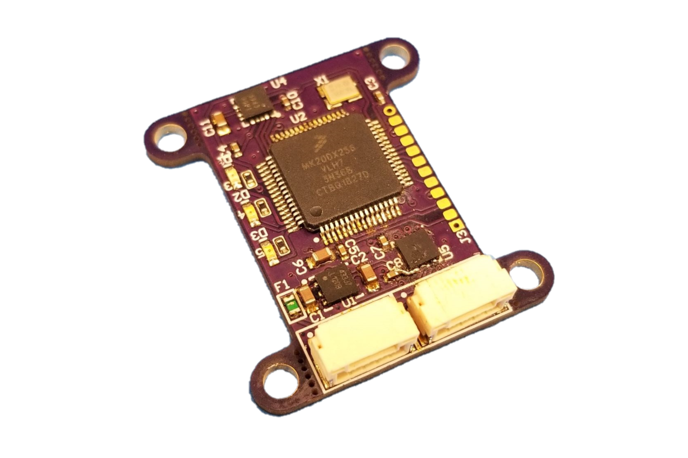

.. _common-avanon-mag:

===============================
Avionics Anonymous Magnetometer
===============================

The `Avionics Anonymous Magnetometer <https://docs.avionicsanonymous.com/devices/minimag>`__ is a high-performance
magnetometer for small unmanned vehicles. It includes a high-quality Memsic MMC5983MA magnetometer enabling 
better than 1-degree heading accuracy. The device interfaces to your autopilot via a robust `UAVCAN <https://uavcan.org>`__ 
interface, which provides high reliability connections to peripherals over greater distances than I2C.

   Avionics Anonymous Magnetometer

The following parameter should be set on the autopilot (and then reboot the autopilot):

- :ref:`CAN_P1_DRIVER <CAN_P1_DRIVER>` = 1 (to enable the 1st CAN port)

If the device does not work please follow the instructions on enabling the CANBUS in the :ref:`common-canbus-setup-advanced` page, followed by :ref:`common-uavcan-setup-advanced` steps.

The `manufacturer's product page is here <https://docs.avionicsanonymous.com/devices/minimag>`__ for general information about the device.
