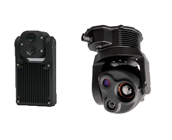

.. _common-avt-gimbal:

===================================
AVT CM41/CM62 3-Axis Gimbal/Cameras
===================================

AVT CM41/CM62 3-Axis Gimbal/Cameras can communicate with the autopilot using the MAVLink Gimbal V2 protocol and are compatible with a range of cameras for real-time video or mapping purposes, and on-gimbal automated object recognition.

Where to Buy
============

These gimbals can be purchased from the `AVT Australia store <https://www.ascentvision.com.au/>`__

Connecting to the Autopilot
===========================
Connect the gimbals's COM2 port to one of the autopilot's Serial/Telemetry ports .

Connect to the autopilot with a ground station and set the following parameters, if using the first mount:

- set :ref:`MNT1_TYPE <MNT1_TYPE>` to "6" for "MAVLink"
- set :ref:`CAM1_TYPE <CAM1_TYPE>` to "6" (MAVLink) and reboot the autopilot
- set :ref:`SERIAL2_BAUD <SERIAL2_BAUD>` to "115" for 115200 bps.  "SERIAL2" can be replaced with any other serial port
- :ref:`SERIAL2_PROTOCOL <SERIAL2_PROTOCOL>` to 2 for "MAVLink2"
- :ref:`SERIAL2_OPTIONS <SERIAL2_OPTIONS>` to 1024 for "Don't forward mavlink to/from"

See the "Control with an RC transmitter" section of :ref:`this page <common-mount-targeting>` for details on parameter changes required to control the gimbal through an RC Transmitter (aka "RC Targeting")

Control and Testing
===================

See :ref:`Gimbal / Mount Controls <common-mount-targeting>` for details on how to control the gimbal using RC, GCS or Auto mode mission commands

Pilot Control
=============
To control the gimbal's lean angles from a transmitter set the RC controls for roll, pitch, or yaw using ``RCx_OPTION`` 212 (Mount1 Roll), 213 (Mount1 Pitch), 214 (Mount1 Yaw) for the first mount,.
