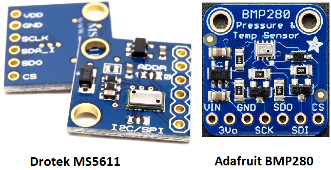
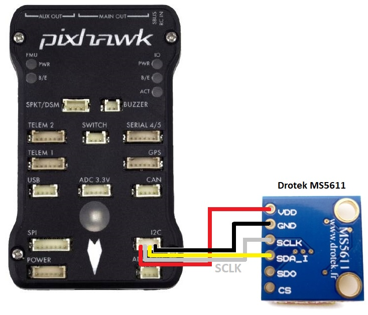
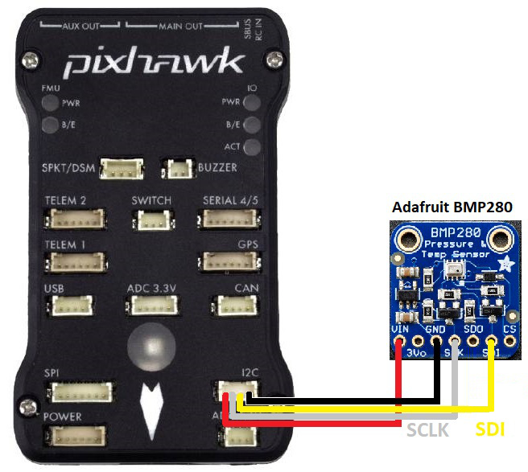
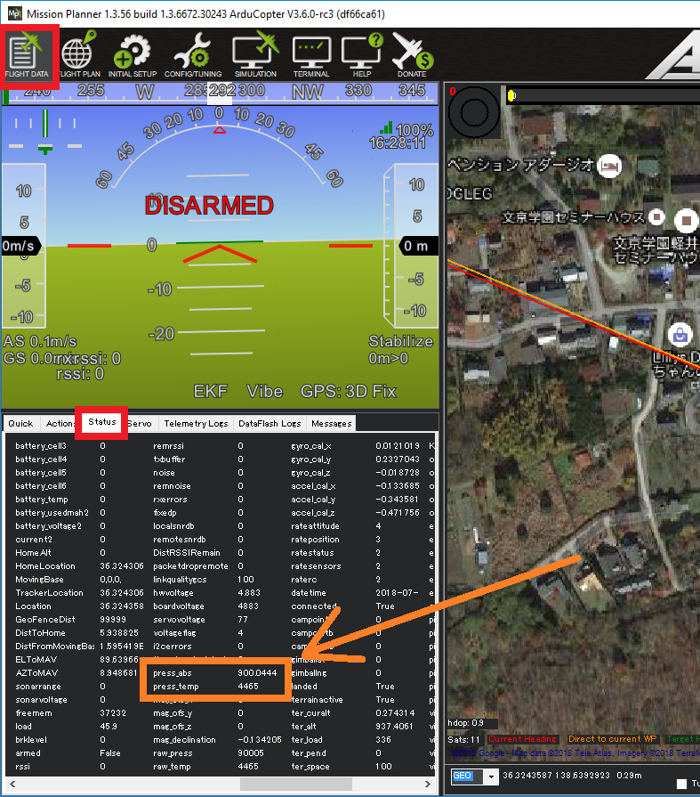

.. _common-baro-external:

Barometer (external)
====================

.. warning::

   This page is a work-in-progress and the instructions below have not been completely verified to be correct

Most flight controllers include a barometer directly on the flight controller but attaching an external barometer can be useful in order to place the barometer away from air pressure disturbances.

.. note::

   Copter users can partially reduce the effect of air pressure disurbances by enabling :ref:`Ground Effect Compensation <Copter:ground-effect-compensation>`

Where to Buy
------------

- `MS5611 from Drotek <https://drotek.com/shop/en/imu/44-ms5611-pressure-barometric-board.html>`__ (recommended)
- `BMP280 I2C from Adafruit <https://www.adafruit.com/product/2651>`__

Connecting and Configuring
--------------------------

Connect the barometer to the flight controller's I2C port as shown below

- :ref:`GND_EXT_BUS <GND_EXT_BUS>` to 1 for Pixhawk boards or 0 for Cubes.  Other flight controllers will also be either 0 or 1.  Reboot the flight controller after changing this parameter.
- :ref:`GND_PRIMARY <GND_PRIMARY>` to 1 to use the external barometer as the primary

Testing
-------

Real-time pressure and temperature from the barometer are sent to the ground station.  If using Mission Planner these values can be seen on the Flight Data >> Status tab, look for "press_abs" and "press_temp".