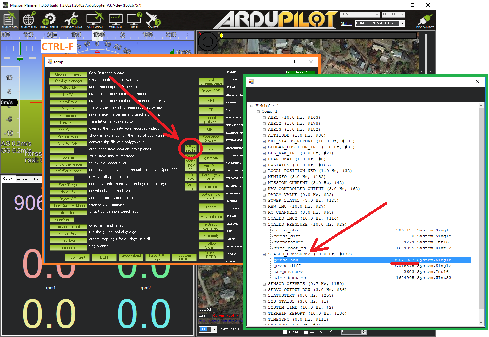

.. _common-baro-external:

Barometer (external)
====================

.. image:: ../../../images/baro-top-image.png
    :width: 450px

Most autopilots include a barometer directly on the autopilot but attaching an external barometer can be useful in order to place the barometer away from air pressure disturbances.  It can also allow monitoring the environmental or an internal component's temperature within a typical range of -40 - +85°C.

.. warning::

   Copter-3.6 only supports the Drotek MS5611.  BMP280 support will be released with Copter-4.0.

.. note::

   Copter users can partially reduce the effect of air pressure disurbances by enabling :ref:`Ground Effect Compensation <Copter:ground-effect-compensation>`

Where to Buy
------------

- `MS5611 from Drotek <https://drotek.com/shop/en/imu/44-ms5611-pressure-barometric-board.html>`__ (recommended)
- `BMP280 I2C from Adafruit <https://www.adafruit.com/product/2651>`__

Connecting and Configuring
--------------------------

Connect the barometer to the autopilot's I2C port as shown below

.. image:: ../../../images/baro-ms5611-pixhawk.jpg
    :target: ../_images/baro-ms5611-pixhawk.jpg
    :width: 450px

On the top of the Drotek MS5611 board, the "I2C" jumper should be soldered.  Look for "I2C/SPI" written on the board.

.. image:: ../../../images/baro-bmp280-pixhawk.jpg
    :target: ../_images/baro-bmp280-pixhawk.jpg
    :width: 450px

- :ref:`BARO_PROBE_EXT <BARO_PROBE_EXT>` to 4 for the Drotek MS5611 or 2 for the Adafruit BMP280.  Reboot the autopilot after changing this parameter.
- :ref:`BARO_PRIMARY <BARO_PRIMARY>` to 1 to use the external barometer as the primary

Testing
-------

.. image:: ../../../images/baro-testing.png
    :target: ../_images/baro-testing.png
    :width: 450px

Real-time pressure and temperature from the barometer are sent to the ground station.  If using Mission Planner they are visible on the Flight Data >> Status tab, look for "press_abs2" and "press_temp2".

Mission Planner's MAVLink Inspector can also be used to view the data.  From the Flight Data screen press Ctrl-F, then push the "MAVLink In" button and then expand the view and look for SCALED_PRESSURE2.

.. tip::
   If using ArduPilot onboard OSD, the secondary barometer's temperature reading can be displayed using the OSDn_BTEMP panel.
