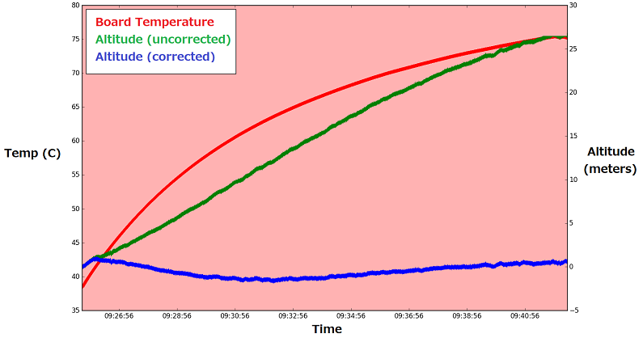

.. _common-baro-temp-comp:
[copywiki destination="copter"]

Barometer Temperature Compensation
==================================

Some small autopilots with very tightly packed components can suffer from bad altitude control if the barometer suffers from significant changes in reported pressure as the temperature changes.  The barometer temperature compensation feature can be used to partially correct this issue.

.. warning::

   This feature is not useful for most autopilots including the Pixracer and Pixhawk family of boards

.. note::

   This feature is available in Copter-3.6 (and higher)

How to Use
----------

- set :ref:`TCAL_ENABLED <TCAL_ENABLED>` to 2 (to learn and use calibration)
- power down the board and let it cool for a few minutes
- power on the board and leave it for about 10 minutes
- learning will happen as the board heats up and while it is not moving
- the :ref:`TCAL_BARO_EXP <TCAL_BARO_EXP>` should be updated with a non-zero value
- optionally turn off learning by setting :ref:`TCAL_ENABLED <TCAL_ENABLED>` to 1 (to use but not learn new calibration values)
