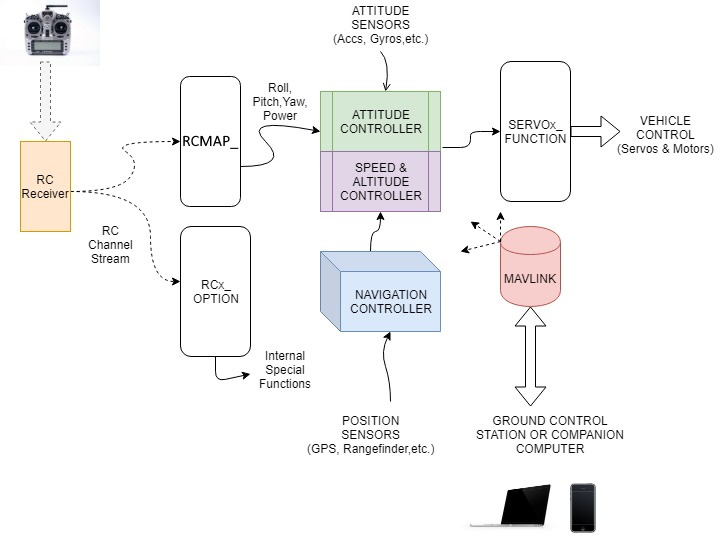

.. _basic-operation:

======================================
Simple Overview of ArduPilot Operation
======================================

This is a very basic overview of the functions of ArduPilot firmware running on a autopilot. Shown below is a simple block diagram of the basic functional operation. This will give you a better understanding of ArduPilot basic functions as you configure your system.

Basic Goal
----------

The basic goal of the software is to provide control of the vehicle, either autonomously, or via pilot input through radio control transmitter or ground control station, or via companion computer on board the vehicle, any of which are optional, including only loading a fully autonomous mission on the vehicle for execution.

Inputs
------

Control inputs are input either by radio control receiver, or via Mavlink communication from telemetry or companion computers. The radio control receiver provides Roll/Pitch/Yaw inputs for desired attitude control, vehicle power (throttle), as well as control of operational modes and auxiliary functions. The radio control inputs for Roll/Pitch/Yaw/Throttle can be assigned to any radio control channel via the ``RCMAP_x`` functions. Auxiliary functions are assigned using the ``RCx_FUNCTION`` parameters.

Outputs
-------
Outputs are provided to activate servos, motors, relays, etc. to control the vehicle. Any autopilot output can be assigned the desired vehicle control output function via the SERVOx_FUNCTION parameters.

Sensors
-------

Attitude, position, power system monitoring, and vehicle speed are provided by sensor inputs to the autopilot. All ArduPilot compatible autopilots have at least one or more accelerometers, baros, and gyros integrated onboard.
Typically a GPS, and often, a Compass sensor is required. Usually these are provided externally.
Some controllers have multiple instances of sensors for redundancy, a key feature of the ArduPilot software. Many sensors require a one-time calibration during the Mandatory Hardware setup step.

[copywiki destination="plane,copter,rover"]

