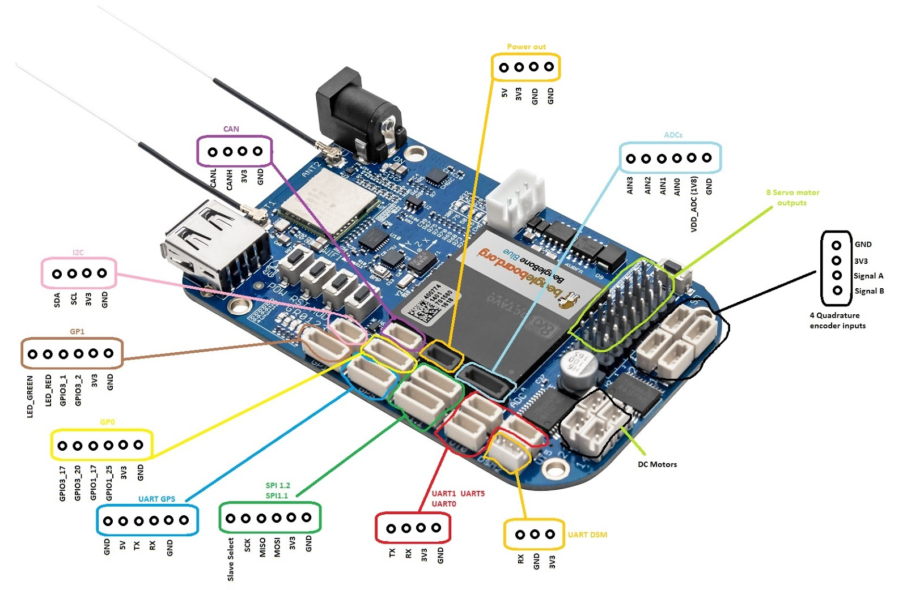

.. _common-beagle-bone-blue:

===============
BeagleBone Blue
===============

`BeagleBone Blue <https://beagleboard.org/blue>`__ (BBBlue) is a complete, Linux-enabled robotics computer.
Community-supported and fully open-source, the real-time performance, flexible networking and rich set of robotics-oriented peripherals make building mobile robots quick and affordable.

.. note::

   Copter support was added in Copter-3.5.

.. image:: ../../../images/beagle-bone-blue-annotated.png
    :target: ../_images/beagle-bone-blue-annotated.png
    :width: 800 px

Confer the `schematic(s) <https://github.com/beagleboard/beaglebone-blue/blob/master/BeagleBone_Blue_sch.pdf>`__ from `BBBlue repo <https://github.com/beagleboard/beaglebone-blue/>`__ for more details.

Specifications
==============

-  **Processor**

   -  1GHz ARM Cortex-A8
   -  2×32-bit 200-MHz programmable real-time units (PRUs)
   -  512MB DDR3 RAM integrated
   -  4GB 8-bit eMMC flash

-  **Sensors**

   -  MPU9250 for accelerometers, gyroscope and internal compass (I2C)
   -  BMP280 barometer

-  **Interfaces**

   -  Wifi (802.11bgn)
   -  Bluetooth 4.1 and BLE
   -  8x ESC/Servo out (6v), 4x DC motor out
   -  USB 2.0 client and host
   -  11x programmable LEDs
   -  2x buttons
   -  1.8V analog
   -  SPI, I2C, UART
   -  2-cell LiPo support with balancing, 9-18V charger input

-  **OS**

   -  Linux (Debian)

Quick Start
===========

Preparing BBBlue with linux
---------------------------

Download the latest buster-console image from https://rcn-ee.net/rootfs/bb.org/testing/ (`bone-debian-10.11-console-armhf-2021-12-01-1gb.img.xz <https://rcn-ee.net/rootfs/bb.org/testing/2021-12-01/buster-console/bone-debian-10.11-console-armhf-2021-12-01-1gb.img.xz>`__ used in this example).

.. note::

   In case this image does not exist anymore or is outdated, go to https://rcn-ee.net/rootfs/bb.org/testing/ and look for the most recent folder that contains a ``...-console`` folder with image - it contains all we need and is usually around 150 MB. The ``...-iot`` could also be used but is bigger. Basically just look for the smallest and most recent ``bone-...`` image, as you can always install more software if needed.

Flash image onto SD card.

Insert SD card in BBBlue and power up using a suitable USB cable at the micro USB bus.

Connect via SSH (``ssh debian@192.168.7.2`` on Windows and ``ssh debian@192.168.6.2`` on Mac/Linux).
The password should be ``temppwd``. It is given at the command prompt.

Connect BBBlue to the internet using a shared internet connection over USB (see chapter `Connect BBBlue to the internet`_).

On the BBBlue configure gateway and nameserver.

::
    
    sudo nano /etc/network/interfaces
    
Then paste the following lines under ``iface lo inet loopback``

::

    iface usb0 inet static
    address 192.168.7.2
    netmask 255.255.255.252
    network 192.168.7.0
    gateway 192.168.7.1
    post-up route add default gw 192.168.7.1
    dns-nameservers 192.168.7.1

Next, configure the Host (Linux or Windows):

**Windows:**

::

    Press CTRL + R > Type ncpa.cpl and hit Enter.
    Find your real Ethernet or Wifi Adapter and right click > Properties
    Select the Tab "Sharing" > Tick the first checkbox and select the BBBlue ethernet connection
    Press OK
    Select the BBBlue ethernet connection and right click > Properties
    Double click "Internet Protocol, Version 4 (TCP/IPv4)
    Set the IP Address to 192.168.7.1
    Set DNS server to 8.8.8.8
    Press OK

**Linux:**

Host computer's command prompt:

::

    ifconfig
    
use this output to figure out which is your internet connected network adapter and replace in the following 'wlan0' by the name of it:

::

    sudo sysctl net.ipv4.ip_forward=1
    sudo iptables -t nat -A POSTROUTING -o wlan0 -j MASQUERADE
    sudo iptables -A FORWARD -m conntrack --ctstate RELATED,ESTABLISHED -j ACCEPT
    sudo iptables -A FORWARD -i usb0 -o wlan0 -j ACCEPT

Reboot the BBBlue and then reconnect again using SSH

::

    sudo reboot

Eliminate the necessity for the user to enter the sudoer password:

::

    echo "debian ALL=(ALL) NOPASSWD: ALL" | sudo tee -a /etc/sudoers.d/debian >/dev/null

Install locales (a lot of programs complain otherwise) and set them:

::
    
    sudo apt -y update
    sudo apt install -y locales
    sudo dpkg-reconfigure locales

Choose a locale (e.g. en_US.UTF-8 = English, United States, UTF8). This may take a while.

::

    sudo apt -y dist-upgrade
    sudo apt install -y git
    sudo apt-get install -y cpufrequtils

Set CPU profile to "Performance":

::

    sudo sed -i 's/GOVERNOR="ondemand"/GOVERNOR="performance"/g' /etc/init.d/cpufrequtils
    

Setting up ArduPilot
--------------------

The following instructions show how to setup ArduPlane. It is the same for other vehicle types just replace ``plane`` by e.g. ``copter`` etc. (see `Building ArduPilot <https://github.com/ArduPilot/ardupilot/blob/master/BUILD.md>`__). It is also possible to setup multiple vehicle types on the same system.

Create an empty service file so that ardupilot automatically starts on boot and runs in the background:

::

    sudo nano /lib/systemd/system/arduplane.service

Paste following text. And replace ``<target IP address>`` with the IP address of the telemetry receiving computer:

::

    [Unit]
    Description=ArduPlane Service
    After=networking.service
    StartLimitIntervalSec=0
    Conflicts=arducopter.service ardurover.service antennatracker.service

    [Service]
    ExecStart=/usr/bin/ardupilot/arduplane -C /dev/ttyO1 -A udp:<target IP address>:14550 -B /dev/ttyS2
    Restart=on-failure
    RestartSec=1

    [Install]
    WantedBy=multi-user.target

::

    sudo mkdir -p /usr/bin/ardupilot

Download the latest ArduPilot binary for the ``blue`` target/FC from https://firmware.ardupilot.org/ (`Plane/stable-4.1.6/blue/arduplane <https://firmware.ardupilot.org/Plane/stable-4.1.6/blue/arduplane>`__ used in this example). Copy this file to `/usr/bin/ardupilot/`.

::

    sudo wget -O /usr/bin/ardupilot/arduplane https://firmware.ardupilot.org/Plane/stable-4.1.6/blue/arduplane
    
Alternatively there are other possible sources like the https://custom.ardupilot.org/ build server or you can compile it yourself (see `Cross compiling ArduPilot from source`_).

.. note::

   In case this image does not exist anymore or is outdated, go to https://firmware.ardupilot.org/ and look for the vehicle type you want. Then look for the firmware you want - usually the most recent ``stable`` - and within that folder look for ``blue``. In this folder you will find some text files and the firmware binary/executable.
   

::

    sudo chmod 0755 /usr/bin/ardupilot/a*
    sudo systemctl enable arduplane.service
    sudo reboot

Your BBBlue is now ready to connect to a Ground Control Station (e.g. `MissionPlanner <https://ardupilot.org/planner/docs/mission-planner-installation.html>`__ or  `QGroundControl <http://qgroundcontrol.com/>`__ )

When establishing a connection select UDP on port 14550.

More information can be found in section `Connect BBBlue to a Ground Station Software`_ 

Appendix
========

`Connect BBBlue to the internet`
--------------------------------

Via Wifi
~~~~~~~~

Connect the BBBlue to an available access point - this does NOT setup the BBBlue to act as access point itself.

::

    connmanctl services | grep 'YOUR_SSID' | grep -Po 'wifi_[^ ]+'
    cat >/var/lib/connman/wifi.config

One line at a time, we're writing a file line by line:

::

    [service_<OUTPUT-FROM-CONNMANCTL-COMMAND>]
    Type = wifi
    Security = wpa2
    Name = YOUR_SSID
    Passphrase = YOUR_WIFI_PASSWORD

CTRL + C, should save File contents. Make sure to add a new line (press Enter) after Passphrase = ***** 

::

    sudo reboot

Again, ssh into the BBBlue at the former IP.

Obtain the IP of the BBBlue wifi interface:

::

    ip addr

ssh by wifi into the BBBlue.

Via shared internet connection
~~~~~~~~~~~~~~~~~~~~~~~~~~~~~~

Refer to `Quick Start`_

`Cross compiling ArduPilot from source`
---------------------------------------

Generally you can compile ArduPilot on the BBBlue itself. But this takes a lot of time (several hours) and a lot of space (you need to maximize/grow the partition on the SD card to fit) and is therefore not recommended.

Install Ubuntu 20.04 64-Bit as build machine (e.g. can be VM or github action).

::

    sudo apt update
    sudo apt install git
    git clone --recurse-submodules https://github.com/ardupilot/ardupilot.git
    cd ardupilot

use either the stable tag ``ArduPlane-stable`` or the current Plane branch ``Plane-4.1`` (in the moment both refer to Plane-4.1.6) - make sure to use a ``stable`` version

::

    ./Tools/environment_install/install-prereqs-ubuntu.sh
    git checkout Plane-4.1

::

    ./waf configure --board=blue
    ./waf plane

binary is located in ``build/blue/bin/``.

Kernel configuration
--------------------

In this section we update the kernel. There are two types of kernels: Real-time and regular (default). In this guide we will configure the real-time kernel v5.10 RT. Refer to `elinux.org/Beagleboard <https://elinux.org/Beagleboard:BeagleBoneBlack_Debian#Kernel_Options>`__  if you wish to use different version or type. 

Update local scripts:

::

    cd /opt/scripts && git pull

Update kernel:

::

    sudo /opt/scripts/tools/update_kernel.sh --bone-rt-kernel --lts-5_10

Specify device tree binary to be used at startup:

::

    sudo sed -i 's/#dtb=/dtb=am335x-boneblue.dtb/g' /boot/uEnv.txt

PRU Drivers
-----------

There are two types of drivers available for the PRU's (Programmable Realtime Units): RProc and UIO. RProc is enabled by default. In this example we're using UIO instead of RProc. If you don't want to change to UIO, ignore setting the ``uboot_overlay_pru=`` section.

Open uEnv.txt for editing:

::

    sudo nano /boot/uEnv.txt

Set ``uboot_overlay_pru=AM335X-PRU-UIO-00A0.dtbo``.

Finally reboot the board to finalize configuration.

::

    sudo reboot

Test to see if the device tree blob (DTB) is loaded

::

    lsmod |grep uio

It should show something like this:

::

    uio_pruss       4928 0
    uio_pdrv_genirq 3539 0
    uio             8822 2 uio_pruss,uio_pdrv_genirq

Flash SD card to eMMC
---------------------

You can use the following steps to copy everything over to the eMMC. This way the SD card can be removed or used for other purposes.

::

    sudo nano /boot/uEnv.txt

Uncomment the line ``#cmdline=init=/opt/scripts/tools/eMMC/init-eMMC-flasher-v3.sh``

It should now be:

::

    cmdline=init=/opt/scripts/tools/eMMC/init-eMMC-flasher-v3.sh

Save the file and ``sudo reboot``

The flashing process will immediately start on reboot. **This process can take up 15 minutes (Usually 5 minutes). Wait until all flashing LEDs are OFF (Only power LED is on).**

**Once done, remove power and then remove the SD card.**

Power it up again and it should boot as usual.

Check if booted from eMMC or SD card
~~~~~~~~~~~~~~~~~~~~~~~~~~~~~~~~~~~~

::

    sudo apt-get install tiomapconf

Boot from eMMC:

::

    sudo omapconf read 0x44E10040
    0040033C

Boot from microSD (boot button pressed):

::

    sudo omapconf read 0x44E10040
    00400338

`Connect BBBlue to a Ground Station Software`
---------------------------------------------

Via built-in Bluetooth
~~~~~~~~~~~~~~~~~~~~~~

In order to use the built-in Bluetooth connection as MAVLink some steps are required. First, we need a Python script that provides a rfcomm bluetooth service. The script also creates a virtual serial port (/dev/pts/0) which we will specify as ardupilot telemetry channel later. Everything that is sent or received to or from the virtual serial port will be redirected over bluetooth to our client application or ardupilot.

::

    sudo pip3 install pybluez
    sudo pip3 install pyserial

    sudo mkdir /usr/bin/bluetooth-serial
    sudo nano /usr/bin/bluetooth-serial/bluetooth-serial.py

Paste the following script

::

    import os, pty, serial, time
    from bluetooth import *
    import threading
    
    def receive(client, master):
        try:
            while True:
                received_data = os.read(master, 1024)
                client.send(received_data)
        except:
            print("cannot receive, connection closed")
            
    def send(client, master):
        try:
            while True:
                data = client.recv(1024) #128
                written = os.write(master, data)
        except:
            print("cannot send, connection closed")

    def start_server_and_listen(master):
        service_uuid = "00001101-0000-1000-8000-00805F9B34FB"
        server = BluetoothSocket(RFCOMM)
        server.bind(("", PORT_ANY))
        server.listen(1)
        port = server.getsockname()[1]
        advertise_service(server, "BBBlue-MAVLink", service_id = service_uuid, service_classes = [servi$
        client, client_info = server.accept()
        receive_thread = threading.Thread(target=receive, args=(client, master))
        send_thread = threading.Thread(target=send, args=(client, master))
        receive_thread.start()
        send_thread.start()
        receive_thread.join()
        send_thread.join()
        server.close()
        client.close()

    master, slave = pty.openpty()
    s_name = os.ttyname(slave)
    print(s_name)
    ser = serial.Serial(port=s_name, baudrate=57600, stopbits=serial.STOPBITS_TWO)

    while 1:
        try:
            start_server_and_listen(master)
        except:
            print("Exception occured, restarting server...")

    client.close()
    server.close()
    
    
Next we create a systemd service for this script.

::

    sudo nano /lib/systemd/system/bluetooth-serial.service
    
And paste the following text.

::

    [Unit]
    Description=Bluetooth Serial Service
    After=networking.service

    [Service]
    Type=simple
    Restart=always
    ExecStart=/usr/bin/python3 /usr/bin/bluetooth-serial/bluetooth-serial.py

    [Install]
    WantedBy=multi-user.target

We now have to adjust the previously created ardupilot service. Open the service file:

::

    sudo nano /lib/systemd/system/arduplane.service
    

It's mandatory that the bluetooth-serial.service starts before ardupilot. We can replace the After=[...] to

::

    After=bluetooth-serial.service
    
to achieve this behaviour.

Next let's adjust the communication channel to our newly created virtual serial port:

::

    ExecStart=/usr/bin/ardupilot/arduplane -A /dev/pts/0

Enable service:
::

    sudo systemctl enable bluetooth-serial.service

Save the file and reboot.

::

    sudo reboot
    
Now it's time to connect our bluetooth capable device to the BBBlue. On Windows add a regular Bluetooth device and select "beaglebone".

After pairing a new virtual COM-Port should appear.

You can now use this COM-Port as connection for your ground control software e.g. QGroundControl or Mission Planner.

If there are, for some reason, two COM-Ports just test both of them until you find the correct one.

Troubleshooting
===============

RCOutputAioPRU.cpp:SIGBUS error generated
-----------------------------------------

https://github.com/imfatant/test/issues/16#issuecomment-477725439

For me the ``sudo dd if=/dev/zero of=/dev/mmcblk1 bs=1M count=10`` did the trick.

Careful: The uboot_overlay_pru version in this Github comment is outdated. Use the instructions above for reference.

Check system config
-------------------

::

    sudo /opt/scripts/tools/version.sh

The ``current`` config should look like this (Use diffchecker or similar tool):

::

    git:/opt/scripts/:[1583f354594aabfaff08dee2a4aabdfe61433024]
    eeprom:[A335BNLTBLA21736EL001182]
    model:[TI_AM335x_BeagleBone_Blue]
    dogtag:[BeagleBoard.org Debian Buster Console Image 2021-12-01]
    bootloader:[microSD-(push-button)]:[/dev/mmcblk0]:[U-Boot SPL 2019.04-g923f8b8 (Oct 26 2021 - 14:46:57 +0000)]:[location: dd MBR]
    bootloader:[microSD-(push-button)]:[/dev/mmcblk0]:[U-Boot 2019.04-g923f8b8]:[location: dd MBR]
    bootloader:[eMMC-(default)]:[/dev/mmcblk1]:[U-Boot SPL 2019.04-g923f8b8 (Oct 26 2021 - 14:46:57 +0000)]:[location: dd MBR]
    bootloader:[eMMC-(default)]:[/dev/mmcblk1]:[U-Boot 2019.04-g923f8b8]:[location: dd MBR]
    UBOOT: Booted Device-Tree:[am335x-boneblue.dts]
    UBOOT: Loaded Overlay:[AM335X-PRU-RPROC-4-19-TI-00A0.kernel]
    UBOOT: Loaded Overlay:[BB-ADC-00A0.kernel]
    kernel:[4.19.94-ti-r68]
    device-tree-override:[dtb=am335x-boneblue.dtb]
    /boot/uEnv.txt Settings:
    uboot_overlay_options:[enable_uboot_overlays=1]
    uboot_overlay_options:[uboot_overlay_pru=AM335X-PRU-UIO-00A0.dtbo]
    uboot_overlay_options:[enable_uboot_cape_universal=1]
    pkg check: to individually upgrade run: [sudo apt install --only-upgrade <pkg>]
    pkg:[bb-cape-overlays]:[4.14.20210821.0-0~buster+20210821]
    pkg:[bb-customizations]:[1.20211201.1-0~buster+20211201]
    pkg:[bb-usb-gadgets]:[1.20211012.0-0~buster+20211012]
    pkg:[bb-wl18xx-firmware]:[1.20210922.2-0~buster+20211007]
    pkg:[kmod]:[26-1]
    WARNING:pkg:[librobotcontrol]:[NOT_INSTALLED]
    pkg:[firmware-ti-connectivity]:[20190717-2rcnee1~buster+20200305]
    groups:[debian : debian adm kmem dialout cdrom floppy audio dip video plugdev users systemd-journal input bluetooth netdev gpio admin tisdk weston-launch cloud9ide]
    cmdline:[console=ttyS0,115200n8 bone_capemgr.uboot_capemgr_enabled=1 root=/dev/mmcblk0p1 ro rootfstype=ext4 rootwait coherent_pool=1M net.ifnames=0 lpj=1990656 rng_core.default_quality=100 quiet]
    dmesg | grep remote
    [   26.835790] remoteproc remoteproc0: wkup_m3 is available
    [   26.901553] remoteproc remoteproc0: powering up wkup_m3
    [   26.901586] remoteproc remoteproc0: Booting fw image am335x-pm-firmware.elf, size 217148
    [   26.901840] remoteproc remoteproc0: remote processor wkup_m3 is now up
    [   28.464026] remoteproc remoteproc1: 4a334000.pru is available
    [   28.480195] remoteproc remoteproc2: 4a338000.pru is available
    dmesg | grep pru
    [   28.464026] remoteproc remoteproc1: 4a334000.pru is available
    [   28.464212] pru-rproc 4a334000.pru: PRU rproc node pru@4a334000 probed successfully
    [   28.480195] remoteproc remoteproc2: 4a338000.pru is available
    [   28.480412] pru-rproc 4a338000.pru: PRU rproc node pru@4a338000 probed successfully
    dmesg | grep pinctrl-single
    [    0.975434] pinctrl-single 44e10800.pinmux: 142 pins, size 568
    dmesg | grep gpio-of-helper
    END

Video of BBBlue flying Copter-3.5
==========================================

..  youtube:: v2xWtlyYrtE
    :width: 100%

..  youtube:: 8bVc9X869pw
    :width: 100%

More Links
==========

- `Blog post announcing support <https://discuss.ardupilot.org/t/beaglebone-blue-released-linux-enabled-autopilot-for-80/15772>`__
- `BeagleBone recommended accessories page <https://github.com/beagleboard/beaglebone-blue/wiki/Accessories>`__
- `Mirkix's instructions on loading Copter to BeagleBone Blue <https://github.com/mirkix/ardupilotblue>`__
- `Building ArduPilot for BeagleBone Black on Linux — Dev documentation <https://ardupilot.org/dev/docs/building-for-beaglebone-black-on-linux.html#building-for-beaglebone-black-on-linux>`__
- `Robot Control Library: Networking WiFi <https://beagleboard.org/static/librobotcontrol/networking_wifi.html>`__
- `Setting up the BeagleBoneBlue for the first time – muonic <https://muonic.wordpress.com/2019/04/09/setting-up-the-beagleboneblue-for-the-first-time/>`__
- `Beagleboard:BeagleBoneBlack Debian - eLinux.org <https://elinux.org/Beagleboard:BeagleBoneBlack_Debian#Flashing_eMMC>`__
- `Pinouts · beagleboard/beaglebone-blue Wiki <https://github.com/beagleboard/beaglebone-blue/wiki/Pinouts>`__
- `ArduPilot Blue - A beginner's guide <https://github.com/imfatant/test>`__
- `EE192 Getting Started with the Beaglebone Blue <https://inst.eecs.berkeley.edu/~ee192/sp21/files/GettingStartedBBBL.pdf>`__
- `How to compile using a github action workflow <https://github.com/drtrigon/ardupilot-beagle-bone-blue-binaries/>`__
- `Building ArduPilot <https://github.com/ArduPilot/ardupilot/blob/master/BUILD.md>`__
- `Enabling the UIO PRU driver in recent kernels <https://catch22eu.github.io/website/beaglebone/beaglebone-pru-uio/>`__
- `Enabling the UIO Drivers on the Beaglebone Black <http://www.ofitselfso.com/BeagleNotes/Enabling_the_UIO_Drivers_on_the_Beaglebone_Black.php>`__

[copywiki destination="plane,copter,rover,blimp"]

