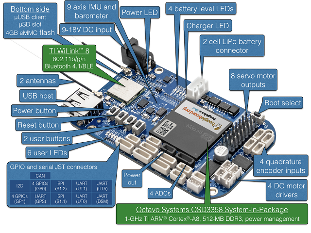

.. _common-beagle-bone-blue:

================
Beagle Bone Blue
================

`BeagleBone Blue <https://beagleboard.org/blue>`__ is a complete, Linux-enabled robotics computer.
Community-supported and fully open-source, the real-time performance, flexible networking and rich set of robotics-oriented peripherals make building mobile robots quick and affordable.

.. note::

   Copter support was added in Copter-3.5.

Specifications
==============

-  **Processor**

   -  1GHz ARM Cortex-A8
   -  2×32-bit 200-MHz programmable real-time units (PRUs)
   -  512MB DDR3 RAM integrated
   -  4GB 8-bit eMMC flash

-  **Sensors**

   -  MPU9250 for accelerometers, gyroscope and internal compass (I2C)
   -  BMP280 barometer

-  **Interfaces**

   -  Wifi (802.11bgn)
   -  Bluetooth 4.1 and BLE
   -  8x ESC/Servo out (6v), 4x DC motor out
   -  USB 2.0 client and host
   -  11x programmable LEDs
   -  2x buttons
   -  1.8V analog
   -  SPI, I2C, UART
   -  2-cell LiPo support with balancing, 9-18V charger input

-  **OS**

   -  Linux (Debian)

Uploading firmware
==================

Please follow `Mirkix's instructions on loading Copter to BeagleBone Blue <https://github.com/mirkix/ardupilotblue>`__.

Video of BeagleBone Blue flying Copter-3.5
==========================================

..  youtube:: v2xWtlyYrtE
    :width: 100%

..  youtube:: 8bVc9X869pw
    :width: 100%

More Links
==========

- `Blog post announcing support <https://discuss.ardupilot.org/t/beaglebone-blue-released-linux-enabled-autopilot-for-80/15772>`__
- `BeagleBone recommended accessories page <https://github.com/beagleboard/beaglebone-blue/wiki/Accessories>`__
