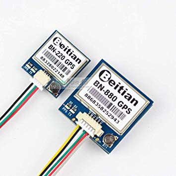

.. _common-beitian-gps:

=========================================
Beitian BN-220 GPS / BN-880 GPS & Compass
=========================================

Inexpensive, light, Dual Mode GPS and GPS/Compass using UBLOX M8N module

- Receiving Format :　GPS,GLONASS,Galileo,BeiDou,QZSS and SBAS
- Frequency : GPS L1,GLONASS L1,BeiDou B1,SBAS L1,Galileo E1
- Channels : 72
- Data Protocol : NMEA-0183 or UBX, Default NMEA-0183
- Single GNSS : 1Hz-18Hz
- Concurrent GNSS : 1Hz-10Hz
- BN-880 Compass IC: HMC5883L

.. note:: Small GPS modules with small backplanes, such as the BN-220, may take a long time to acquire sufficient stability of their velocity and position lock to allow pre-arm checks to pass when using EKF3 in Plane or EKF2 or EKF3 in Copter. Solutions are to either wait however long it takes for pre-arm checks to clear, increase the effective size of the ground plane by putting a larger square of aluminum foil behind the GPS (be careful not to short anything, insulating it from the GSP electronics!), or increase the value of the ``EKFx_CHECK_SCALE`` which controls the tightness of the pre-arm consistency checks to 120 to 150 (this is NOT recommended for Copter).

