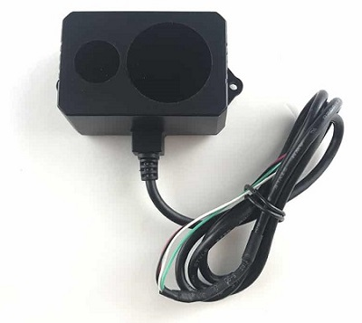
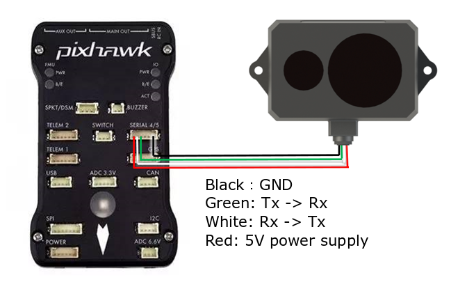

.. _common-benewake-tf02-lidar:

===================
Benewake TF02 lidar
===================

The `Benewake TF02 lidar <http://www.benewake.com/en/tf02.html>`__ has an indoor range of 22m, an outdoor range of 10m, an update rate of 100hz and weighs only 52g.  More specifications can be found `here <http://www.benewake.com/en/canshu/show-172.html>`__ and in the `datasheet <http://www.benewake.com/en/down.html>`__.

.. note::

   Support for this sensor is available in Copter-3.6 (and higher) and Rover-3.4 (and higher)

Where to Buy
------------

- the `Benewake.com Agents <http://www.benewake.com/en/agent.html>`__ page provides the full list of retailers including `3DXR <https://www.3dxr.co.uk/product/benewake-tf02-lidar-22m-100hz-tof/>`__.

Connecting to the Flight Controller
-----------------------------------

For a serial connection you can use any spare Serial/UART port.  The diagram below shows how to connect to SERIAL4.

If the SERIAL4/5 port on a Pixhawk is being used then the following parameters should be set:

-  :ref:`SERIAL4_PROTOCOL <SERIAL4_PROTOCOL>` = 9 (Lidar)
-  :ref:`SERIAL4_BAUD <SERIAL4_BAUD>` = 115 (115200 baud)
-  :ref:`RNGFND_TYPE <RNGFND_TYPE>` = 19 (Benewake TF02)
-  :ref:`RNGFND_MIN_CM <RNGFND_MIN_CM>` = 30
-  :ref:`RNGFND_MAX_CM <RNGFND_MAX_CM>` = **2000** for indoor use OR **1000** for outdoor.  *This is the distance in centimeters that the rangefinder can reliably read.*
-  :ref:`RNGFND_GNDCLEAR <RNGFND_GNDCLEAR>` = 10 *or more accurately the distance in centimetres from the range finder to the ground when the vehicle is landed.  This value depends on how you have mounted the rangefinder.*

If instead the Telem2 port was used then the serial parameters listed above should instead be:

-  :ref:`SERIAL2_PROTOCOL <SERIAL2_PROTOCOL>` = 9
-  :ref:`SERIAL2_BAUD <SERIAL2_BAUD>` = 115

Testing the sensor
==================

Distances read by the sensor can be seen in the Mission Planner's Flight
Data screen's Status tab. Look closely for "sonarrange".

.. image:: ../../../images/mp_rangefinder_lidarlite_testing.jpg
    :target: ../_images/mp_rangefinder_lidarlite_testing.jpg
