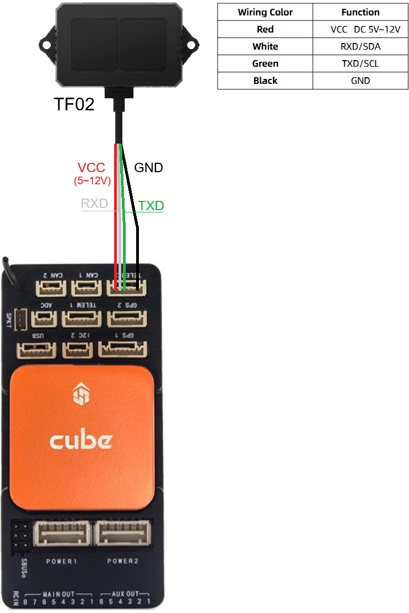
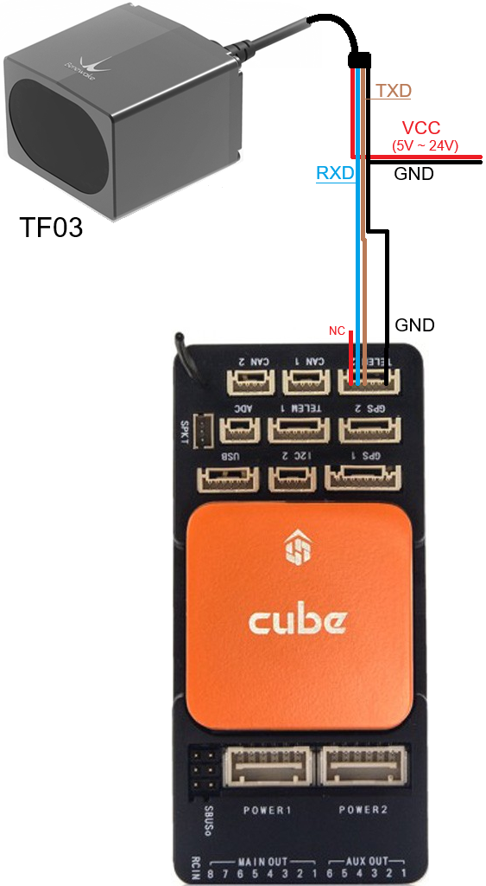
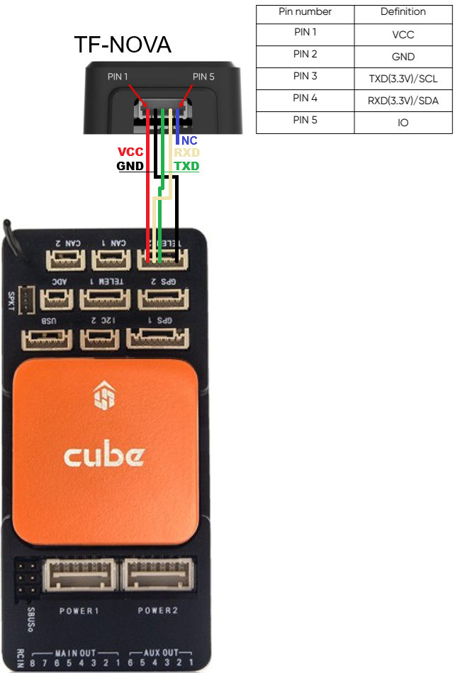
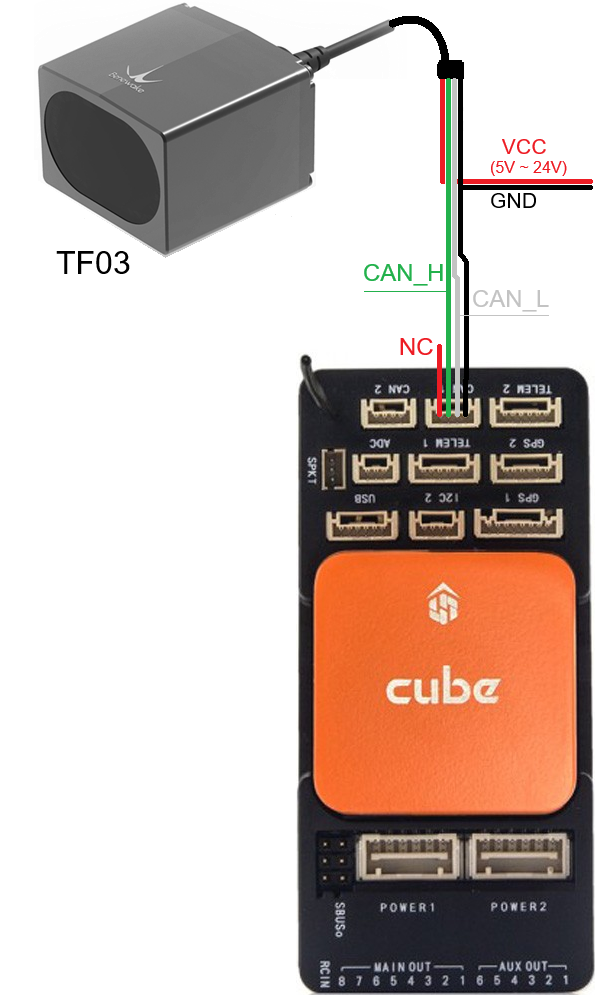

.. _common-benewake-tf02-lidar:

==============================================================
Benewake TF02-Pro / TF03 / TFS20-L / TF-Luna / TF-Nova / TF350
==============================================================

Benewake provides a range of lidar sensors that use proprietary serial and/or CAN interfaces

.. image:: ../../../images/benewake-tf02-topimage.jpg

.. list-table:: Lidar Specifications (some ranges are estimates)
   :header-rows: 1
   :widths: 15 15 10 12 10 15

   * - Model
     - Range (Indoor/Outdoor)
     - Weight
     - Voltage
     - FOV
     - Interface
   * - TF02 (discontinued)
     - 22m / 10m
     - 52g
     - 5V
     - 3 deg
     - UART
   * - `TF02-Pro <https://en.benewake.com/TF02Pro/index.html>`__
     - 40m / 13.5m
     - 50g
     - 5V~12V
     - 3 deg
     - UART
   * - `TF02-i <https://en.benewake.com/TF02i/index.html>`__
     - 40m / 13.5m
     - 60g
     - 7V~30V
     - 3 deg
     - CAN
   * - `TF03 <https://en.benewake.com/TF03/index.html>`__
     - 100m / 50m
     - 89g
     - 5V~24V
     - 0.5 deg
     - UART, CAN
   * - `TFS20-L <https://en.benewake.com/TFS20L/index.html>`__
     - 20m / 15m
     - 2g
     - 3.3V
     - 2 deg
     - UART
   * - `TF-Luna <https://en.benewake.com/TFLuna/index.html>`__
     - 8m / 3m
     - 5g
     - 3.7V~5.2V
     - 2 deg
     - UART
   * - `TF-Nova <https://en.benewake.com/tf-nova>`__
     - 14m / 7m
     - 5g
     - 5V
     - 14 deg
     - UART
   * - `TF350 <https://en.benewake.com/TF350/index.html>`__
     - 350m / 150m
     - 224g
     - 5V~24V
     - 0.35 deg
     - UART, CAN

More details on these lidar can be found in the `benewake.com's downloads area <https://en.benewake.com/DataDownload>`__

Where to Buy
------------

- `Benewake.com Distributors <https://en.benewake.com/Agent/index.html>`__ including `3DXR <https://www.3dxr.co.uk/sensors-c5/lidar-range-and-flow-sensors-c4>`__ and `Unmanned Tech UK <https://www.unmannedtechshop.co.uk/benewake-tf02-lidar-rangefinder-ip65-22m/>`__
- `Benewake's store on Alibaba.com <https://beixingguangzi.en.alibaba.com>`__

Connecting via Serial
---------------------

For a serial connection you can use any spare Serial/UART port.  The diagram below shows how to connect a TF02 to Serial2.  Please note that wire colours may vary by model so please check the datasheet

The diagram below shows how to connect a TF03 to Serial2

The diagram below shows how to connect a TF-Nova to Serial2

If SERIAL2 is being used then the following parameters should be set for the first rangefinder:

-  :ref:`SERIAL2_PROTOCOL <SERIAL2_PROTOCOL>` = 9 (Lidar)
-  :ref:`SERIAL2_BAUD <SERIAL2_BAUD>` = 115 (115200 baud)
-  :ref:`RNGFND1_TYPE <RNGFND1_TYPE>` = 19 (Benewake TF02) for TF02, 27 (Benewake TF03) for TF02-Pro, TF03, TFS20-L, TF-Luna, TF-Nova, TF350
-  :ref:`RNGFND1_MIN <RNGFND1_MIN>` = 0.1
-  :ref:`RNGFND1_MAX <RNGFND1_MAX>`: for TF02 use **20** for indoor, **10** for outdoor.  For TF03 use **100** for indoor, **50** for outdoor.  Please see table at top of this page for other sensors. *This is the distance in meters that the rangefinder can reliably read.*
-  :ref:`RNGFND1_GNDCLR <RNGFND1_GNDCLR>` = 0.1 *or more accurately the distance in metres from the range finder to the ground when the vehicle is landed.  This value depends on how you have mounted the rangefinder.*

Connecting via CAN
------------------

The TF02-i, TF03, TFmini-i and TF350 can be connected to the autopilot via CAN1.  The diagram below shows how to connect a TF03 to CAN1.  Please note that wire colours may vary by model so please check the datasheet.

If CAN1 is used then set the following parameters:

-  :ref:`CAN_P1_DRIVER <CAN_P1_DRIVER>` = 1 (First driver)
-  :ref:`CAN_D1_PROTOCOL <CAN_D1_PROTOCOL>` = 11 (Benewake)
-  :ref:`RNGFND1_TYPE <RNGFND1_TYPE>` = 34 (Benewake CAN)
-  :ref:`RNGFND1_MIN <RNGFND1_MIN>` = 0.1
-  :ref:`RNGFND1_MAX <RNGFND1_MAX>`: for TF02-i use **40** for indoor, **13** for outdoor.  For TF03 use **100** for indoor, **50** for outdoor.  Please see table at top of this page for other sensors. *This is the distance in meters that the rangefinder can reliably read.*
-  :ref:`RNGFND1_GNDCLR <RNGFND1_GNDCLR>` = 0.1 *or more accurately the distance in metres from the range finder to the ground when the vehicle is landed.  This value depends on how you have mounted the rangefinder.*

Testing the sensor
==================

Distances read by the sensor can be seen in the Mission Planner's Flight
Data screen's Status tab. Look closely for "rangefinder1".

.. image:: ../../../images/mp_rangefinder_lidarlite_testing.jpg
    :target: ../_images/mp_rangefinder_lidarlite_testing.jpg
