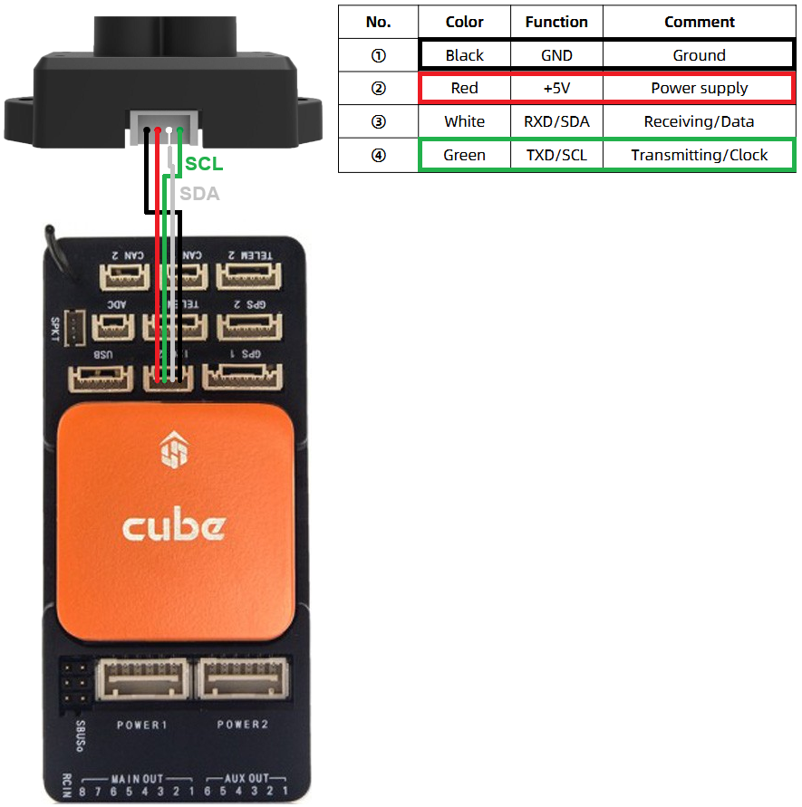

.. _common-benewake-tfmini-lidar:

===================================
Benewake TFmini / TFmini Plus lidar
===================================

The `TFmini <https://en.benewake.com/TFminiS/index.html>`__  and `TFmini Plus <https://en.benewake.com/TFminiPlus/index.html>`__ lidars have an indoor range of 12m, an outdoor range of 7m and weigh 5g and 11g respectively.

Both UART and I2C versions are available.  UART has the advantage of allowing easier firmware updates.

More details on both these lidar can be found in the `benewake.com's downloads area <https://en.benewake.com/DataDownload/>`__

.. image:: ../../../images/benewake-tfmini-topimage.jpg
    :width: 450px

Where to Buy
------------

- `Benewake's store on Alibaba.com <https://beixingguangzi.en.alibaba.com/>`__
- `Benewake.com Distributors <https://en.benewake.com/Agent/index.html>`__

Connecting using Serial
-----------------------

For a serial connection you can use any spare Serial/UART port.  The diagram below shows how to connect to the autopilot's SERIAL4 port.

.. image:: ../../../images/benewake-tfmini-pixhawk.png
    :width: 450px

If the SERIAL4 port on an autopilot is being used then the following parameters should be set for the first rangefinder:

- :ref:`SERIAL4_PROTOCOL <SERIAL4_PROTOCOL>` = 9 (Lidar)
- :ref:`SERIAL4_BAUD <SERIAL4_BAUD>` = 115 (115200 baud)
- :ref:`RNGFND1_TYPE <RNGFND1_TYPE>` = 20 (Benewake-Serial)
- :ref:`RNGFND1_MIN <RNGFND1_MIN>` = 30 for TFmini, 10 for TFminiPlus
- :ref:`RNGFND1_MAX <RNGFND1_MAX>` = **1000** for indoor use OR **600** for outdoors.  *This is the distance in centimeters that the rangefinder can reliably read.*
- :ref:`RNGFND1_GNDCLR <RNGFND1_GNDCLR>` = 10 *or more accurately the distance in centimetres from the range finder to the ground when the vehicle is landed.  This value depends on how you have mounted the rangefinder.*

Connecting using I2C
--------------------

The diagram below shows how to connect to the autopilot's I2C port.

- :ref:`RNGFND1_TYPE <RNGFND1_TYPE>` = 25 (Benewake TFminiPlus-I2C)
- :ref:`RNGFND1_ADDR<RNGFND1_ADDR>` = 16 (I2C address of lidar in decimal, equivalent to 0x10 hexadecimal)
- :ref:`RNGFND1_MIN <RNGFND1_MIN>` = 30 for TFmini, 10 for TFminiPlus
- :ref:`RNGFND1_MAX <RNGFND1_MAX>` = **1000** for indoor use OR **600** for outdoors.  *This is the distance in centimeters that the rangefinder can reliably read.*
- :ref:`RNGFND1_GNDCLR <RNGFND1_GNDCLR>` = 10 *or more accurately the distance in centimetres from the range finder to the ground when the vehicle is landed.  This value depends on how you have mounted the rangefinder.*

Testing the sensor
==================

Distances read by the sensor can be seen in the Mission Planner's Flight
Data screen's Status tab. Look closely for "sonarrange".

.. image:: ../../../images/mp_rangefinder_lidarlite_testing.jpg
    :target: ../_images/mp_rangefinder_lidarlite_testing.jpg
