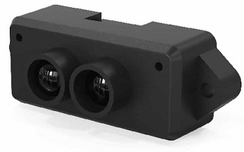
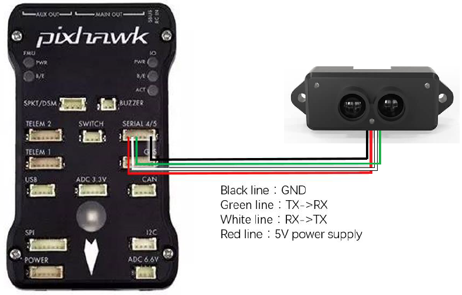
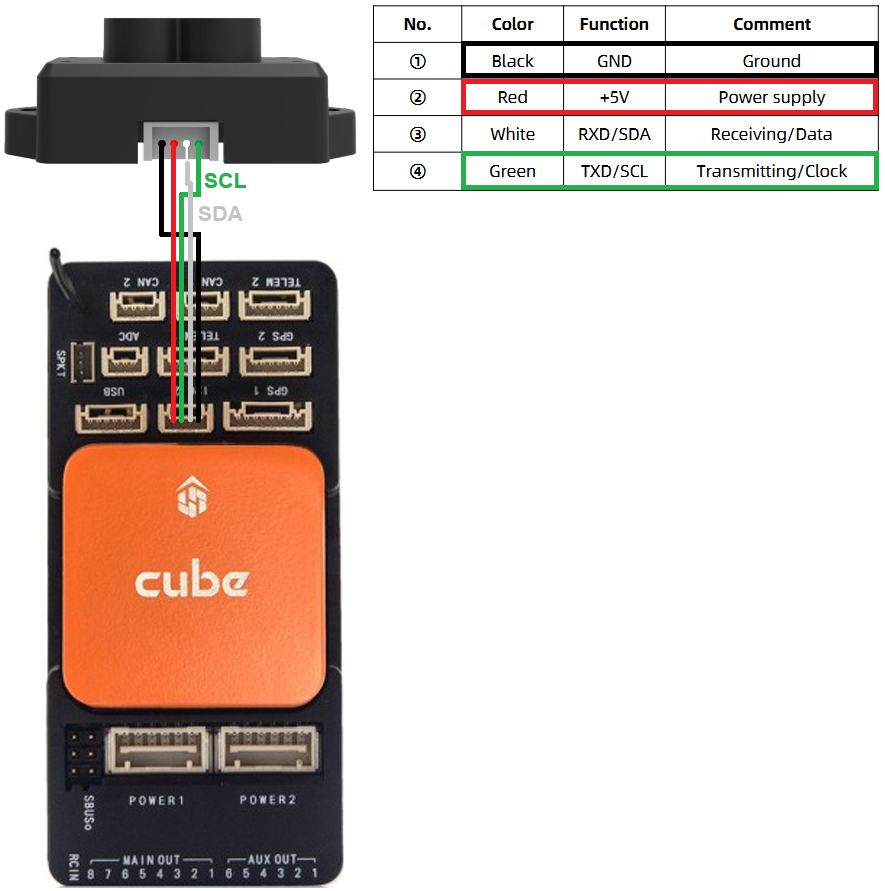

.. _common-benewake-tfmini-lidar:

===================================
Benewake TFmini / TFmini Plus lidar
===================================

The `TFmini <https://en.benewake.com/TFminiS/index.html>`__  and `TFmini Plus <https://en.benewake.com/TFminiPlus/index.html>`__ lidars have an indoor range of 12m, an outdoor range of 7m and weigh 5g and 11g respectively.

Both UART and I2C versions are available.  UART has the advantage of allowing easier firmware updates.

More details on both these lidar can be found in the `benewake.com's downloads area <https://en.benewake.com/DataDownload/>`__

Where to Buy
------------

- `Benewake's store on Alibaba.com <https://beixingguangzi.en.alibaba.com/>`__
- `Benewake.com Distributors <https://en.benewake.com/Agent/index.html>`__

Connecting using Serial
-----------------------

For a serial connection you can use any spare Serial/UART port.  The diagram below shows how to connect to the autopilot's SERIAL4 port.

If the SERIAL4 port on an autopilot is being used then the following parameters should be set for the first rangefinder:

- :ref:`SERIAL4_PROTOCOL <SERIAL4_PROTOCOL>` = 9 (Lidar)
- :ref:`SERIAL4_BAUD <SERIAL4_BAUD>` = 115 (115200 baud)
- :ref:`RNGFND1_TYPE <RNGFND1_TYPE>` = 20 (Benewake-Serial)
- :ref:`RNGFND1_MIN <RNGFND1_MIN>` = 0.3 for TFmini, 0.1 for TFminiPlus
- :ref:`RNGFND1_MAX <RNGFND1_MAX>` = **10** for indoor use OR **6** for outdoors.  *This is the distance in meters that the rangefinder can reliably read.*
- :ref:`RNGFND1_GNDCLR <RNGFND1_GNDCLR>` = 0.1 *or more accurately the distance in metres from the range finder to the ground when the vehicle is landed.  This value depends on how you have mounted the rangefinder.*

Connecting using I2C
--------------------

The diagram below shows how to connect to the autopilot's I2C port.

- :ref:`RNGFND1_TYPE <RNGFND1_TYPE>` = 25 (Benewake TFminiPlus-I2C)
- :ref:`RNGFND1_ADDR<RNGFND1_ADDR>` = 16 (I2C address of lidar in decimal, equivalent to 0x10 hexadecimal)
- :ref:`RNGFND1_MIN <RNGFND1_MIN>` = 0.3 for TFmini, 0.1 for TFminiPlus
- :ref:`RNGFND1_MAX <RNGFND1_MAX>` = **10** for indoor use OR **6** for outdoors.  *This is the distance in meters that the rangefinder can reliably read.*
- :ref:`RNGFND1_GNDCLR <RNGFND1_GNDCLR>` = 0.1 *or more accurately the distance in metres from the range finder to the ground when the vehicle is landed.  This value depends on how you have mounted the rangefinder.*

Optional Power Saving
---------------------

When using the I2C TFmini Plus driver (:ref:`RNGFND1_TYPE <RNGFND1_TYPE>` = 25) the lidar can optionally be told to stop measuring when the vehicle is more than a specified height above the terrain, saving power.

Set :ref:`RNGFND1_PWRRNG <RNGFND1_PWRRNG>` to the height in meters above which the lidar should be powered down. A value of 0 (the default) disables the feature.

While powered down the rangefinder reports a "powered down" status rather than an error: its distance is not displayed on the OSD and altitude sources using it will fall back to other sensors. It is powered back up as soon as the estimated terrain height drops back below :ref:`RNGFND1_PWRRNG <RNGFND1_PWRRNG>`.

[site wiki="copter"]
The height above terrain is taken from the :ref:`terrain database <terrain-following>`, so terrain data must be available, either from the GCS or from the autopilot's SD card, for the lidar to ever be powered down.
[/site]
[site wiki="sub"]
The height above terrain is taken from the terrain database, so terrain data must be available for the lidar to ever be powered down.
[/site]
[site wiki="plane"]
The height above terrain comes from the :ref:`terrain database <common-terrain-following>` when terrain data is available, otherwise from the barometric height above home, or the height above the landing target while landing.
[/site]

.. note:: Since the TFmini Plus has a maximum range of 12m, this is normally only useful on vehicles which spend most of their flight well above that height.

Testing the sensor
------------------

Distances read by the sensor can be seen in the Mission Planner's Flight
Data screen's Status tab. Look closely for "rangefinder1".

.. image:: ../../../images/mp_rangefinder_lidarlite_testing.jpg
    :target: ../_images/mp_rangefinder_lidarlite_testing.jpg
