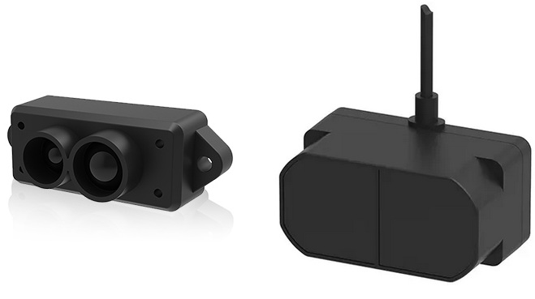

.. _common-benewake-tfmini-lidar:

===================================
Benewake TFmini / TFmini Plus lidar
===================================

The `Benewake TFmini lidar <http://en.benewake.com/product/detail/5c345e26e5b3a844c472329c.html>`__ and `TFmini Plus <http://en.benewake.com/product/detail/5c345cd0e5b3a844c472329b.html>`__ have an indoor range of 12m, an outdoor range of 7m and weigh only (5g).

More details on both these lidar can be found in the `benewake.com's downloads area <http://en.benewake.com/download>`__

.. note::

   Support for this sensor is available in Copter-3.6 (and higher) and Rover-3.4 (and higher)

Where to Buy
------------

- `Benewake.com Agents <http://en.benewake.com/agent>`__
- `Benewake's store on Alibaba.com <https://benewake.en.alibaba.com/?spm=a2700.icbuShop.88.19.66976e38pCbzVV>`__

Connecting to the Autopilot
-----------------------------------

For a serial connection you can use any spare Serial/UART port.  The diagram below shows how to connect to SERIAL4.

.. image:: ../../../images/benewake-tfmini-pixhawk.png

If the SERIAL4/5 port on a Pixhawk is being used then the following parameters should be set for the first rangefinder:

-  :ref:`SERIAL4_PROTOCOL <SERIAL4_PROTOCOL>` = 9 (Lidar)
-  :ref:`SERIAL4_BAUD <SERIAL4_BAUD>` = 115 (115200 baud)
-  :ref:`RNGFND1_TYPE <RNGFND1_TYPE>` = 20 (Benewake TFmini/Plus-Serial)

.. note:: :ref:`RNGFND1_TYPE <RNGFND1_TYPE>` = 20 also works for TFminiPlus via its UART connection, if connected via I2C to the autopilot, use :ref:`RNGFND1_TYPE <RNGFND1_TYPE>` = 25 (Benewake TFmini/Plus-I2C) and also set :ref:`RNGFND1_ADDR<RNGFND1_ADDR>` = 16 (I2C Address of lidar in decimal). *The sensor’s default I2C address is 0x10 hexademical which is 16 in decimal.* 

-  :ref:`RNGFND1_MIN_CM <RNGFND1_MIN_CM>` = 30 for TFmini, =10 for TFminiPlus
-  :ref:`RNGFND1_MAX_CM <RNGFND1_MAX_CM>` = **1000** for indoor use OR **600** for outdoors.  *This is the distance in centimeters that the rangefinder can reliably read.*
-  :ref:`RNGFND1_GNDCLEAR <RNGFND1_GNDCLEAR>` = 10 *or more accurately the distance in centimetres from the range finder to the ground when the vehicle is landed.  This value depends on how you have mounted the rangefinder.*

If instead the Telem2 port was used then the serial parameters listed above should instead be:

-  :ref:`SERIAL2_PROTOCOL <SERIAL2_PROTOCOL>` = 9
-  :ref:`SERIAL2_BAUD <SERIAL2_BAUD>` = 115

Testing the sensor
==================

Distances read by the sensor can be seen in the Mission Planner's Flight
Data screen's Status tab. Look closely for "sonarrange".

.. image:: ../../../images/mp_rangefinder_lidarlite_testing.jpg
    :target: ../_images/mp_rangefinder_lidarlite_testing.jpg
